# MRTG Security, Compliance & Identity Fundamentals


## Project Overview

**MRTG Security, Compliance & Identity Fundamentals** is a 12-lab Microsoft cloud security portfolio project aligned to the **SC-900: Microsoft Security, Compliance, and Identity Fundamentals** certification.

The series continues the Monroe Redstone Technology Group (MRTG) portfolio environment and builds on the cloud foundation established in the AZ-900 project. It connects Microsoft Learn concepts with practical exploration and configuration across Microsoft Entra, Microsoft Defender, Microsoft Sentinel, Microsoft Purview, Azure security capabilities, and Microsoft compliance services.

The project emphasizes:

- Security, compliance, and identity fundamentals
- Shared responsibility
- Zero Trust
- Defense in depth
- Microsoft Entra ID
- Authentication and authorization
- Multifactor authentication and passwordless authentication
- Least privilege
- Conditional Access
- Microsoft Entra roles and Azure RBAC
- Identity governance and privileged access
- Microsoft Defender security solutions
- Microsoft Defender for Cloud
- Microsoft Sentinel SIEM and SOAR concepts
- Microsoft Defender XDR
- Microsoft Purview
- Information protection and data governance
- Compliance, audit, retention, and eDiscovery
- Professional technical documentation
- Evidence collection and screenshot sanitization

The fictional enterprise organization used throughout the series is:

```text
Monroe Redstone Technology Group
```

---

## Project Status

```text
Project Build                     | In Progress
Labs Completed                    | 9 of 12
Master Lab Template               | Ready
Repository Structure              | Ready
AI Use Disclosure                 | Included
Security Best Practices           | Defined
Screenshot Sanitization Practices | Defined
```

---

## AI-Assisted Learning and Documentation

This project is completed through hands-on work within Microsoft cloud environments.

AI tools, including ChatGPT, may be used as supporting resources during the lab series to assist with:

- Organizing lab objectives
- Explaining security, compliance, and identity concepts
- Developing troubleshooting approaches
- Reviewing documentation for completeness
- Improving grammar, clarity, and consistency
- Formatting GitHub documentation
- Developing architecture and concept diagrams
- Identifying information that should be redacted
- Reviewing alignment with SC-900 exam objectives

All technical activities are performed and validated by the project author.

The project author personally:

- Completes all hands-on activities in the applicable Microsoft administrative portals
- Makes configuration and administrative decisions
- Creates and manages test identities, policies, roles, and resources where applicable
- Captures and reviews screenshots
- Redacts sensitive information before publication
- Validates the results of each lab
- Troubleshoots issues encountered during the labs
- Reviews and edits the final documentation
- Confirms that documentation reflects the actual environment and work performed

AI-generated information is treated as guidance rather than authoritative technical instruction.

Technical information and recommendations are validated against applicable sources such as:

- Microsoft Learn
- Microsoft documentation
- Microsoft administrative portals
- The observed behavior of the lab environment
- The final configuration state of the environment

AI does not independently perform or validate administrative actions within the Microsoft environment. Its role is to support learning, research, troubleshooting, documentation, and review.

---

## SC-900 Exam Alignment

This project is aligned to the Microsoft SC-900 skills measured as of **July 28, 2026**.

| Exam Domain | Weight |
|---|---:|
| Describe the concepts of security, compliance, and identity | 10-15% |
| Describe the capabilities of Microsoft Entra | 25-30% |
| Describe the capabilities of Microsoft security solutions | 35-40% |
| Describe the capabilities of Microsoft compliance solutions | 20-25% |

Official study guide: https://learn.microsoft.com/en-us/credentials/certifications/resources/study-guides/sc-900

---

## Project Principles

### Identity First

Every lab asks:

1. **Who or what is requesting access?**
2. **What grants that identity permission?**
3. **How would misuse or compromise be prevented, detected, or investigated?**

### Least Privilege

Administrative access should use the narrowest practical permissions and scope. Test identities and privileged assignments should not remain active without a documented reason.

### Zero Trust

The series reinforces the three Zero Trust principles:

- Verify explicitly
- Use least-privilege access
- Assume breach

### Discovery Before Deployment

A service does not need to be deployed simply to prove that it exists. Discovery-only labs are used when deployment would add unnecessary cost, licensing requirements, security exposure, or cleanup complexity.

### Security-First Documentation

Screenshots and documentation are reviewed before publication. Sensitive tenant, identity, subscription, billing, authentication, and security details are removed or redacted.

### Cost and Licensing Awareness

Azure Cost Management is used when Azure consumption resources are involved. Microsoft licensing and premium feature requirements are documented when they affect a lab. Cost validation is not forced into identity or compliance labs where no Azure consumption resources are created.

---

## Lab Series

| Lab | Title | Primary Focus | Status |
|---:|---|---|:---:|
| 01 | [Security, Compliance, and Identity Foundations](labs/lab-01-security-compliance-identity-foundations/) | SCI concepts, shared responsibility, Zero Trust, defense in depth, authentication, and authorization | **Complete** |
| 02 | [Microsoft Entra Identity](labs/lab-02-microsoft-entra-identity/) | Entra ID, identity types, users, groups, roles, and cloud identity foundations | **Complete** |
| 03 | [Authentication and Multifactor Authentication](labs/lab-03-authentication-mfa/) | Authentication methods, MFA, passwordless authentication, SSPR, and authentication strength | **Complete** |
| 04 | [RBAC and Conditional Access](labs/lab-04-rbac-conditional-access/) | Least privilege, Microsoft Entra roles, Azure RBAC, Conditional Access, and Global Secure Access | **Complete** |
| 05 | [Identity Governance](labs/lab-05-identity-governance/) | PIM, access reviews, entitlement management, identity lifecycle, Identity Protection, Verified ID, and Security Copilot integration | **Complete** |
| 06 | [Azure Infrastructure Security](labs/lab-06-azure-security/) | Defense in depth, network security, DDoS Protection, Azure Firewall, WAF, Bastion, Key Vault, and NSGs | **Complete** |
| 07 | [Microsoft Defender for Cloud](labs/lab-07-defender-for-cloud/) | CNAPP, CSPM, Secure Score, recommendations, regulatory compliance, multicloud security, workload protection, DevOps security, and AI security | **Complete** |
| 08 | [Microsoft Sentinel](labs/lab-08-microsoft-sentinel/) | SIEM, SOAR, data connectors, analytics, incidents, AI/ML, Fusion, Content hub, hunting, automation, and Security Copilot | **Complete** |
| 09 | [Microsoft Defender XDR](labs/lab-09-defender-xdr/) | Defender XDR, cross-domain correlation, Defender for Endpoint, Defender for Office 365, Defender for Identity, Defender for Cloud Apps, vulnerability management, automated investigation and response, and unified Defender portal concepts | **Complete** |
| 10 | [Service Trust and Compliance](labs/lab-10-service-trust-compliance/) | Service Trust Portal, audit reports, assurance documentation, shared responsibility, and compliance concepts | Planned |
| 11 | [Microsoft Purview](labs/lab-11-microsoft-purview/) | Information protection, sensitivity labels, DLP, retention, records management, Audit, and eDiscovery | Planned |
| 12 | [MRTG SC-900 Security, Compliance, and Identity Capstone](labs/lab-12-mrtg-sc900-capstone/) | Integrated identity, security operations, threat protection, compliance, governance, and incident analysis | Planned |

---

## Learning Path

```mermaid
flowchart LR
    L01[Lab 01<br/>SCI Foundations] --> L02[Lab 02<br/>Entra Identity]
    L02 --> L03[Lab 03<br/>Authentication + MFA]
    L03 --> L04[Lab 04<br/>RBAC + Conditional Access]
    L04 --> L05[Lab 05<br/>Identity Governance]
    L05 --> L06[Lab 06<br/>Azure Security]
    L06 --> L07[Lab 07<br/>Defender for Cloud]
    L07 --> L08[Lab 08<br/>Microsoft Sentinel]
    L08 --> L09[Lab 09<br/>Defender XDR]
    L09 --> L10[Lab 10<br/>Service Trust + Compliance]
    L10 --> L11[Lab 11<br/>Microsoft Purview]
    L11 --> L12[Lab 12<br/>MRTG Capstone]
```



---

## Repository Structure

```text
mrtg-sc900-security-compliance-identity/
├── README.md
├── LICENSE
├── .gitignore
├── docs/
│   └── lab-template.md
└── labs/
    ├── lab-01-security-compliance-identity-foundations/
    ├── lab-02-microsoft-entra-identity/
    ├── lab-03-authentication-mfa/
    ├── lab-04-rbac-conditional-access/
    ├── lab-05-identity-governance/
    ├── lab-06-azure-security/
    ├── lab-07-defender-for-cloud/
    ├── lab-08-microsoft-sentinel/
    ├── lab-09-defender-xdr/
    ├── lab-10-service-trust-compliance/
    ├── lab-11-microsoft-purview/
    └── lab-12-mrtg-sc900-capstone/
```

Each lab directory contains its README and a dedicated `screenshots/` directory.

---

## Documentation Standard

Every completed lab is expected to document, where applicable:

- Objective
- Business problem solved
- Scenario
- Success criteria
- Prerequisites and starting state
- Required permissions
- Microsoft services used
- Environment state
- Architecture or concept diagram
- Lab safety and change control
- Steps performed
- Supporting concepts
- Evidence collected
- Validation
- SC-900 objective coverage
- Exam traps and key distinctions
- IAM and security relevance
- Zero Trust analysis
- Governance and compliance considerations
- Cost and licensing considerations
- Troubleshooting
- Production recommendations
- Lessons learned
- Skills demonstrated
- Cleanup
- Documentation security review
- Screenshot inventory

The master documentation template is located at [`docs/lab-template.md`](docs/lab-template.md).

---

## Documentation Security Best Practices

Before publication, lab evidence is reviewed for information such as:

- Tenant IDs
- Subscription IDs
- Directory and tenant names
- User principal names
- Personal email addresses
- Object IDs and principal IDs
- Authentication details
- Secrets, keys, tokens, and certificates
- Billing information
- Public IP addresses when disclosure is unnecessary
- Administrative account details
- Browser tabs, notifications, or other unrelated sensitive data

No secret, token, password, private key, or authentication credential should ever be committed to this repository.

---

## Relationship to the MRTG Learning Path

```text
AZ-900
  ↓
Cloud and Azure fundamentals
  ↓
SC-900
  ↓
Security, compliance, and identity fundamentals
  ↓
SC-300
  ↓
Identity and access administration
  ↓
AZ-104
  ↓
Deeper Azure administration and hybrid infrastructure
```

The SC-900 series is designed to strengthen the identity and security foundation before deeper Microsoft Entra administration and Azure administration work.

---

## Disclaimer

This repository is an independent educational lab project. Monroe Redstone Technology Group is a fictional organization used for training and portfolio documentation.

Microsoft, Microsoft Azure, Microsoft Entra, Microsoft Defender, Microsoft Sentinel, Microsoft Purview, and related product names are trademarks of Microsoft Corporation. This project is not affiliated with, endorsed by, or sponsored by Microsoft.

Cloud interfaces, licensing, product names, and certification objectives can change. Current Microsoft documentation should be used to validate production decisions and exam preparation.

---

## License

This project is licensed under the MIT License. See [`LICENSE`](LICENSE).
