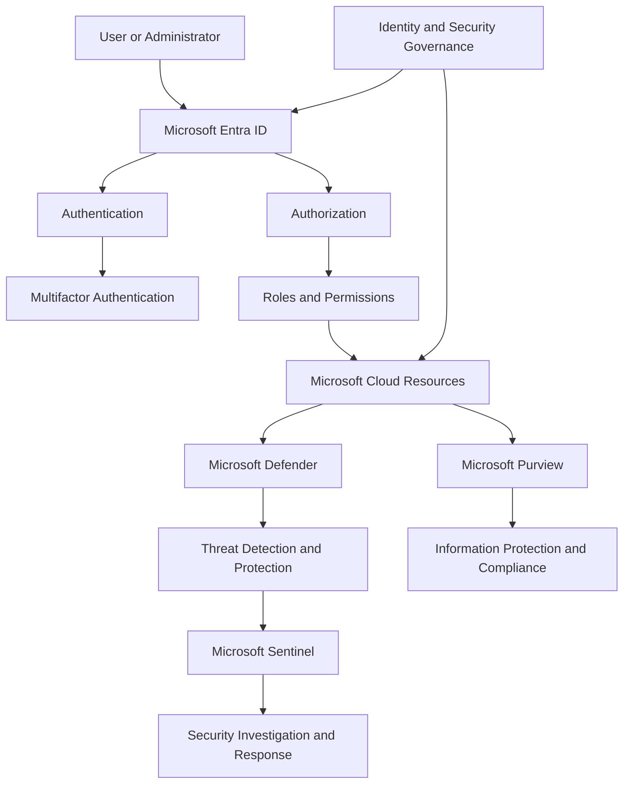

# Lab XX - Lab Title

## AI Use Disclosure

AI tools may be used to support learning, troubleshooting, documentation organization, technical review, and GitHub formatting during this lab.

All hands-on configuration, validation, screenshots, administrative decisions, and final documentation review must be completed by the project author. AI-generated guidance must be reviewed against Microsoft documentation and the observed behavior of the lab environment before being accepted.

---

## Lab Metadata

| Item | Value |
|---|---|
| Difficulty | Beginner / Intermediate |
| Estimated Time | XX-XX minutes |
| Lab Type | Discovery-only / Deployment and configuration |
| SC-900 Domain | Domain name |
| Previous Lab Dependency | Lab XX or None |
| Next Lab Dependency | Lab XX or None |

---

## Objective

Describe the primary technical and learning objectives of the lab.

By completing this lab, I:

- Reviewed or configured objective one
- Reviewed or configured objective two
- Reviewed or configured objective three
- Validated objective four
- Confirmed the final identity, security, compliance, resource, and cost state where applicable

> Update this section to reflect completed work. Use past tense and avoid listing actions that were not performed.

---

## Business Problem Solved

Explain:

- The current business, identity, security, or compliance challenge
- The operational, security, governance, regulatory, or financial risk created by the challenge
- The Microsoft security, compliance, identity, or Azure capability that addresses the requirement
- The expected technical and business outcome

Example:

Monroe Redstone Technology Group needed to understand or implement a Microsoft security, compliance, or identity capability before expanding its cloud environment.

Without the capability, the organization could experience:

- Excessive or unauthorized access
- Weak authentication controls
- Security exposure
- Limited threat visibility
- Data-protection gaps
- Compliance risk
- Inconsistent administration
- Weak governance
- Unexpected cost

This lab established the knowledge or configuration required to address those concerns.

---

## Scenario

Monroe Redstone Technology Group is strengthening its Microsoft cloud environment through secure identity, Zero Trust, threat protection, governance, and compliance practices.

In this lab, MRTG must:

- Requirement one
- Requirement two
- Requirement three
- Requirement four
- Validate the final environment or configuration state

State whether the lab was:

```text
Discovery-only
```

or:

```text
Deployment and configuration
```

For a discovery-only lab, use language such as:

> This was a discovery-only lab. No Microsoft cloud resources, identity objects, security policies, or compliance configurations were created or modified.

For a deployment lab, describe the identities, policies, resources, or configurations that were created or modified.

---

## Success Criteria

The lab is considered successful when:

- Required concepts have been reviewed
- Required configurations have been completed where applicable
- Expected identity, access, security, or compliance behavior has been validated
- No unnecessary privileged access remains
- No unnecessary billable resources remain
- Evidence has been captured and sanitized

---

## Prerequisites

Before beginning this lab, confirm:

- Required Microsoft tenant access is available
- Required licensing or trial features are available
- Required administrative role is assigned
- Previous lab dependencies are complete
- Required Azure subscription access is available where applicable

---

## Expected Starting State

Document the identities, roles, policies, licenses, resources, and previous-lab dependencies that should already exist before the lab begins.

---

## Required Permissions

| Permission or Role | Purpose | Required |
|---|---|---|
| Role name | Explain why the role is needed | Yes / No |

> Use the least-privileged role capable of completing the lab.

---

## Microsoft Services and Resources Used

| Microsoft Service, Resource, or Platform | Purpose |
|---|---|
| Microsoft Learn | Provided SC-900 certification-aligned instruction |
| Microsoft Entra admin center | Supported identity and access review or configuration where applicable |
| Microsoft Defender portal | Supported security review or configuration where applicable |
| Microsoft Purview portal | Supported compliance and information-protection review where applicable |
| Microsoft Sentinel | Supported SIEM/SOAR review or configuration where applicable |
| Azure Portal | Supported Azure security service review or configuration where applicable |
| Service Trust Portal | Supported compliance and assurance research where applicable |
| Azure Cost Management | Supported spending validation when Azure consumption resources were involved |
| Service or resource name | Explain how it was used |

> Remove services that were not used in the lab.

---

## Why These Services Were Used

### Microsoft Learn

Explain how Microsoft Learn supported:

- SC-900 certification-aligned instruction
- Concept review
- Service comparison
- Exam-objective preparation

### Microsoft Entra

Explain:

- What identity or access capability was used or reviewed
- Why it was selected
- Which requirement it satisfies
- Whether it was configured or reviewed only
- What least-privilege and licensing considerations apply

### Microsoft Defender

Explain:

- What Defender capability was used or reviewed
- What threat or security problem it addresses
- Whether it protects identities, endpoints, email, applications, workloads, or cloud resources
- How it contributes to prevention, detection, investigation, or response
- Whether it was configured or reviewed only

### Microsoft Sentinel

Explain:

- How Sentinel functions as a SIEM and SOAR platform
- Which security data could be collected
- How analytics, incidents, hunting, workbooks, or automation apply
- Whether Sentinel was deployed or reviewed only

### Microsoft Purview

Explain:

- What data-governance or compliance capability was reviewed
- What business or regulatory requirement it addresses
- How information is classified, protected, retained, investigated, or governed
- Whether it was configured or reviewed only

### Azure Portal

Explain how Azure Portal supported applicable security-service discovery, configuration, validation, monitoring, or cost review.

---

## Environment

| Item | Value |
|---|---|
| Organization | Monroe Redstone Technology Group |
| Project | MRTG Security, Compliance & Identity Fundamentals |
| Lab | Lab XX - Lab Title |
| Cloud Ecosystem | Microsoft Cloud |
| Identity Platform | Microsoft Entra |
| Security Platform | Microsoft Defender |
| Compliance Platform | Microsoft Purview |
| SIEM Platform | Microsoft Sentinel or Not Applicable |
| Azure Management Interface | Azure Portal or Not Applicable |
| Learning Platform | Microsoft Learn |
| Azure Subscription | Existing MRTG lab subscription or Not Applicable |
| Microsoft Entra Tenant | MRTG Lab Tenant |
| Primary Azure Region | Central US where applicable |
| Existing Resource Group | Resource group name or None |
| New Resource Group | Resource group name or None |
| Users Created | List users or None |
| Groups Created | List groups or None |
| Roles Assigned | List roles or None |
| Policies Created | List policies or None |
| Resources Created | List resources or None |
| Resources Modified | List resources or None |
| Resources Deleted | List resources or None |
| Evaluated Azure Spend | $0.00 where applicable |
| Documentation Platform | GitHub |
| Lab Type | Discovery-only or Deployment and configuration |
| Estimated Cost | $0.00 or estimated amount |

> Remove environment rows that do not apply to the lab.

### Resource Naming Convention

Use this section only when the lab creates or documents Azure resources.

```text
<resource-type>-<organization>-<project>-<lab>-<region>-<instance>
```

Example:

```text
rg-mrtg-sc900-labxx-centralus-001
```

### Identity Naming Convention

Use this section when test identities or groups are created.

```text
<organization>-<function>-<purpose>
```

Examples:

```text
MRTG-Security-Analysts
MRTG-Helpdesk
MRTG-Global-Readers
MRTG-Test-User01
```

### Required Azure Tags

Use only when tags are applied or reviewed.

| Tag | Value |
|---|---|
| `Project` | `MRTG-SC900-SCI-Fundamentals` |
| `Lab` | `Lab-XX` |
| `Environment` | `Lab` |
| `Owner` | `MRTG-Security-Operations` |
| `CostCenter` | `Training` |
| `ManagedBy` | `Azure-Portal` |
| `DeleteAfter` | `YYYY-MM-DD` |

---

## Architecture / Concept Diagram



Update the diagram to represent the actual users, groups, roles, authentication flows, Conditional Access controls, privileged access, resources, Defender capabilities, Sentinel data flows, Purview controls, governance relationships, monitoring, and compliance processes.

For discovery-only work, use a concept diagram instead of implying that resources or policies were deployed.

---

## Lab Safety and Change Control

Before modifying identity or security settings:

- Confirm the correct test account is being used
- Confirm the correct tenant and subscription
- Review the scope of the proposed change
- Avoid modifying production identities or policies
- Use report-only or non-enforcing modes where available
- Maintain an alternate administrative access path when appropriate
- Document the original configuration before changing it
- Define a rollback or cleanup procedure

---

## Steps Performed

### Step 1: Step Title

1. Opened the required Microsoft Learn module, portal, or administrative interface.
2. Navigated to the appropriate service or configuration page.
3. Reviewed or entered the required settings.
4. Confirmed the expected state.
5. Did not create or modify identities, resources, or policies unless required by the lab.

Configuration or observed state:

```text
Setting: Value
Setting: Value
Setting: Value
```


**Validation:** Explain what the screenshot confirms.

### Step 2: Step Title

1. Performed the required review or configuration.
2. Reviewed the relevant identity, security, or compliance properties.
3. Compared the observed result with the expected result.
4. Recorded the final state.

```text
Setting: Value
Setting: Value
Setting: Value
```


**Validation:** Explain what the screenshot confirms.

### Step 3: Step Title

1. Opened the relevant Microsoft service.
2. Reviewed its status and properties.
3. Confirmed the expected values.
4. Confirmed whether any changes were made.


**Validation:** Explain what the screenshot confirms.

> Add or remove steps to match the actual lab. Preserve the exact screenshot filenames used in the repository.

---

## Supporting Concept Summary

Use one or more supporting concept sections when the lab requires additional explanation.

Possible examples:

- Authentication vs Authorization
- Identity vs Account
- Microsoft Entra ID vs Active Directory Domain Services
- Zero Trust
- Least Privilege
- Defense in Depth
- Conditional Access
- Microsoft Entra Roles vs Azure RBAC
- PIM vs Permanent Privilege
- Identity Risk vs Sign-In Risk
- SIEM vs SOAR
- Defender Product Comparison
- Defender for Cloud vs Defender XDR
- Sensitivity Labels vs DLP
- Retention Policies vs Retention Labels
- Security vs Compliance
- Shared Responsibility

Example:

| Concept | Purpose |
|---|---|
| Authentication | Verifies who or what an identity is |
| Authorization | Determines what the authenticated identity can access |
| Least privilege | Limits permissions to only what is required |
| Zero Trust | Requires explicit verification rather than implicit trust |

---

## Evidence Collected

Evidence generated during this lab may include:

- Configuration screenshots
- Role-assignment evidence
- Sign-in or audit information
- Security recommendations
- Policy configuration
- Portal validation
- Architecture diagrams
- Cost validation
- Troubleshooting evidence

Explain what evidence was collected and what each item proves.

---

## Validation

| Validation Item | Expected Result | Actual Result |
|---|---|---|
| Service review | Required Microsoft service is located and reviewed | Passed |
| Identity review | Required identity configuration is confirmed | Passed / N/A |
| Authentication review | Required authentication control is documented | Passed / N/A |
| Authorization review | Required permission or role state is documented | Passed / N/A |
| Security review | Required security capability is reviewed | Passed / N/A |
| Compliance review | Required compliance capability is documented | Passed / N/A |
| Resource creation | Expected resources are created or no resources are created | Passed |
| Policy modification | Expected policy changes are completed or no changes are made | Passed |
| Cost validation | Final spending matches the lab estimate where applicable | Passed / N/A |
| Screenshot review | Sensitive information is redacted | Passed |

---

## Completion Checklist

Replace generic checklist items with actual actions completed.

- [x] Reviewed required Microsoft Learn content
- [x] Opened required Microsoft administrative portals
- [x] Reviewed or completed required configuration
- [x] Validated final service, identity, policy, or resource state
- [x] Confirmed whether identities were created or modified
- [x] Confirmed whether roles or permissions were assigned
- [x] Confirmed whether security policies were changed
- [x] Confirmed whether Azure resources were created
- [x] Reviewed authentication considerations
- [x] Reviewed authorization and least-privilege considerations
- [x] Reviewed Zero Trust principles
- [x] Reviewed governance considerations
- [x] Reviewed compliance considerations
- [x] Reviewed cost and licensing considerations where applicable
- [x] Sanitized screenshots before upload
- [x] Avoided exposing tenant, identity, subscription, or security information

---

## SC-900 Exam Objective Coverage

### Primary Exam Domain

Select the primary applicable domain:

```text
Describe the concepts of security, compliance, and identity
```

or:

```text
Describe the capabilities of Microsoft Entra
```

or:

```text
Describe the capabilities of Microsoft security solutions
```

or:

```text
Describe the capabilities of Microsoft compliance solutions
```

### Supporting Exam Domain

Add a supporting domain when applicable.

### Skills Measured

This lab supports the ability to:

- Describe the relevant security, compliance, or identity concept
- Explain the purpose of the Microsoft capability
- Compare related Microsoft services
- Explain the business requirement addressed by the capability
- Describe authentication and authorization considerations
- Describe Zero Trust and least-privilege considerations
- Describe governance and compliance considerations
- Identify where the capability is managed
- Recognize scenarios in which the capability should be used

### How This Lab Supports the Objectives

Explain:

- The SC-900 concepts demonstrated
- The services reviewed or configured
- The business requirements addressed
- The differences between similar Microsoft capabilities
- The identity, security, or compliance decisions an SC-900 candidate should understand
- How portal review or configuration connected theory to practical administration

---

## Mini Objective Coverage

By completing this lab, I can:

- Explain the purpose of the Microsoft service or capability
- Identify the business problem addressed
- Explain where the capability fits within Microsoft's security, compliance, and identity ecosystem
- Describe its authentication considerations
- Describe its authorization considerations
- Explain its Zero Trust relevance
- Explain its least-privilege relevance
- Describe its governance considerations
- Describe its compliance considerations
- Explain applicable cost or licensing considerations
- Compare it with relevant Microsoft alternatives
- Recognize scenarios in which the capability should be selected
- Locate the capability in the appropriate Microsoft portal
- Validate the service without making unnecessary changes

---

## Exam Traps and Key Distinctions

Document the distinctions most likely to cause confusion on the exam.

Examples:

### Authentication vs Authorization

- Authentication verifies identity.
- Authorization determines permitted access.

### Microsoft Entra ID vs Active Directory Domain Services

- Active Directory Domain Services is primarily an on-premises directory service.
- Microsoft Entra ID is Microsoft's cloud identity and access platform.

### Microsoft Sentinel vs Microsoft Defender XDR

- Microsoft Sentinel is a cloud-native SIEM and SOAR platform.
- Microsoft Defender XDR correlates security signals across Microsoft Defender products.

### Security vs Compliance

- Security focuses on protecting identities, systems, applications, and data.
- Compliance focuses on meeting defined requirements and demonstrating adherence.

> Keep only distinctions that apply to the lab.

---

## IAM / Security Relevance

This lab relates to applicable areas such as:

- Identity lifecycle
- Authentication
- Authorization
- Microsoft Entra ID
- Multifactor authentication
- Passwordless authentication
- Conditional Access
- Microsoft Entra roles
- Azure RBAC
- Least privilege
- Privileged Identity Management
- Access reviews
- Identity Protection
- Workload identities
- Zero Trust
- Defense in depth
- Threat detection
- Logging
- Monitoring
- Accountability
- Information protection

### On-Premises Connection

Use when the comparison adds value.

| On-Premises Concept | Microsoft Cloud Concept |
|---|---|
| Active Directory Domain Services identity | Microsoft Entra identity |
| Security group membership | Microsoft Entra group-based access |
| Domain administrative role | Microsoft Entra administrative role |
| Delegated administration | Scoped cloud role assignment |
| Group Policy | Conditional Access or Azure Policy depending on purpose |
| Windows event logs | Microsoft Defender, Azure Monitor, or Sentinel telemetry |
| Security monitoring | Microsoft Defender and Microsoft Sentinel |
| Data classification | Microsoft Purview information protection |

### Security Analysis

Explain:

- Which identity accesses or administers the service
- How the identity is authenticated
- How access is authorized
- Which role or scope controls the permission
- Whether permissions are inherited
- What the minimum required access should be
- Which privileged roles are involved
- Whether Conditional Access applies
- Whether MFA should be required
- Whether PIM would be appropriate
- What activity should be logged
- What production security controls would be added
- What sensitive information was redacted from screenshots

---

## Identity, Access, and Security Questions

Every lab should answer:

1. **Who or what is requesting access?**
2. **What grants that identity permission?**
3. **How would misuse or compromise be prevented, detected, or investigated?**

---

## Zero Trust Analysis

Use when applicable.

### Verify Explicitly

Explain how the environment verifies identity, authentication strength, device or session context, risk, and requested resource.

### Use Least Privilege

Explain which permissions are required, which are unnecessary, whether assignments should be permanent or temporary, and whether PIM or access reviews should be used.

### Assume Breach

Explain what activity should be monitored, how suspicious activity could be detected, which Microsoft security services would assist investigation, and what containment or response controls would be appropriate.

---

## Governance and Compliance Notes

Potential considerations include:

- Identity ownership
- Group ownership
- Administrative role assignment
- Role-assignment scope
- Privileged access
- Access reviews
- Conditional Access
- Security policy ownership
- Naming standards
- Resource tagging
- Change management
- Logging
- Monitoring
- Compliance requirements
- Data classification
- Retention
- DLP
- Auditability
- Resource lifecycle
- Cleanup responsibility
- Licensing
- Cost ownership

### Governance Decisions

| Decision | Implementation | Reason |
|---|---|---|
| Lab type | Discovery-only or deployment | Explain why |
| Identity scope | Narrowest practical scope | Reduces unnecessary access |
| Privilege | Least privilege | Limits security exposure |
| Authentication | MFA or appropriate method | Strengthens identity verification |
| Administrative access | PIM where applicable | Reduces standing privilege |
| Monitoring | Relevant Microsoft security capability | Improves detection and accountability |
| Screenshot review | Sensitive identifiers redacted | Protects environment information |
| Cleanup | Resources or test identities removed where required | Prevents abandoned access and cost |

### Governance Lesson

Summarize the primary governance lesson from the lab.

---

## Compliance Considerations

Use when applicable.

Potential considerations include:

- Regulatory requirements
- Data classification
- Sensitivity labels
- Data Loss Prevention
- Retention
- Records management
- Audit
- eDiscovery
- Insider risk
- Service assurance documentation
- Shared responsibility
- Data residency
- Privacy
- Access accountability

### Compliance Lesson

Summarize what the lab demonstrated about protecting information and proving that controls are operating as intended.

---

## Cost and Licensing Considerations

### Estimated Lab Cost

```text
Estimated cost: $0.00
```

or:

```text
Estimated cost: $0.00 to $X.XX
```

### Licensing

Document whether the capability:

- Was available in the current tenant
- Required a trial
- Required an additional Microsoft license
- Was reviewed only because licensing was unavailable
- Could create Azure consumption charges

### Common Cost Drivers

Potential factors include:

- Microsoft licensing
- Defender plan
- Sentinel data ingestion
- Log retention
- Azure resource type
- Service tier
- Region
- Runtime
- Storage
- Data transfer
- Monitoring
- Optional premium security features

### Azure Cost Validation

Use only for labs involving Azure consumption resources.

Document the observed budget, forecast, evaluated spend, and final resource state.

> Do not force Azure Cost Management into labs that do not create or use Azure consumption resources.

---

## Troubleshooting Notes

### Issue 1: Issue Title

**Symptom**

Describe the error, unexpected behavior, confusing portal state, permission issue, licensing limitation, or failed validation.

**Cause**

Explain the confirmed or likely cause.

**Resolution**

1. Performed troubleshooting action.
2. Reviewed the relevant identity, role, policy, license, or resource.
3. Applied the corrective action or documented the expected state.
4. Repeated validation.

**Result**

Describe the final outcome.

> Discovery-only labs can document licensing limitations, unavailable features, empty states, portal differences, similar service names, redaction requirements, or scope-related confusion.

---

## What I Would Do Differently in Production

A production implementation could include applicable controls such as:

### Identity and Access

- Separate administrator and standard-user accounts
- Microsoft Entra groups instead of direct assignments
- Privileged Identity Management
- Conditional Access
- Multifactor authentication
- Passwordless authentication
- Emergency-access accounts
- Regular access reviews
- Managed identities
- Workload identity governance

### Governance

- Formal approval workflows
- Role-assignment standards
- Required group ownership
- Access-review schedules
- Security-policy ownership
- Azure Policy
- Resource locks
- Required tags
- Approved regions
- Change management
- Documented exceptions

### Security

- Microsoft Defender XDR
- Defender for Cloud
- Microsoft Sentinel
- Centralized logging
- Threat detection
- Vulnerability management
- Network segmentation
- Private endpoints
- Secret management
- Incident-response procedures

### Compliance

- Sensitivity labels
- DLP policies
- Retention policies
- Records management
- Audit
- eDiscovery
- Insider Risk Management
- Formal compliance reporting

### Operations

- Alerting
- Security monitoring
- Identity lifecycle automation
- Incident-response procedures
- Service ownership
- Support escalation
- Periodic policy review
- Regular access certification

### Cost Management

- License optimization
- Sentinel ingestion controls
- Log-retention planning
- Workload-level budgets
- Forecast alerts
- Cost-center tags
- Resource-lifecycle management
- Scheduled cost reviews

Explain which controls apply to this lab and why they were not required in the learning environment.

---

## Lessons Learned

Key lessons from this lab include:

- Lesson one
- Lesson two
- Lesson three
- Lesson four
- Lesson five

### Technical Takeaway

Summarize the most important technical lesson.

### Business Takeaway

Summarize the business value of the Microsoft capability.

### IAM Takeaway

Summarize the identity, authentication, authorization, privilege, or access-management lesson.

### Security Takeaway

Summarize the threat prevention, detection, investigation, or response implication.

### Compliance Takeaway

Summarize the information-protection, governance, or regulatory implication where applicable.

### Exam Takeaway

Summarize what should be remembered for the SC-900 exam.

---

## Skills Demonstrated

This lab demonstrated practical experience with applicable skills including:

- Microsoft Entra administration
- Identity and access management
- Authentication
- Authorization
- Least privilege
- Zero Trust
- Microsoft security administration
- Security monitoring
- Compliance review
- Technical documentation
- Troubleshooting
- Change validation
- Security evidence collection

> Tailor this list to the actual work completed.

---

## Documentation Security Review

Before publishing this lab:

- [x] Tenant IDs were reviewed and redacted where necessary
- [x] Subscription IDs were reviewed and redacted where necessary
- [x] User principal names were reviewed
- [x] Email addresses were reviewed
- [x] Public IP addresses were reviewed
- [x] Authentication details were redacted
- [x] Secrets, keys, tokens, and certificates were not exposed
- [x] Billing information was redacted
- [x] Administrative account information was reviewed
- [x] Screenshots contained no unrelated sensitive browser tabs or notifications

---

## Cleanup

### Identities, Resources, or Configurations Retained

| Item | Reason |
|---|---|
| Name | Required for the next lab, portfolio evidence, or future validation |

### Items Removed

| Item | Reason |
|---|---|
| Name | No longer required and could create cost, privilege, or security risk |

### Cleanup Procedure

Use only when cleanup was required.

1. Opened the relevant Microsoft administrative portal.
2. Reviewed test identities, assignments, policies, resources, and dependencies.
3. Confirmed that no retained object depended on the item being removed.
4. Removed the unnecessary resource, role assignment, policy, group, or test identity.
5. Confirmed that the item no longer appeared or no longer granted access.
6. Reviewed remaining privileged assignments.
7. Reviewed Azure Cost Management where applicable.
8. Documented the final environment state.

### Cleanup Validation

- [x] Required identities and resources were retained
- [x] Unnecessary test accounts were removed or disabled
- [x] Unnecessary privileged assignments were removed
- [x] Unnecessary policies were removed or disabled
- [x] Unnecessary Azure resources were deleted
- [x] No unnecessary premium services remained enabled
- [x] Cost Management was reviewed where applicable
- [x] Final identity and security state was documented
- [x] Screenshot data was sanitized

---

## Outcome

This lab successfully demonstrated:

- Completed capability
- Completed capability
- Completed capability
- Completed capability
- Final validation result

The final environment or configuration met the defined:

- Technical requirements
- Identity requirements
- Security requirements
- Governance requirements
- Compliance requirements
- Cost-management requirements where applicable

The lab also established a practical connection between SC-900 concepts and their application within the Microsoft cloud ecosystem.

---

## Screenshot Inventory

| Screenshot | Description |
|---|---|
| `01-descriptive-screenshot-name.png` | Description of the first screenshot |
| `02-descriptive-screenshot-name.png` | Description of the second screenshot |
| `03-descriptive-screenshot-name.png` | Description of the third screenshot |
| `04-final-validation.png` | Final environment, security, or cost validation |

---

## Screenshots

### Screenshot One


### Screenshot Two


### Screenshot Three


### Final Validation


---

## Next Lab

Use this section for Labs 01 through 11.

The next lab is:

```text
Lab XX - Next Lab Title
```

The next lab builds on this work by examining:

- Next objective
- Next objective
- Next objective
- Next objective

---

## Series Completion

Use this section instead of **Next Lab** for Lab 12.

This lab completes the **MRTG Security, Compliance & Identity Fundamentals** project.

The completed series established practical foundations in:

- Security, compliance, and identity concepts
- Zero Trust
- Defense in depth
- Microsoft Entra ID
- Authentication
- Authorization
- Multifactor authentication
- Conditional Access
- Least privilege
- Microsoft Entra roles
- Azure RBAC
- Identity governance
- Privileged Identity Management
- Identity Protection
- Azure security capabilities
- Microsoft Defender
- Microsoft Defender for Cloud
- Microsoft Defender XDR
- Microsoft Sentinel
- Microsoft Purview
- Data protection
- Compliance
- Threat detection and response

The series also established a foundation for future work involving SC-300, advanced Microsoft Entra administration, hybrid identity, privileged access, Conditional Access engineering, Microsoft security operations, AZ-104, and regulated cloud environments.
