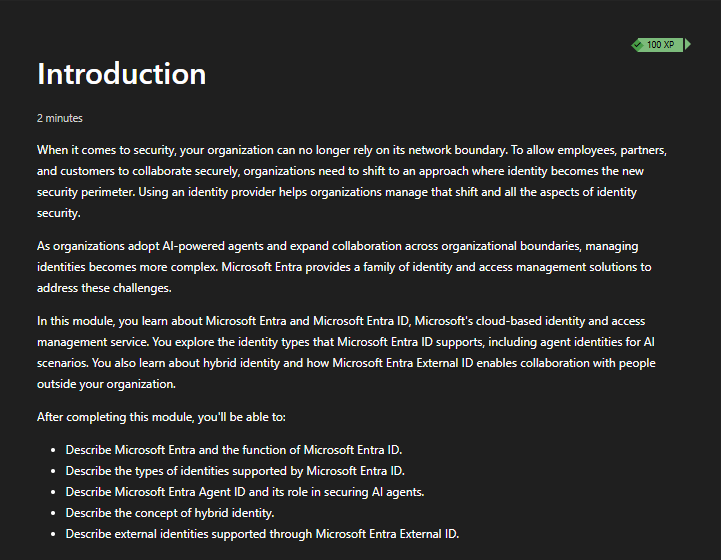
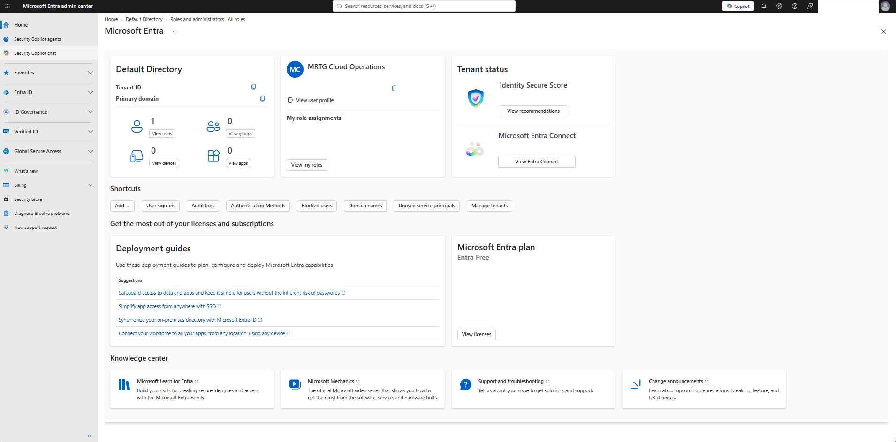
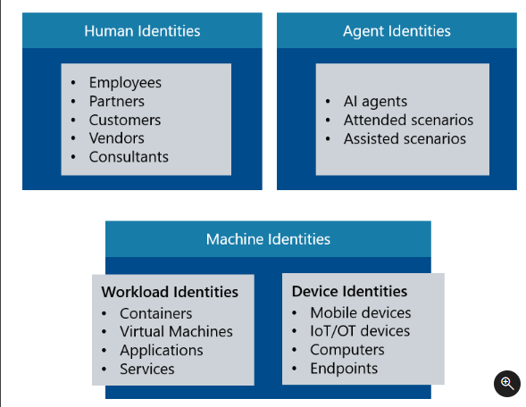
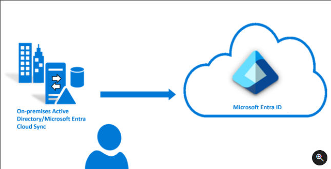

# Lab 02 - Microsoft Entra Identity

> **Status:** Complete

## AI Use Disclosure

AI tools may be used to support learning, troubleshooting, documentation organization, and technical review during this lab. All hands-on work, validation, screenshots, administrative decisions, and final documentation review will be completed by the project author. AI-generated guidance will be reviewed against Microsoft documentation and observed lab results before being accepted.

---

## Lab Metadata

| Item | Value |
|---|---|
| Difficulty | Beginner |
| Estimated Time | 2-3 hours |
| Lab Type | Microsoft Learn + read-only discovery |
| SC-900 Domain | Describe the capabilities of Microsoft Entra |
| Primary Objective | Describe function and identity types of Microsoft Entra ID |
| Previous Lab Dependency | Lab 01 - Security, Compliance, and Identity Foundations |
| Next Lab Dependency | Lab 03 - Authentication and Multifactor Authentication |

---

## Objective

Build a practical understanding of Microsoft Entra ID as Microsoft's cloud identity and access management platform and distinguish the major identity types it supports.

This lab covered:

- Microsoft Entra and the function of Microsoft Entra ID
- User identities
- Device identities
- Workload identities
- Applications and service principals
- Managed identities
- Microsoft Entra Agent ID and agent identities
- Groups
- Hybrid identity
- Microsoft Entra External ID and external identities

Authentication methods, MFA, Conditional Access, RBAC, identity protection, and identity governance are intentionally deferred to Labs 03-05 so each topic receives focused treatment.

---

## Business Problem Solved

Monroe Redstone Technology Group (MRTG) needs to understand the identity objects that exist in Microsoft Entra before it can safely design authentication, authorization, governance, or monitoring controls.

Without this foundation, MRTG could:

- Treat every identity as if it represents a human user
- Misunderstand how applications and services authenticate
- Confuse device identities with user identities
- Create unnecessary credentials instead of using managed identities
- Mismanage external collaboration
- Fail to account for hybrid identities spanning AD DS and Microsoft Entra ID
- Overlook emerging AI agent identities and their governance requirements

---

## Scenario

MRTG is reviewing its cloud identity architecture before implementing stronger authentication and access policies.

The organization must identify the different identity categories that may request access to resources and understand how Microsoft Entra ID represents people, devices, workloads, external users, hybrid users, and AI agents.

The lab combined Microsoft Learn with sanitized read-only discovery in the Microsoft Entra admin center. No production identities, access policies, or privileged assignments were created or modified solely for evidence collection.

---

## Success Criteria

The lab is successful when:

- The Microsoft Learn module **Describe the function and identity types of Microsoft Entra ID** is completed
- Microsoft Entra ID can be described in practical IAM terms
- User, device, workload, external, hybrid, and agent identities can be distinguished
- Applications, service principals, and managed identities can be differentiated
- System-assigned and user-assigned managed identities can be explained
- Security groups and Microsoft 365 groups can be distinguished at a foundational level
- Hybrid identity can be explained as a common identity spanning on-premises and cloud environments
- External identity can be related to cross-organization access scenarios
- Screenshots are sanitized before publication

---

## Prerequisites

- Completed Lab 01
- Access to Microsoft Learn
- General Azure and Microsoft 365 fundamentals
- Access to the Microsoft Entra admin center for discovery
- Access to the project GitHub repository

---

## Expected Starting State

- Lab 01 complete
- No Lab 02 configuration changes performed
- Microsoft Learn **Introduction to Microsoft Entra** learning path available
- No requirement to create real personal identities for evidence

---

## Required Permissions

| Permission or Role | Purpose | Required |
|---|---|---|
| Microsoft Learn account | Complete module and assessment | Yes |
| Microsoft Entra tenant access | Read-only/discovery activities | Recommended |
| Privileged Entra role | Not required for core lab | No |

Least privilege was used. No elevation was required simply to capture evidence.

---

## Services and Resources Used

| Service or Resource | Purpose |
|---|---|
| Microsoft Learn | SC-900 training content and module assessment |
| Microsoft Entra admin center | Read-only identity platform discovery |
| GitHub | Documentation and evidence storage |

---

## Why These Services Were Used

Microsoft Learn provided the official training path for the SC-900 Entra identity concepts. The Microsoft Entra admin center connected those concepts to the real administrative interface. GitHub provides a version-controlled portfolio record of the completed lab and sanitized evidence.

---

## Environment

```text
Organization: Monroe Redstone Technology Group (MRTG)
Lab mode: Microsoft Learn + read-only discovery
Azure consumption resources deployed: None
Identity configuration changes: None required
Estimated Azure consumption cost: $0.00
```

---

## Architecture / Concept Diagram

```text
Identity requesting access
        |
        +--> Human identity
        |
        +--> Device identity
        |
        +--> Workload identity
        |
        +--> External identity
        |
        +--> Hybrid identity
        |
        +--> Agent identity
                |
                v
        Microsoft Entra ID
                |
                v
      Authentication + authorization
                |
                v
          Approved resource
```

---

## Lab Safety and Change Control

- Confirm the correct Microsoft Entra tenant before portal activity.
- Prefer read-only discovery for this lab.
- Do not create real personal accounts solely for portfolio evidence.
- Do not assign privileged roles for screenshot purposes.
- Do not publish personal names, email addresses, UPNs, tenant IDs, object IDs, secrets, tokens, authentication details, or unnecessary security-posture information.
- Use fictional MRTG identities where examples are needed.
- Sanitize all screenshots before committing them to GitHub.
- Treat AI-generated guidance as secondary to Microsoft documentation and observed results.

---

## Steps Performed

1. Opened the Microsoft Learn module **Describe the function and identity types of Microsoft Entra ID** and captured the starting state.
2. Reviewed Microsoft Entra and the purpose of Microsoft Entra ID.
3. Reviewed human, machine, workload, device, and agent identity concepts.
4. Reviewed Microsoft Entra Agent ID and why AI agents require governed identities.
5. Reviewed hybrid identity and the relationship between on-premises AD DS and Microsoft Entra ID.
6. Reviewed external identity concepts and Microsoft Entra External ID.
7. Performed read-only discovery in the Microsoft Entra admin center.
8. Sanitized the Entra admin center screenshot to remove personal, tenant, privileged-role, and security-posture details not required for evidence.
9. Passed the Microsoft Learn module assessment.
10. Completed scenario-based knowledge checks covering identity types, application registrations, service principals, managed identities, groups, hybrid identity, external identity, and agent identity.
11. Clarified the distinction between a general service principal and an Azure managed identity for credential-free workload authentication.
12. Uploaded all five sanitized screenshots and verified the expected evidence files in the repository.

---

## Supporting Concept Summary

### Identity Type Matrix

| Identity Type | What It Represents | MRTG Example |
|---|---|---|
| User identity | A human user | Employee signing in to Microsoft 365 |
| Device identity | A registered or joined device | Windows laptop represented in Entra |
| Workload identity | A non-human software workload | Application or service accessing Azure resources |
| External identity | A user from outside MRTG | Contractor using an existing organization identity |
| Hybrid identity | Identity represented across on-premises and cloud environments | AD DS user provisioned or synchronized to Entra ID |
| Agent identity | An AI agent requiring governed access | Support agent retrieving approved Microsoft service data |

### Application Registration vs. Service Principal

```text
Application registration = application definition / blueprint
Service principal        = tenant-local identity / instance of that application
```

The application registration describes the application. The service principal is the representation in a tenant that can be granted permissions and access.

### Managed Identities

A managed identity is an Azure-managed identity for a workload. It removes the need for developers or administrators to manually store and rotate application credentials for supported Azure scenarios.

| Type | Lifecycle | Reuse |
|---|---|---|
| System-assigned managed identity | Tied to one Azure resource and removed with that resource | Not shared across resources |
| User-assigned managed identity | Exists as an independent Azure resource | Can be assigned to multiple supported resources |

For an Azure-hosted application accessing Key Vault, a managed identity is preferable to storing a client secret because Azure manages the underlying credential lifecycle.

### Security Groups vs. Microsoft 365 Groups

| Group Type | Primary Purpose |
|---|---|
| Security group | Control access to resources, applications, and permissions |
| Microsoft 365 group | Support user collaboration across Microsoft 365 services |

### Hybrid Identity

Hybrid identity connects an identity across on-premises AD DS and Microsoft Entra ID.

```text
On-premises AD DS identity
        |
        v
Provisioning / synchronization
        |
        v
Microsoft Entra ID identity
```

The goal is a connected identity experience rather than treating the same person as unrelated identities in each environment.

### External Identity

External identity allows approved users outside MRTG to access resources using identities they already have rather than requiring MRTG to create and maintain a separate username and password for every external collaborator.

Benefits include reducing credential sprawl, administrative overhead, and stale account risk while preserving MRTG control over resource access.

### Agent Identity

AI agents should have their own governed identities rather than operating through an employee account. This allows MRTG to authenticate the agent, grant only required permissions, monitor its activity, and remove access independently.

The core security principle is:

```text
Least privilege
```

---

## Evidence Collected

The following sanitized evidence was captured, uploaded, and verified in the repository:

| Screenshot | Evidence |
|---|---|
| [`00-entra-identity-module-starting-state.png`](screenshots/00-entra-identity-module-starting-state.png) | Microsoft Learn module starting state and objectives |
| [`01-entra-admin-center-overview.png`](screenshots/01-entra-admin-center-overview.png) | Sanitized Microsoft Entra admin center overview |
| [`02-entra-identity-types.png`](screenshots/02-entra-identity-types.png) | Identity-type model covering human, agent, workload, and device identities |
| [`03-hybrid-identity.png`](screenshots/03-hybrid-identity.png) | Hybrid identity relationship between on-premises AD DS and Microsoft Entra ID |
| [`04-entra-function-identity-types-module-complete.png`](screenshots/04-entra-function-identity-types-module-complete.png) | Passed module assessment and module completion |

### Screenshot 00 - Module Starting State



### Screenshot 01 - Microsoft Entra Admin Center



### Screenshot 02 - Identity Types



### Screenshot 03 - Hybrid Identity



### Screenshot 04 - Module Complete


---

## Validation

Validation was performed through the Microsoft Learn assessment, scenario-based knowledge checks, read-only portal discovery, and repository evidence verification.

| Validation Item | Result |
|---|---|
| Microsoft Learn identity-types module | Completed |
| Module assessment | Passed |
| User vs. device vs. workload identities | Correctly distinguished |
| External, hybrid, and agent identities | Correctly distinguished |
| Application registration vs. service principal | Correctly distinguished |
| System-assigned vs. user-assigned managed identity | Correctly distinguished |
| Security group vs. Microsoft 365 group | Correctly distinguished |
| Managed identity for credential-free Azure workload access | Correctly identified after clarification |
| Sanitized Entra admin center evidence | Captured and reviewed |
| Required screenshot files | Present in repository |

---

## Completion Checklist

- [x] Capture starting-state screenshot
- [x] Complete Microsoft Entra identity-types module
- [x] Pass module assessment
- [x] Perform sanitized Entra admin center discovery
- [x] Complete identity-type knowledge checks
- [x] Complete application/service-principal knowledge check
- [x] Complete managed-identity knowledge check
- [x] Complete group knowledge check
- [x] Complete hybrid-identity knowledge check
- [x] Complete external-identity knowledge check
- [x] Complete agent-identity knowledge check
- [x] Upload sanitized screenshots
- [x] Perform final repository evidence review
- [x] Mark Lab 02 complete

---

## SC-900 Exam Objective Coverage

### Primary Exam Domain

```text
Describe the capabilities of Microsoft Entra
```

### Primary Skill Area

```text
Describe function and identity types of Microsoft Entra ID
```

This lab supports the ability to:

- Describe Microsoft Entra ID
- Describe identity types supported by Microsoft Entra ID
- Describe agent identities and Microsoft Entra Agent ID at a foundational level
- Describe hybrid identity
- Recognize external identity concepts

---

## Mini Objective Coverage

| Objective | Demonstrated Through |
|---|---|
| Microsoft Entra ID purpose | Learn module and Entra admin center discovery |
| Identity types | Identity-type diagram and scenario matching |
| Application identity | Application registration vs. service principal knowledge check |
| Managed identity | System/user-assigned comparison and Key Vault scenario |
| Groups | Security vs. Microsoft 365 group scenario |
| Hybrid identity | AD DS-to-Entra concept and evidence screenshot |
| External identity | Contractor access scenario |
| Agent identity | AI agent least-privilege scenario |

---

## Exam Traps and Key Distinctions

- An identity is not always a human user.
- Device identities and user identities represent different security subjects.
- An application registration is the application definition; a service principal is the tenant-local representation that can receive access.
- A managed identity is a workload identity managed by Azure and is designed to avoid manual credential handling in supported scenarios.
- System-assigned managed identities follow the lifecycle of one resource; user-assigned managed identities have independent lifecycles and can be reused.
- Security groups focus on access control; Microsoft 365 groups focus on collaboration.
- Hybrid identity spans on-premises and cloud identity environments.
- External identity reduces the need to create separate MRTG credentials for every outside collaborator.
- AI agents should be governed as identities and granted least privilege.

---

## IAM / Security Relevance

A core IAM question is:

```text
Who or what is requesting access?
```

In Microsoft Entra, the answer may be a human user, device, application, managed identity, external identity, hybrid identity, or AI agent. Correctly identifying the security principal is necessary before selecting authentication, authorization, governance, and monitoring controls.

---

## On-Premises Connection

Traditional AD DS provides identity and directory services for on-premises Windows environments. Microsoft Entra ID provides cloud identity and access management. Hybrid identity connects these environments so organizations can support users and resources that span both on-premises and cloud services.

---

## Security Analysis

The major risks highlighted by this lab include:

- Treating all identities as human users
- Giving workloads long-lived secrets when a managed identity is available
- Granting excessive permissions to service principals or agents
- Failing to govern external identities
- Confusing device trust with user authorization
- Losing visibility into identities that span on-premises and cloud environments

The security response is to identify the requesting principal, authenticate it appropriately, apply least privilege, and monitor its lifecycle and access.

---

## Zero Trust Analysis

Lab 02 applies Zero Trust to every identity type:

- **Verify explicitly:** identify and authenticate the user, device, workload, external user, hybrid identity, or agent requesting access.
- **Use least privilege:** grant only the permissions needed for the intended task.
- **Assume breach:** monitor identity behavior and plan for compromise or misuse of any identity type.

---

## Governance and Compliance Notes

Identity governance begins with knowing which identities exist and why they need access. Human users, external collaborators, workloads, devices, and AI agents may require different lifecycle, review, ownership, and monitoring processes.

Later labs build on this foundation with access management, identity protection, privileged access, and governance controls.

---

## Cost and Licensing Considerations

```text
Estimated Azure consumption cost: $0.00
```

The core lab used Microsoft Learn and read-only Microsoft Entra discovery. No Azure consumption resources were deployed.

Some Microsoft Entra capabilities discussed later in the series may require premium licensing, but premium licensing was not required simply to understand the identity types covered in this lab.

---

## Troubleshooting / Learning Corrections

The main distinction requiring clarification during the knowledge checks was the Key Vault workload-authentication scenario.

A general service principal can represent an application, but when an Azure-hosted workload should authenticate without storing or manually managing a client secret, the stronger answer is a **managed identity**. Managed identities are represented through service principals while Azure manages the credential lifecycle.

---

## What I Would Do Differently in Production

In a production environment, MRTG would:

- Maintain documented owners for workload and agent identities
- Prefer managed identities over stored secrets where supported
- Review service-principal permissions regularly
- Apply lifecycle controls to external identities
- Separate administrative identities from normal user identities
- Use formal access reviews and monitoring for sensitive identities
- Avoid granting permissions simply because an identity exists in the directory

---

## Lessons Learned

- Microsoft Entra manages far more than employee user accounts.
- Identity type determines which authentication, authorization, and governance controls make sense.
- Service principals and managed identities are closely related but are not interchangeable terms.
- Managed identities reduce credential-management risk for supported Azure workloads.
- Hybrid and external identity solve different problems.
- AI agents should be treated as governed security principals rather than extensions of a human account.

---

## Skills Demonstrated

- Microsoft Entra ID fundamentals
- Identity-type classification
- Workload identity fundamentals
- Application registration and service-principal concepts
- Managed identity concepts
- Group-type differentiation
- Hybrid identity fundamentals
- External identity fundamentals
- AI agent identity fundamentals
- Least-privilege reasoning
- Read-only Microsoft Entra admin center discovery
- Screenshot sanitization and security-focused documentation
- SC-900 objective mapping

---

## Cleanup

No Azure consumption resources, identities, policies, or role assignments were created for this lab, so no technical cleanup was required.

The screenshots folder retains only the sanitized evidence selected for publication.

---

## Documentation Security Review

The published evidence was reviewed before repository use.

The Entra admin center screenshot was sanitized to remove information not required to demonstrate the lab, including personal account details, tenant-specific identifiers, privileged-role details, and security-posture values.

Final review criteria included removal or avoidance of:

- Personal email addresses
- User principal names
- Tenant IDs
- Primary tenant domains
- Object or principal identifiers
- Privileged-role details
- Security score values
- Authentication secrets or tokens
- Unnecessary tenant security-status details

No passwords, secrets, tokens, private keys, or authentication credentials were intentionally published.

---

## Outcome

Lab 02 successfully established the Microsoft Entra identity model that the remaining identity-focused SC-900 labs will build on.

MRTG can now distinguish the major identity types represented in Microsoft Entra, explain the relationship between application registrations and service principals, identify when managed identities reduce credential-management risk, and connect hybrid, external, and agent identities to practical IAM decisions.

```text
Lab 02 Result: COMPLETE
```

---

## Next Lab

```text
Lab 03 - Authentication and Multifactor Authentication
```

Lab 03 continues the Microsoft Entra learning path with authentication methods, MFA, password protection and management, and related authentication capabilities.
