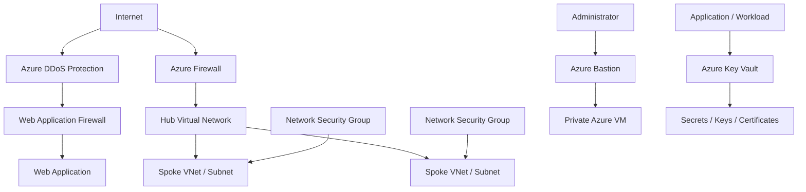
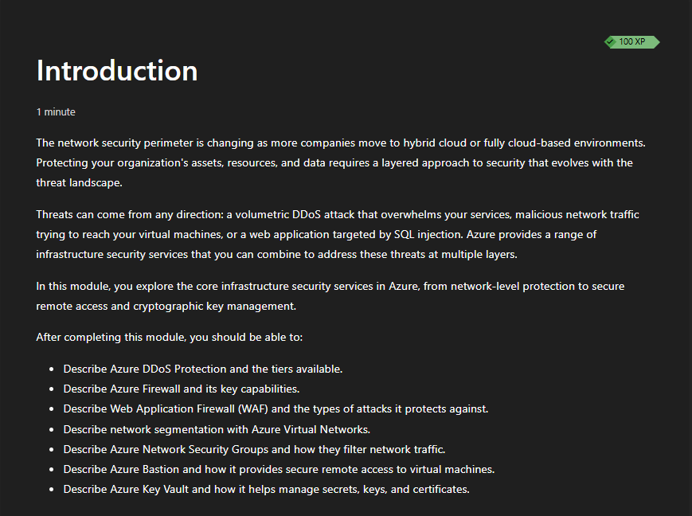
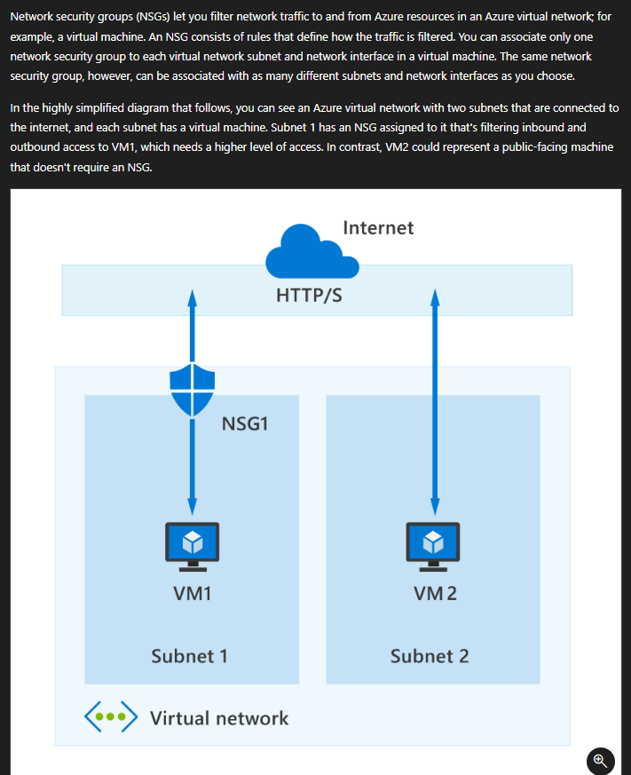
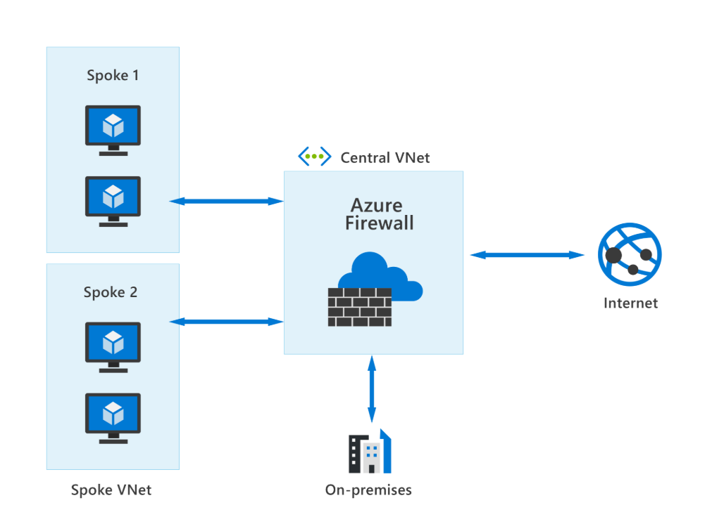
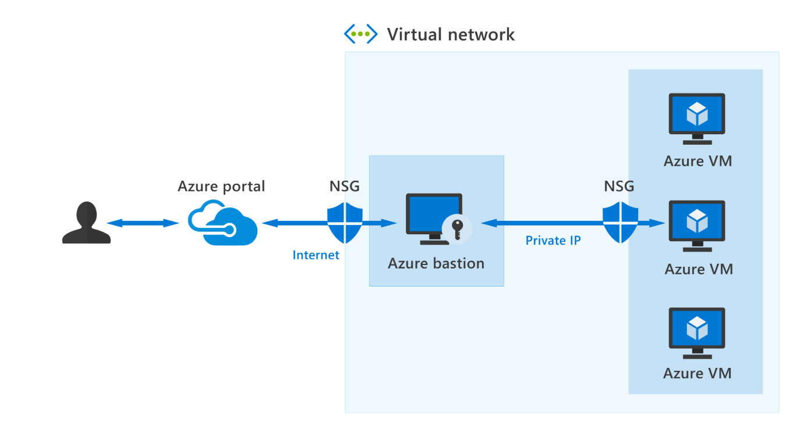
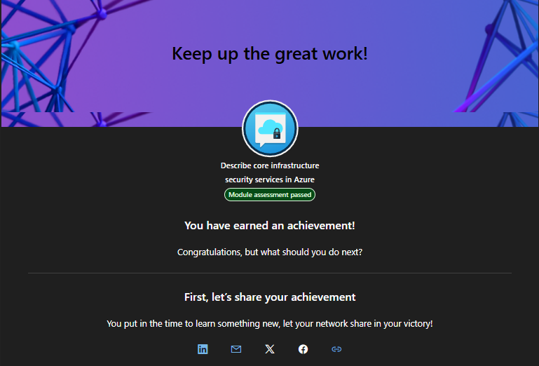

# Lab 06 - Azure Infrastructure Security

> **Status:** Complete

## AI Use Disclosure

AI tools may be used to support learning, troubleshooting, documentation organization, technical review, and GitHub formatting during this lab.

All hands-on configuration, validation, screenshots, administrative decisions, and final documentation review must be completed by the project author. AI-generated guidance must be reviewed against Microsoft documentation and the observed behavior of the lab environment before being accepted.

---

## Lab Metadata

| Item | Value |
|---|---|
| Difficulty | Beginner |
| Estimated Time | 2-3 hours |
| Lab Type | Microsoft Learn + discovery-only |
| SC-900 Domain | Describe the capabilities of Microsoft security solutions |
| Primary Objective | Describe core infrastructure security services in Azure |
| Previous Lab Dependency | Lab 05 - Identity Governance |
| Next Lab Dependency | Lab 07 - Microsoft Defender for Cloud |

---

## Objective

Build a practical understanding of Azure infrastructure security capabilities and explain how defense in depth protects networks, applications, management access, secrets, and workloads.

By completing this lab, I:

- Reviewed defense-in-depth concepts for Azure infrastructure
- Reviewed Network Security Groups (NSGs) and network segmentation
- Reviewed Azure DDoS Protection
- Reviewed Azure Firewall
- Reviewed Web Application Firewall (WAF)
- Reviewed Azure Bastion
- Reviewed Azure Key Vault
- Distinguished related Azure network-security controls
- Completed read-only Azure Portal discovery
- Passed the Microsoft Learn module assessment and scenario-based knowledge checks
- Confirmed that no Azure consumption resources were created for the core lab

---

## Business Problem Solved

Monroe Redstone Technology Group (MRTG) needs to protect Azure-hosted workloads from network attacks, unauthorized administrative access, web threats, exposed secrets, and weak segmentation.

Without layered infrastructure security, MRTG could experience:

- Overly permissive network access
- Unnecessary public exposure
- Distributed denial-of-service impact
- Weak control of inbound and outbound traffic
- Web application attacks
- Direct exposure of management ports
- Insecure storage of secrets, keys, and certificates
- Excessive reliance on a single security control

This lab established the knowledge required to select and explain Azure infrastructure security services without deploying unnecessary billable resources.

---

## Scenario

MRTG has already established identity, authentication, authorization, Conditional Access, and identity-governance fundamentals.

The organization must now understand the Azure infrastructure controls that protect workloads after identities and permissions have been established.

MRTG needs to understand how to:

- Segment Azure networks
- Filter network traffic
- Protect internet-facing workloads from DDoS attacks
- Centrally inspect and control network traffic
- Protect web applications at the application layer
- Secure administrative access to virtual machines
- Protect sensitive secrets, keys, and certificates
- Apply multiple security layers rather than relying on a single control

```text
Discovery-only
```

This was a discovery-only lab. No Azure infrastructure resources, firewall policies, DDoS plans, Bastion deployments, Key Vaults, or other security configurations were created or modified solely for portfolio evidence.

---

## Success Criteria

The lab was considered successful because:

- The Microsoft Learn module **Describe core infrastructure security services in Azure** was completed
- The module assessment was passed
- Defense in depth was explained
- NSGs were distinguished from Azure Firewall
- DDoS Protection was explained
- WAF was distinguished from general network-firewall controls
- Azure Bastion was explained as a secure management-access capability
- Azure Key Vault was explained for secrets, keys, and certificates
- Read-only Azure Portal discovery was completed
- Eight scenario-based knowledge checks were passed
- Evidence was sanitized and uploaded
- No Azure consumption resources were created for the core lab

---

## Prerequisites

Before beginning this lab, the following were available:

- Completed Lab 05
- Access to Microsoft Learn
- Access to the Azure Portal for read-only discovery
- General Azure networking fundamentals
- Understanding of identity, authorization, least privilege, and Zero Trust
- Access to the project GitHub repository

No privileged Azure role assignment was required solely for this discovery-focused lab.

---

## Expected Starting State

- Lab 05 complete
- Existing MRTG Azure lab environment available for discovery where applicable
- No Lab 06 security resources deployed solely for portfolio evidence
- No firewall, NSG, DDoS, WAF, Bastion, or Key Vault changes required
- Microsoft Learn module available
- Screenshot directory available in the repository

---

## Required Permissions

| Permission or Role | Purpose | Required |
|---|---|---|
| Microsoft Learn account | Complete module and assessment | Yes |
| Azure Portal access | Read-only security-service discovery | Recommended |
| Azure subscription administrative role | Not required for core discovery | No |

The lab followed least privilege and did not request elevated Azure access solely to inspect services.

---

## Microsoft Services and Resources Used

| Microsoft Service, Resource, or Platform | Purpose |
|---|---|
| Microsoft Learn | SC-900 certification-aligned infrastructure-security instruction and assessment |
| Azure Portal | Read-only discovery of Azure infrastructure-security services |
| Network Security Groups | Reviewed inbound and outbound traffic filtering concepts |
| Azure DDoS Protection | Reviewed distributed denial-of-service protection concepts |
| Azure Firewall | Reviewed centralized managed network-security concepts |
| Web Application Firewall | Reviewed application-layer web protection concepts |
| Azure Bastion | Reviewed secure RDP and SSH management-access concepts |
| Azure Key Vault | Reviewed secure storage of secrets, keys, and certificates |
| GitHub | Stored documentation and sanitized lab evidence |

---

## Why These Services Were Used

### Microsoft Learn

Microsoft Learn provided SC-900-aligned instruction covering the purpose of Azure infrastructure-security services, how the services differ, and which security problems each service addresses.

### Azure Portal

Azure Portal supported read-only discovery of the service locations and management experiences for NSGs, Azure Firewall, DDoS Protection, WAF-related services, Azure Bastion, and Azure Key Vault.

The portal review connected certification concepts to the administrative interface without requiring deployment of billable resources.

### Network Security Groups

NSGs were reviewed because they provide rule-based filtering for inbound and outbound network traffic associated with Azure network interfaces and subnets.

### Azure Firewall

Azure Firewall was reviewed because it provides centralized, managed network-security controls for Azure network traffic and is commonly used in hub-and-spoke architectures.

### Azure DDoS Protection

DDoS Protection was reviewed because internet-facing workloads can be targeted by distributed denial-of-service attacks that attempt to exhaust network or application availability.

### Web Application Firewall

WAF was reviewed because web applications require application-layer protection against common HTTP/S attacks such as SQL injection and cross-site scripting.

### Azure Bastion

Azure Bastion was reviewed because administrative RDP and SSH access should not require exposing virtual machines directly to the internet through public management ports.

### Azure Key Vault

Key Vault was reviewed because credentials, secrets, cryptographic keys, and certificates should be protected in a dedicated secrets-management service rather than embedded in code or configuration files.

---

## Environment

| Item | Value |
|---|---|
| Organization | Monroe Redstone Technology Group |
| Project | MRTG Security, Compliance & Identity Fundamentals |
| Lab | Lab 06 - Azure Infrastructure Security |
| Cloud Ecosystem | Microsoft Cloud |
| Azure Management Interface | Azure Portal |
| Learning Platform | Microsoft Learn |
| Azure Subscription | Existing MRTG lab subscription used for discovery where applicable |
| New Resource Group | None |
| Users Created | None |
| Groups Created | None |
| Roles Assigned | None |
| Policies Created | None |
| Resources Created | None |
| Resources Modified | None |
| Resources Deleted | None |
| Evaluated Azure Spend | $0.00 for discovery-only work |
| Documentation Platform | GitHub |
| Lab Type | Discovery-only |
| Estimated Cost | $0.00 |

---

## Architecture / Concept Diagram



This is a conceptual architecture only. The diagram does not imply that these resources were deployed during the lab.

---

## Lab Safety and Change Control

Before any Azure security modification, the following controls were applied:

- Confirmed the correct Azure environment before discovery
- Avoided changing production or lab security controls
- Used read-only discovery wherever practical
- Did not deploy Azure Firewall solely for evidence
- Did not create a DDoS Protection plan solely for evidence
- Did not deploy Azure Bastion solely for evidence
- Did not create a Key Vault solely for evidence
- Did not alter NSG or WAF policies
- Did not expose public management ports
- Avoided publishing subscription IDs, tenant IDs, public IP addresses, secrets, keys, certificates, or administrative details
- Reviewed screenshots before publication

---

## Steps Performed

### Step 1: Review Module Objectives

1. Opened the Microsoft Learn module **Describe core infrastructure security services in Azure**.
2. Reviewed the module objectives covering DDoS Protection, Azure Firewall, WAF, virtual networks, NSGs, Bastion, and Key Vault.
3. Captured the module starting state.



**Validation:** The screenshot confirms the correct SC-900 Azure infrastructure-security module and learning objectives.

### Step 2: Review Network Security Groups

1. Reviewed how NSGs filter inbound and outbound traffic with security rules.
2. Reviewed the relationship between NSGs, subnets, network interfaces, and network segmentation.
3. Compared NSGs with centralized firewall services.



**Validation:** The screenshot demonstrates traffic filtering and the placement of an NSG in an Azure network architecture.

### Step 3: Review Azure Firewall

1. Reviewed Azure Firewall as a managed, centralized network-security service.
2. Reviewed the hub-and-spoke design shown in Microsoft Learn.
3. Identified how spoke networks can route traffic through a central firewall before reaching external destinations.



**Validation:** The screenshot demonstrates the role of Azure Firewall in a centralized hub-and-spoke network design.

### Step 4: Review Azure Bastion

1. Reviewed Azure Bastion as a secure management-access service.
2. Reviewed how administrators can connect to Azure virtual machines using RDP or SSH without requiring public IP addresses on the target VMs.
3. Connected Bastion to the principle of reducing unnecessary public exposure.



**Validation:** The screenshot demonstrates administrative access through Bastion to private Azure virtual machines.

### Step 5: Review Supporting Infrastructure Security Services

1. Reviewed Azure DDoS Protection concepts.
2. Reviewed Web Application Firewall and its application-layer focus.
3. Reviewed Azure Key Vault for secure storage of secrets, keys, and certificates.
4. Reviewed virtual networks and subnets as segmentation boundaries.
5. Completed read-only Azure Portal discovery of the relevant service areas without creating resources.

### Step 6: Complete Assessment and Knowledge Checks

1. Passed the Microsoft Learn module assessment.
2. Completed scenario-based knowledge checks covering DDoS Protection, NSGs, Azure Firewall, Bastion, Key Vault, WAF, network segmentation, and defense in depth.
3. Captured the completed module state.



**Validation:** The screenshot confirms that the module assessment was passed and the module was completed.

---

## Supporting Concept Summary

### Defense in Depth

Defense in depth uses multiple security layers so that the failure or bypass of one control does not expose the entire environment.

For Azure infrastructure, these layers can include:

```text
Identity
   ↓
Network segmentation
   ↓
Traffic filtering
   ↓
Application-layer protection
   ↓
Secure administrative access
   ↓
Secrets and key protection
   ↓
Monitoring and response
```

### Network Security Groups vs Azure Firewall

| Capability | Network Security Group | Azure Firewall |
|---|---|---|
| Primary purpose | Filter network traffic with security rules | Centralized managed network security |
| Typical scope | Subnet or network interface | Central network architecture / multiple workloads |
| Traffic control | Allow and deny rules | Centralized firewall policy and traffic filtering |
| Common design use | Local segmentation | Hub-and-spoke and centralized egress/ingress control |

NSGs and Azure Firewall can complement each other as separate layers rather than being mutually exclusive.

### Azure Firewall vs Web Application Firewall

| Service | Primary Security Focus |
|---|---|
| Azure Firewall | Network traffic control across Azure networks |
| Web Application Firewall | HTTP/S web-application traffic and common web attacks |

WAF is specifically designed for web-application threats. Azure Firewall provides broader network-level traffic protection and centralized control.

### DDoS Protection

Azure DDoS Protection helps defend Azure resources from distributed denial-of-service attacks intended to overwhelm service availability.

DDoS protection is not a substitute for firewalling, WAF, identity security, or secure application design.

### Azure Bastion

Azure Bastion reduces the need to expose virtual machines directly through public RDP or SSH endpoints.

The security benefit is straightforward:

```text
Administrator
     ↓
Azure Bastion
     ↓
Private VM
```

### Azure Key Vault

Azure Key Vault provides centralized protection for sensitive material such as:

- Secrets
- Cryptographic keys
- Certificates

Applications should retrieve protected values using controlled access rather than storing them directly in source code or plaintext configuration.

---

## Evidence Collected

| Screenshot | Evidence |
|---|---|
| `00-azure-security-module-starting-state.png` | Microsoft Learn starting state and module objectives |
| `01-azure-network-security-groups.png` | NSG traffic filtering and segmentation concept |
| `02-azure-firewall.png` | Azure Firewall hub-and-spoke architecture concept |
| `03-azure-bastion.png` | Secure administrative access to private Azure VMs |
| `04-azure-security-module-complete.png` | Passed module assessment and completion |

The final set intentionally uses concept-focused Microsoft Learn screenshots rather than publishing tenant-specific Azure security configuration.

---

## Validation

| Validation Item | Expected Result | Actual Result |
|---|---|---|
| Microsoft Learn module | Correct Azure infrastructure-security module reviewed | Passed |
| Module assessment | Assessment completed successfully | Passed |
| DDoS knowledge check | Identify Azure DDoS Protection | Passed |
| NSG knowledge check | Identify inbound/outbound rule-based traffic filtering | Passed |
| Azure Firewall knowledge check | Identify centralized managed network security | Passed |
| Bastion knowledge check | Identify secure RDP/SSH access without public VM IPs | Passed |
| Key Vault knowledge check | Identify protection of secrets, keys, and certificates | Passed |
| WAF knowledge check | Identify web-application-layer protection | Passed |
| Segmentation knowledge check | Explain virtual networks and subnets as segmentation controls | Passed |
| Defense-in-depth knowledge check | Explain layered security controls | Passed |
| Azure Portal discovery | Relevant services reviewed without deployment | Passed |
| Resource creation | No resources created for the core lab | Passed |
| Security-policy modification | No policies modified | Passed |
| Azure consumption cost | No consumption resources deployed for core lab | $0.00 |
| Screenshot security review | Final evidence set sanitized | Passed |

---

## Completion Checklist

- [x] Capture starting-state screenshot
- [x] Review defense in depth
- [x] Review NSGs
- [x] Review Azure DDoS Protection
- [x] Review Azure Firewall
- [x] Review Web Application Firewall
- [x] Review Azure Bastion
- [x] Review Azure Key Vault
- [x] Review virtual networks and segmentation
- [x] Pass module assessment
- [x] Complete Azure security discovery
- [x] Complete eight knowledge checks
- [x] Upload sanitized screenshots
- [x] Verify all five screenshots in the repository
- [x] Confirm no Azure resources were created or modified
- [x] Confirm no unnecessary privileged access was used
- [x] Review Zero Trust and defense-in-depth relevance
- [x] Review cost considerations
- [x] Perform final repository evidence review
- [x] Mark Lab 06 complete

---

## SC-900 Exam Objective Coverage

### Primary Exam Domain

```text
Describe the capabilities of Microsoft security solutions
```

### Skills Measured

This lab supports the ability to:

- Describe Azure DDoS Protection
- Describe Azure Firewall
- Describe Web Application Firewall
- Describe network segmentation with Azure Virtual Networks
- Describe Network Security Groups
- Describe Azure Bastion
- Describe Azure Key Vault
- Explain defense in depth
- Compare related Azure infrastructure-security services
- Recognize which capability fits a given security scenario

### How This Lab Supports the Objectives

The lab connected SC-900 terminology to practical Azure security architecture.

It demonstrated that an SC-900 candidate should understand not only the name of each service, but also the security problem it is designed to solve and how it differs from adjacent controls.

---

## Mini Objective Coverage

By completing this lab, I can:

- Explain defense in depth
- Explain the purpose of NSGs
- Explain the purpose of Azure DDoS Protection
- Explain the purpose of Azure Firewall
- Explain the purpose of WAF
- Explain the purpose of Azure Bastion
- Explain the purpose of Azure Key Vault
- Explain network segmentation with VNets and subnets
- Distinguish NSGs from Azure Firewall
- Distinguish WAF from Azure Firewall
- Explain why Bastion reduces public management exposure
- Explain why secrets should be stored in Key Vault rather than application code
- Locate the relevant capabilities in Azure Portal
- Validate the services without unnecessary deployment
- Explain the cost implications of deploying consumption-based Azure security services

---

## Exam Traps and Key Distinctions

### NSG vs Azure Firewall

- An NSG provides rule-based traffic filtering at subnet or network-interface scope.
- Azure Firewall is a centralized managed network-security service.
- They can be used together as separate defense-in-depth layers.

### Azure Firewall vs WAF

- Azure Firewall controls broader network traffic.
- WAF is specifically designed to protect web applications and HTTP/S traffic from common application-layer attacks.

### DDoS Protection vs Firewall

- DDoS Protection addresses denial-of-service attacks intended to overwhelm availability.
- A firewall controls network traffic according to security policy.
- One does not replace the other.

### Bastion vs Public RDP / SSH

- Bastion provides managed RDP/SSH connectivity to Azure VMs without requiring public IP addresses on the target VMs.
- Directly exposing RDP or SSH to the internet increases attack surface.

### Key Vault vs General Storage

- Key Vault is designed for secrets, cryptographic keys, and certificates.
- It should not be confused with general file or object storage.

### Segmentation vs Complete Isolation

- VNets and subnets provide segmentation boundaries.
- Segmentation still requires appropriate routing, NSGs, firewall rules, identity controls, and other security layers.

---

## IAM / Security Relevance

Identity security answers:

```text
Who is requesting access, and what are they authorized to do?
```

Infrastructure security adds:

```text
How can the resource be reached, what traffic is allowed, how is administrative access performed, and how are sensitive credentials protected?
```

Strong security requires both.

Examples include:

- Microsoft Entra and Azure RBAC controlling who can administer infrastructure
- NSGs and Azure Firewall controlling network paths
- Bastion reducing exposure of administrative protocols
- Key Vault protecting secrets used by workloads and administrators
- WAF protecting internet-facing web applications

---

## On-Premises Connection

The concepts in this lab map directly to traditional enterprise infrastructure.

| Azure Capability | Comparable On-Premises Concept |
|---|---|
| VNet / subnet | Network segmentation and VLAN design |
| NSG | Host or network ACL-style traffic filtering |
| Azure Firewall | Central enterprise firewall |
| WAF | Web application firewall / reverse-proxy security layer |
| Bastion | Jump server / hardened administrative access host |
| Key Vault | Enterprise secrets-management or HSM-backed key-management system |
| DDoS Protection | Upstream DDoS mitigation service |

Cloud implementation changes the management model, but the underlying security objectives remain familiar: segmentation, controlled traffic flow, secure administration, and protection of credentials and cryptographic material.

---

## Security Analysis

The major risks addressed by this lab are:

### Excessive Network Exposure

Broadly open NSGs or direct public endpoints can increase the attack surface. Network access should be restricted to the minimum required sources, destinations, ports, and protocols.

### Central Traffic-Control Gaps

Large environments can become difficult to govern if each workload is managed independently. Centralized firewall controls can provide more consistent network policy.

### Application-Layer Attacks

A general network firewall does not eliminate the need for web-application protection. WAF adds application-layer inspection for HTTP/S workloads.

### Management-Port Exposure

Public RDP and SSH endpoints attract password-spraying, credential attacks, and automated scanning. Bastion reduces this exposure by providing a managed access path to private VMs.

### Secret Exposure

Embedding passwords, keys, or certificates in source code or configuration files creates unnecessary credential risk. Key Vault centralizes protection and controlled retrieval.

### Single-Control Dependency

No single Azure security service protects every layer. Defense in depth combines identity, network, application, management, data, secrets, and monitoring controls.

---

## Zero Trust Analysis

Lab 06 reinforces the three Zero Trust principles:

- **Verify explicitly:** identity and authorization should be validated before administrative or application access is permitted.
- **Use least-privilege access:** network rules, management paths, and permissions should allow only the access required.
- **Assume breach:** segmentation, firewalls, WAF, Bastion, and protected secrets limit blast radius if another control fails or an identity becomes compromised.

Zero Trust does not eliminate network security. It combines identity-aware decisions with layered infrastructure controls.

---

## Governance and Compliance Notes

Production Azure infrastructure security should include governance for:

- Approved network architectures
- NSG rule ownership and review
- Firewall-policy change control
- Internet-facing application inventory
- WAF policy ownership
- DDoS protection requirements for critical public services
- Administrative access standards
- Prohibition or review of public RDP and SSH exposure
- Key and secret ownership
- Secret rotation and certificate lifecycle
- Logging and monitoring requirements
- Resource tagging and ownership
- Cost approval for premium or consumption-based security services

These controls help establish repeatable security practices and provide evidence that infrastructure protection is managed rather than ad hoc.

---

## Cost and Licensing Considerations

```text
Estimated Azure consumption cost for this lab: $0.00
```

No Azure consumption resources were deployed during the core lab.

Services such as Azure Firewall, DDoS Protection, Azure Bastion, and related infrastructure capabilities can generate Azure charges when deployed. Production or future hands-on deployment should include current pricing review, architecture justification, cost monitoring, and cleanup planning before resources are created.

The discovery-first approach avoided unnecessary cost while still meeting the SC-900 learning objective.

---

## Troubleshooting

No material technical problems were encountered during the core lab.

The main implementation consideration was deciding whether infrastructure services needed to be deployed for portfolio evidence. Because the SC-900 objective is conceptual and several services can incur Azure charges, Microsoft Learn evidence and read-only Azure Portal discovery were sufficient.

This avoided unnecessary deployment, public exposure, policy changes, and cleanup work.

---

## What I Would Do Differently in Production

A production deployment would require architecture and risk analysis before configuration.

MRTG should:

- Build a documented VNet and subnet segmentation model
- Apply least-permissive NSG rules
- Centralize traffic inspection where architecture justifies Azure Firewall
- Protect public web applications with an appropriate WAF design
- Evaluate DDoS protection based on workload criticality and exposure
- Avoid direct public RDP and SSH where Bastion or another controlled management path is available
- Store application secrets, keys, and certificates in Key Vault
- Use Microsoft Entra identities and Azure RBAC for administrative authorization
- Enable appropriate logging and monitoring
- Review changes through formal change control
- Validate pricing before deploying billable services
- Test recovery and rollback procedures

---

## Lessons Learned

- Infrastructure security is strongest when multiple layers work together.
- NSGs provide localized network traffic filtering, while Azure Firewall provides centralized managed network security.
- WAF addresses web-application attacks and should not be confused with a general network firewall.
- DDoS protection focuses on availability attacks rather than normal firewall policy enforcement.
- Bastion reduces the need to expose VM management ports directly to the internet.
- Key Vault centralizes protection for secrets, cryptographic keys, and certificates.
- Network segmentation limits unnecessary communication paths and helps reduce blast radius.
- Identity controls and network controls complement one another.
- A discovery-only lab can demonstrate SC-900 understanding without deploying unnecessary billable resources.

---

## Skills Demonstrated

- Azure infrastructure-security fundamentals
- Defense-in-depth analysis
- Azure Virtual Network segmentation concepts
- Network Security Group concepts
- Azure DDoS Protection concepts
- Azure Firewall architecture concepts
- Web Application Firewall concepts
- Azure Bastion concepts
- Azure Key Vault concepts
- Network-security service comparison
- Secure administrative-access analysis
- Secrets-management awareness
- Zero Trust analysis
- Azure Portal discovery
- Cloud-cost awareness
- Security-conscious evidence collection
- Scenario-based SC-900 knowledge validation

---

## Cleanup

No Azure infrastructure-security resources or policies were created or modified during the core lab.

Therefore:

```text
Resources to delete: None
Policies to revert: None
Role assignments to remove: None
Estimated ongoing lab cost: $0.00
```

Temporary local screenshots should be removed after sanitized versions are confirmed in the repository.

---

## Documentation Security Review

The final screenshot set was reviewed to avoid intentionally exposing:

- Tenant IDs
- Subscription IDs
- Resource IDs
- Public IP addresses
- Administrative account details
- Network-security rules tied to a real tenant
- Firewall policy details
- Secrets, keys, certificates, or tokens
- Billing information
- Unnecessary browser or account information

The final evidence is concept-focused and does not reveal sensitive MRTG tenant configuration.

---

## Outcome

Lab 06 successfully established the Azure infrastructure-security foundation required for SC-900.

MRTG can now explain how network segmentation, NSGs, DDoS Protection, Azure Firewall, WAF, Bastion, and Key Vault address different infrastructure-security requirements and how those services combine as part of a defense-in-depth architecture.

**Lab 06 status: Complete.**

---

## Screenshot Inventory

| Screenshot | Status | Purpose |
|---|---|---|
| `00-azure-security-module-starting-state.png` | Included | Microsoft Learn module objectives and starting state |
| `01-azure-network-security-groups.png` | Included | NSG traffic filtering and network segmentation concept |
| `02-azure-firewall.png` | Included | Centralized Azure Firewall hub-and-spoke architecture |
| `03-azure-bastion.png` | Included | Secure administrative connectivity to private Azure VMs |
| `04-azure-security-module-complete.png` | Included | Passed assessment and module completion |

---

## Next Lab / Series Completion

```text
Lab 07 - Microsoft Defender for Cloud
```

Lab 07 will move from foundational Azure infrastructure controls into cloud security posture management, Secure Score, security recommendations, and workload protection with Microsoft Defender for Cloud.
