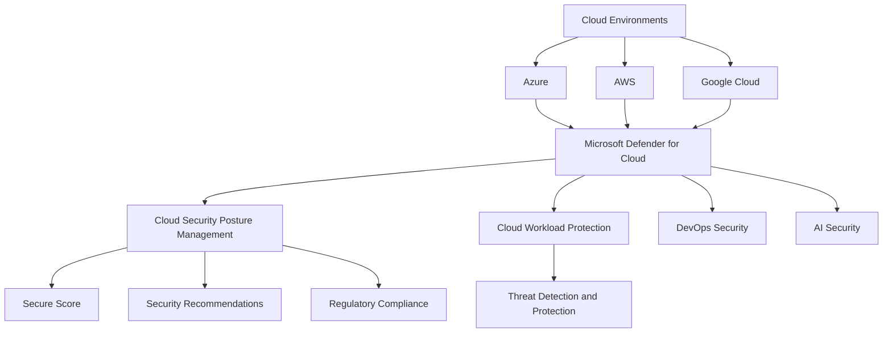
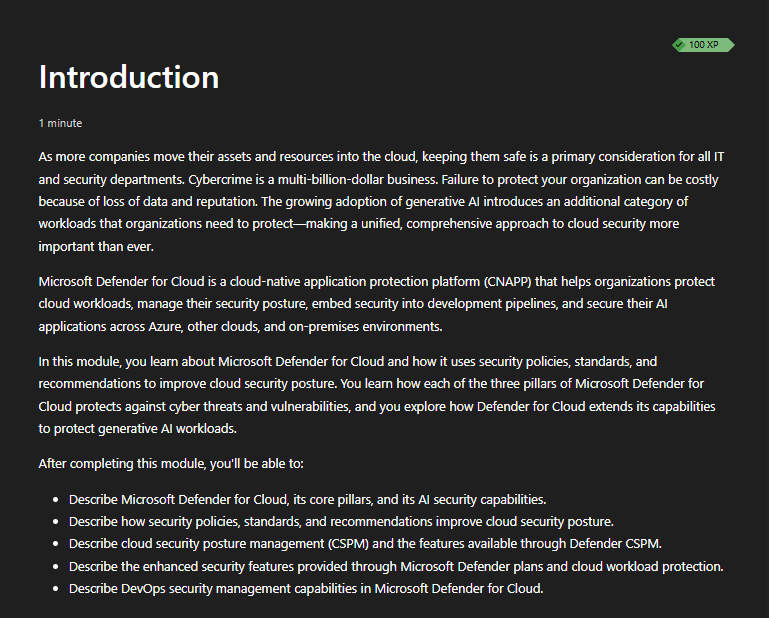
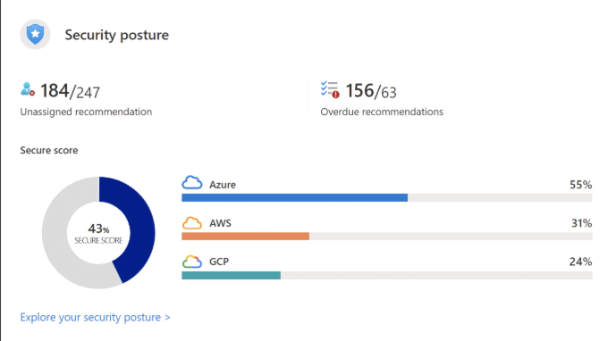
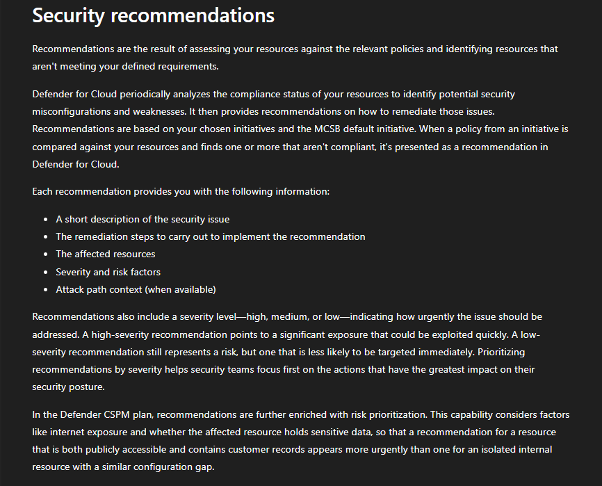
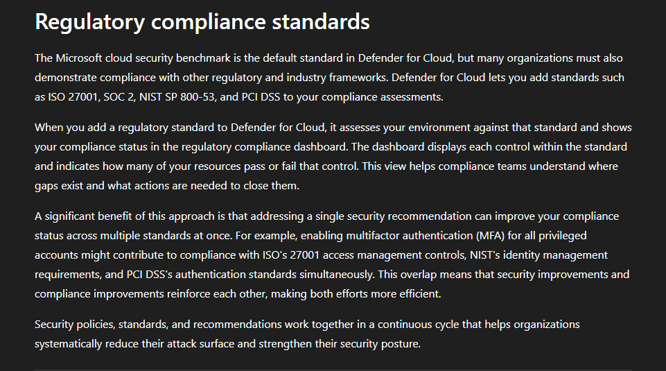
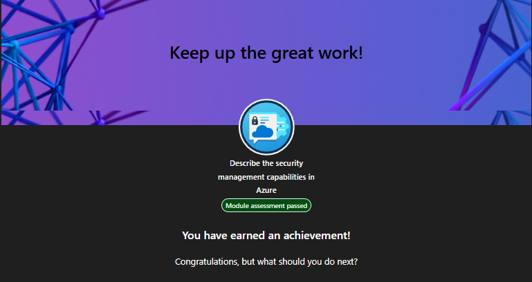

# Lab 07 - Microsoft Defender for Cloud

> **Status:** Complete

## AI Use Disclosure

AI tools may be used to support learning, troubleshooting, documentation organization, technical review, and GitHub formatting during this lab.

All hands-on configuration, validation, screenshots, administrative decisions, and final documentation review must be completed by the project author. AI-generated guidance must be reviewed against Microsoft documentation and the observed behavior of the lab environment before being accepted.

---

## Lab Metadata

| Item | Value |
|---|---|
| Difficulty | Beginner |
| Estimated Time | 2-3 hours |
| Lab Type | Microsoft Learn + read-only discovery |
| SC-900 Domain | Describe the capabilities of Microsoft security solutions |
| Primary Objective | Describe the security management capabilities in Azure with Microsoft Defender for Cloud |
| Previous Lab Dependency | Lab 06 - Azure Infrastructure Security |
| Next Lab Dependency | Lab 08 - Microsoft Sentinel |

---

## Objective

Build a practical understanding of Microsoft Defender for Cloud and explain how it supports cloud-native application protection, cloud security posture management, workload protection, compliance assessment, and security prioritization across Azure and multicloud environments.

By completing this lab, I:

- Reviewed Microsoft Defender for Cloud as a cloud-native application protection platform (CNAPP)
- Reviewed Cloud Security Posture Management (CSPM)
- Reviewed Secure Score
- Reviewed security recommendations and risk-based prioritization
- Reviewed regulatory compliance capabilities
- Reviewed Defender plans and cloud workload protection concepts
- Reviewed multicloud coverage across Azure, AWS, and Google Cloud
- Reviewed AI security and DevOps security management concepts included in the current Microsoft Learn module
- Completed read-only Defender for Cloud discovery
- Passed the Microsoft Learn assessment and eight scenario-based knowledge checks
- Confirmed that no paid Defender plan was enabled solely for the lab

---

## Business Problem Solved

Monroe Redstone Technology Group (MRTG) needs a centralized way to continuously assess cloud security posture, identify weaknesses, prioritize remediation, understand compliance gaps, and protect cloud workloads.

Without centralized cloud security posture management and workload protection, MRTG could experience:

- Misconfigured cloud resources
- Weak security baselines
- Poor visibility into security recommendations
- Difficulty prioritizing remediation work
- Limited regulatory-compliance visibility
- Inconsistent workload protection
- Delayed detection of attacks against cloud resources
- Fragmented security management across cloud providers
- Gaps between preventive posture management and active threat protection

This lab established the knowledge required to explain how Defender for Cloud addresses those concerns without enabling unnecessary paid capabilities.

---

## Scenario

MRTG has completed foundational Azure infrastructure-security review and now needs to understand how Microsoft Defender for Cloud evaluates security posture and helps protect workloads.

MRTG must be able to:

- Understand its security posture at a high level
- Identify security weaknesses and misconfigurations
- Prioritize remediation work based on risk
- Compare security posture against standards and compliance controls
- Understand the difference between CSPM and workload protection
- Recognize Defender for Cloud as a multicloud security platform
- Understand where AI and DevOps security capabilities fit in the current product scope

```text
Discovery-only
```

This was a discovery-only lab. No Defender plan, security policy, compliance standard, workload-protection feature, or Azure resource was enabled or modified solely for portfolio evidence.

---

## Success Criteria

The lab was considered successful because:

- The Microsoft Learn module **Describe the security management capabilities in Azure** was completed
- The module assessment was passed
- Microsoft Defender for Cloud was explained as a CNAPP
- CSPM was explained
- Secure Score was explained
- Security recommendations were explained
- Regulatory compliance capabilities were explained at an SC-900 level
- CSPM was distinguished from cloud workload protection
- Multicloud coverage was explained
- Risk-based prioritization was explained
- Current module concepts for AI security and DevOps security management were reviewed
- Read-only Defender for Cloud discovery was completed
- Eight knowledge checks were passed
- Evidence was sanitized and uploaded

---

## Prerequisites

Before beginning this lab, the following were available:

- Completed Lab 06
- Access to Microsoft Learn
- Azure Portal / Microsoft Defender for Cloud access for read-only discovery
- General Azure security and infrastructure-security fundamentals
- Understanding of Zero Trust, least privilege, and defense in depth
- Access to the project GitHub repository

---

## Expected Starting State

- Lab 06 complete
- Microsoft Learn module available
- No Defender plan enabled solely for Lab 07
- No security policy or regulatory-compliance configuration created for Lab 07
- No new Azure resources required
- Defender for Cloud available for read-only discovery where tenant and subscription access allowed

---

## Required Permissions

| Permission or Role | Purpose | Required |
|---|---|---|
| Microsoft Learn account | Complete module and assessment | Yes |
| Defender for Cloud / Azure Portal read access | Read-only discovery | Recommended |
| Subscription Owner or high-privilege Azure role | Not required for core lab | No |

Least privilege was maintained. No elevated Azure role was requested solely to create evidence.

---

## Microsoft Services and Resources Used

| Microsoft Service, Resource, or Platform | Purpose |
|---|---|
| Microsoft Learn | SC-900-aligned Defender for Cloud instruction and assessment |
| Microsoft Defender for Cloud | Read-only review of posture, recommendations, compliance, plans, and workload-protection concepts |
| Azure Portal | Administrative discovery where applicable |
| GitHub | Documentation and sanitized evidence storage |

---

## Why These Services Were Used

### Microsoft Learn

Microsoft Learn provided certification-aligned instruction covering Defender for Cloud, CNAPP, CSPM, Secure Score, recommendations, workload protection, multicloud security, regulatory compliance, AI security, and DevOps security management.

### Microsoft Defender for Cloud

Defender for Cloud was reviewed because it combines cloud security posture management with workload-protection capabilities and supports security management across multicloud environments.

The discovery experience connected SC-900 concepts to the operational interface without requiring premium plan activation.

### Azure Portal

Azure Portal supported read-only navigation to Defender for Cloud areas such as overview, Secure Score, recommendations, regulatory compliance, environment settings, and workload-protection views.

---

## Environment

| Item | Value |
|---|---|
| Organization | Monroe Redstone Technology Group |
| Project | MRTG Security, Compliance & Identity Fundamentals |
| Lab | Lab 07 - Microsoft Defender for Cloud |
| Cloud Ecosystem | Microsoft Cloud |
| Security Platform | Microsoft Defender for Cloud |
| Azure Management Interface | Azure Portal |
| Learning Platform | Microsoft Learn |
| Lab Type | Discovery-only |
| Defender Plans Enabled for Lab | None |
| Security Policies Modified | None |
| Compliance Standards Modified | None |
| Azure Resources Created | None |
| Azure Resources Modified | None |
| Azure Resources Deleted | None |
| Estimated Azure Consumption Cost | $0.00 for discovery-only work |
| Documentation Platform | GitHub |

---

## Architecture / Concept Diagram



This is a conceptual diagram only. It does not imply that all integrations or paid capabilities were enabled during the lab.

---

## Lab Safety and Change Control

- Confirmed the correct environment before discovery.
- Used read-only review wherever practical.
- Did not enable paid Defender plans solely for evidence.
- Did not modify policy assignments.
- Did not dismiss or remediate recommendations in production resources.
- Did not change regulatory-compliance settings.
- Did not change workload-protection settings.
- Did not create Azure resources for the core lab.
- Avoided publishing tenant IDs, subscription IDs, resource IDs, security alerts, attack paths, affected resource names, or administrative identities.
- Used concept-focused Microsoft Learn screenshots for portfolio evidence.

---

## Steps Performed

### Step 1: Review Current Module Scope

1. Opened the Microsoft Learn module **Describe the security management capabilities in Azure**.
2. Reviewed the current learning objectives.
3. Confirmed that the module includes Defender for Cloud as a CNAPP, core pillars, AI security, security policies and recommendations, CSPM, enhanced security features, and DevOps security management.
4. Captured the starting state.



**Validation:** The screenshot confirms the current module scope used for this lab.

### Step 2: Review Secure Score

1. Reviewed Secure Score as a posture-management indicator.
2. Reviewed how Defender for Cloud summarizes security posture.
3. Reviewed multicloud posture context across Azure, AWS, and Google Cloud.



**Validation:** The screenshot demonstrates the relationship between Defender for Cloud, security posture, Secure Score, and multicloud visibility.

### Step 3: Review Security Recommendations

1. Reviewed how Defender for Cloud evaluates resources against security policies and initiatives.
2. Reviewed security recommendations generated from identified weaknesses and misconfigurations.
3. Reviewed remediation guidance, severity, affected-resource context, and risk factors.
4. Reviewed how risk context can help prioritize remediation.



**Validation:** The screenshot demonstrates how recommendations help convert posture findings into prioritized remediation work.

### Step 4: Review Regulatory Compliance

1. Reviewed regulatory-compliance concepts in Defender for Cloud.
2. Reviewed the Microsoft cloud security benchmark as a security standard.
3. Reviewed examples of additional standards such as ISO 27001, SOC 2, NIST SP 800-53, and PCI DSS as presented in the learning content.
4. Connected security recommendations to compliance-control improvement.



**Validation:** The screenshot demonstrates how Defender for Cloud can assess cloud resources against security and compliance standards.

### Step 5: Complete Defender for Cloud Discovery

1. Reviewed the Defender for Cloud overview / cloud overview.
2. Reviewed Security posture / Secure Score.
3. Reviewed Recommendations.
4. Reviewed Regulatory compliance.
5. Reviewed Environment settings / Defender plans without enabling paid plans.
6. Reviewed workload-protection areas where visible.
7. Reviewed DevOps security and AI security areas where available.
8. Made no configuration changes solely for evidence.

### Step 6: Complete Assessment and Knowledge Checks

1. Passed the Microsoft Learn module assessment.
2. Completed eight scenario-based knowledge checks.
3. Captured the module completion state.



**Validation:** The screenshot confirms that the module assessment was passed and the module was completed.

---

## Supporting Concept Summary

### Microsoft Defender for Cloud as a CNAPP

A Cloud-Native Application Protection Platform (CNAPP) combines multiple cloud-security capabilities in one security platform.

At an SC-900 level, Defender for Cloud brings together capabilities such as:

- Cloud security posture management
- Workload protection
- Security recommendations
- Risk prioritization
- Regulatory-compliance assessment
- Multicloud security management
- DevOps security capabilities
- AI security capabilities in the current product scope

### CSPM

Cloud Security Posture Management focuses on finding and reducing weaknesses in cloud configuration and security posture.

Typical CSPM questions include:

```text
What is misconfigured?
What security controls are missing?
What should be fixed first?
How does the environment compare with security standards?
```

### Secure Score

Secure Score provides a high-level measurement of security posture and helps teams understand where improvements can be made.

It is a prioritization and posture-management tool, not proof that an environment is completely secure.

### Security Recommendations

Recommendations identify security weaknesses or misconfigurations and provide remediation guidance.

They can include information such as:

- Severity
- Affected resources
- Risk factors
- Remediation steps
- Relevant attack-path context

### Regulatory Compliance

Regulatory-compliance capabilities map resource assessments to security and compliance standards so teams can identify failed or incomplete controls and understand where remediation can improve posture.

### CSPM vs Workload Protection

| Capability | Primary Purpose |
|---|---|
| CSPM | Improve cloud security posture and reduce misconfiguration risk |
| Cloud workload protection | Protect running cloud workloads against threats |

The two capabilities are complementary: posture management is preventive and risk-reduction focused, while workload protection addresses active threat protection for workloads.

### Multicloud

Defender for Cloud can support security posture management across Azure, AWS, and Google Cloud environments, helping reduce fragmented cloud-security management.

---

## Evidence Collected

| Screenshot | Evidence |
|---|---|
| `00-defender-for-cloud-module-starting-state.png` | Current Microsoft Learn module scope and objectives |
| `01-defender-for-cloud-secure-score.png` | Secure Score, posture-management, and multicloud concept |
| `02-defender-for-cloud-recommendations.png` | Security recommendations, remediation, and prioritization concept |
| `03-defender-for-cloud-regulatory-compliance.png` | Regulatory-compliance and security-standard assessment concept |
| `04-defender-for-cloud-module-complete.png` | Passed module assessment and completion |

---

## Validation

| Validation Item | Expected Result | Actual Result |
|---|---|---|
| Microsoft Learn module | Correct Defender for Cloud module completed | Passed |
| Module assessment | Assessment completed successfully | Passed |
| Defender for Cloud purpose | Identify posture management and workload protection | Passed |
| Secure Score | Explain security-posture measurement and improvement | Passed |
| Security recommendations | Explain remediation guidance for identified weaknesses | Passed |
| Regulatory compliance | Explain standards-based control assessment | Passed |
| CSPM vs workload protection | Distinguish posture management from active workload protection | Passed |
| Multicloud | Recognize Azure, AWS, and Google Cloud coverage | Passed |
| CNAPP | Explain combined cloud-security capabilities | Passed |
| Risk prioritization | Identify Secure Score and risk-based recommendations | Passed |
| Read-only Defender for Cloud discovery | Completed without paid-plan activation | Passed |
| Azure resource creation | No resources created | Passed |
| Screenshot security review | Final evidence sanitized | Passed |

---

## Completion Checklist

- [x] Capture starting-state screenshot
- [x] Review Defender for Cloud overview
- [x] Review CNAPP concept
- [x] Review CSPM
- [x] Review Secure Score
- [x] Review security recommendations
- [x] Review regulatory compliance
- [x] Review Defender plans and workload protection
- [x] Review multicloud coverage
- [x] Review AI security concept from current module
- [x] Review DevOps security management concept from current module
- [x] Pass module assessment
- [x] Complete read-only Defender for Cloud discovery
- [x] Complete eight knowledge checks
- [x] Upload sanitized screenshots
- [x] Verify all five screenshot files in the repository
- [x] Confirm no paid Defender plan was enabled for evidence
- [x] Confirm no security policy or resource changes were made
- [x] Perform final repository evidence review
- [x] Mark Lab 07 complete

---

## SC-900 Exam Objective Coverage

### Primary Exam Domain

```text
Describe the capabilities of Microsoft security solutions
```

### Skills Measured

This lab supports the ability to:

- Describe Microsoft Defender for Cloud
- Describe Cloud Security Posture Management
- Describe Secure Score
- Describe security policies, standards, and recommendations
- Describe enhanced security / workload-protection capabilities
- Describe multicloud security-management concepts
- Recognize current DevOps security and AI security concepts in Defender for Cloud
- Explain how Defender for Cloud helps prioritize security improvements

### How This Lab Supports the Objectives

The lab connected SC-900 terminology to operational cloud-security management by reviewing how Defender for Cloud measures posture, identifies weaknesses, prioritizes remediation, evaluates compliance, and protects workloads.

---

## Mini Objective Coverage

By completing this lab, I can:

- Explain Defender for Cloud at a high level
- Explain CNAPP
- Explain CSPM
- Explain Secure Score
- Explain security recommendations
- Explain risk-based prioritization
- Explain regulatory-compliance views
- Distinguish CSPM from workload protection
- Explain multicloud coverage
- Recognize where Defender plans fit
- Explain why enabling paid capabilities requires cost review
- Recognize DevOps security and AI security as part of the current module scope
- Locate key Defender for Cloud areas without making unnecessary changes

---

## Exam Traps and Key Distinctions

### Defender for Cloud vs Microsoft Sentinel

- Defender for Cloud focuses on cloud posture management and cloud workload protection.
- Microsoft Sentinel is a SIEM and SOAR platform for collecting, correlating, investigating, and responding to security data across environments.

### CSPM vs Workload Protection

- CSPM focuses on posture, misconfiguration, exposure, and preventive improvement.
- Workload protection focuses on protecting running workloads against threats.

### Secure Score vs Security Recommendations

- Secure Score summarizes posture at a higher level.
- Security recommendations identify specific improvements and remediation actions.

### Regulatory Compliance vs Automatic Compliance

- Regulatory-compliance views help assess controls against standards.
- A dashboard or high score does not automatically make an organization compliant; governance, process, evidence, and organizational requirements still matter.

### Multicloud vs Azure-Only

- Defender for Cloud is not limited to Azure.
- It can support posture management across Azure, AWS, and Google Cloud environments.

### CNAPP vs Single Security Tool

- CNAPP is a broader cloud-security platform concept.
- Defender for Cloud combines multiple capabilities rather than functioning as only a vulnerability scanner, firewall, or compliance dashboard.

---

## IAM / Security Relevance

Identity controls determine who can access resources and what they are authorized to do. Defender for Cloud adds continuous resource-security assessment and workload protection.

Together, these controls answer different but complementary questions:

```text
Identity: Who can access this resource?
Posture: Is this resource configured securely?
Protection: Is this workload being threatened or attacked?
```

This makes Defender for Cloud relevant to IAM professionals because identity risk and infrastructure posture frequently intersect. Excessive permissions, exposed services, weak configurations, and vulnerable workloads can combine into larger attack paths.

---

## On-Premises Connection

Traditional enterprise security teams use vulnerability scanners, configuration-management systems, endpoint/workload protection tools, compliance-assessment platforms, and SIEM solutions to understand and reduce risk.

Defender for Cloud brings similar security-management goals into cloud and multicloud environments through posture assessment, recommendations, compliance mapping, and workload-protection capabilities.

Hybrid organizations still need consistent ownership, remediation processes, identity controls, logging, and change management across both cloud and on-premises systems.

---

## Security Analysis

The major risks addressed by this lab include:

### Misconfiguration

Cloud resources can become exposed or weakly configured through incorrect settings. CSPM and recommendations help identify these weaknesses.

### Poor Remediation Prioritization

Security teams can face large numbers of findings. Secure Score, severity, risk factors, and attack-path context help teams determine what should be addressed first.

### Inconsistent Multicloud Visibility

Separate security tooling for each cloud can create fragmented oversight. Defender for Cloud can centralize portions of posture management across Azure, AWS, and Google Cloud.

### Weak Workload Protection

A securely configured environment can still face active threats. Workload-protection capabilities provide another layer beyond posture management.

### Compliance Blind Spots

Security teams need to understand where technical controls align or fail against standards. Regulatory-compliance views provide structured assessment context, while actual organizational compliance still requires broader governance and evidence.

---

## Zero Trust Analysis

Lab 07 reinforces Zero Trust principles:

- **Verify explicitly:** continuously evaluate security state rather than assuming previously configured resources remain secure.
- **Use least-privilege access:** remediation and security-management actions should use only the permissions required.
- **Assume breach:** prioritize exposures, attack paths, and workload protection because cloud resources can be targeted even when preventive controls exist.

Defender for Cloud complements identity-focused Zero Trust by continuously evaluating the security posture of the resources identities can access.

---

## Governance and Compliance Notes

A production Defender for Cloud program should define:

- Security-standard ownership
- Recommendation triage and remediation SLAs
- Secure Score review cadence
- Accepted-risk and exemption processes
- Defender plan ownership
- Multicloud connector ownership
- Regulatory-compliance review responsibilities
- Alert investigation and escalation paths
- DevOps security ownership
- AI workload security responsibilities where relevant
- Cost approval for premium Defender capabilities
- Evidence-retention and audit requirements

Security recommendations should feed an accountable remediation process rather than remain as unassigned findings.

---

## Cost and Licensing Considerations

```text
Estimated Azure consumption cost for this lab: $0.00
```

No paid Defender plan was enabled solely for Lab 07.

Microsoft Defender for Cloud includes posture-management capabilities, while additional Defender plans and enhanced workload-protection features can create Azure charges or licensing dependencies.

Before enabling premium capabilities in production or future hands-on labs, MRTG should review current Microsoft pricing, scope, protected resource counts, expected data usage, and cleanup requirements.

---

## Troubleshooting

No material technical issue prevented completion of the lab.

The main design decision was to avoid enabling billable Defender plans merely to create portfolio evidence. The SC-900 objective was satisfied through Microsoft Learn, scenario-based validation, and read-only Defender for Cloud discovery.

---

## What I Would Do Differently in Production

A production rollout should include:

- Inventorying subscriptions and cloud accounts
- Defining multicloud onboarding scope
- Establishing Secure Score review cadence
- Assigning ownership for recommendations
- Prioritizing high-risk findings and attack paths
- Defining remediation SLAs
- Reviewing regulatory standards relevant to the business
- Enabling Defender plans only after workload and cost analysis
- Integrating alert handling with security operations
- Establishing exemption and accepted-risk governance
- Connecting DevOps workflows where appropriate
- Evaluating AI workload security requirements where applicable
- Reviewing access through least-privilege Azure RBAC

---

## Lessons Learned

- Defender for Cloud is broader than a simple vulnerability or compliance tool.
- CNAPP combines cloud posture and workload-protection capabilities.
- Secure Score provides a posture summary, while recommendations provide specific actions.
- Risk-based prioritization helps teams focus on the most important security work first.
- Regulatory-compliance views organize security assessments against standards but do not automatically establish organizational compliance.
- CSPM and workload protection solve different but complementary problems.
- Defender for Cloud supports multicloud security management.
- The current Microsoft Learn module includes AI security and DevOps security management concepts in addition to traditional CSPM and workload-protection topics.
- Discovery-only review can satisfy SC-900 learning goals without activating paid plans.

---

## Skills Demonstrated

- Microsoft Defender for Cloud fundamentals
- CNAPP concepts
- Cloud Security Posture Management concepts
- Secure Score interpretation
- Security recommendation analysis
- Risk-based remediation prioritization
- Regulatory-compliance concepts
- Cloud workload-protection concepts
- Multicloud security concepts
- DevOps security awareness
- AI security awareness
- Zero Trust analysis
- Read-only Defender for Cloud discovery
- Cloud-cost awareness
- Security-conscious evidence collection
- Scenario-based SC-900 knowledge validation

---

## Cleanup

No Defender plan, policy, compliance standard, cloud connector, or Azure resource was created or modified solely for the lab.

```text
Resources to delete: None
Plans to disable: None
Policies to revert: None
Role assignments to remove: None
Estimated ongoing lab cost: $0.00
```

---

## Documentation Security Review

The final evidence set was reviewed to avoid intentionally exposing:

- Tenant IDs
- Subscription IDs
- Cloud account IDs
- Resource IDs or resource names tied to a real tenant
- Security alerts
- Attack paths
- Vulnerability details tied to real resources
- Administrative account details
- Billing information
- Secrets, keys, or tokens

The final screenshot set is concept-focused and based on Microsoft Learn content.

---

## Outcome

Lab 07 successfully established the Microsoft Defender for Cloud foundation required for SC-900.

MRTG can now explain how Defender for Cloud combines CNAPP capabilities, CSPM, Secure Score, recommendations, regulatory-compliance assessment, workload protection, multicloud security, and current DevOps and AI security concepts.

**Lab 07 status: Complete.**

---

## Screenshot Inventory

| Screenshot | Status | Purpose |
|---|---|---|
| `00-defender-for-cloud-module-starting-state.png` | Included | Current module scope and starting state |
| `01-defender-for-cloud-secure-score.png` | Included | Secure Score, posture, and multicloud concept |
| `02-defender-for-cloud-recommendations.png` | Included | Security recommendations and risk-based remediation concept |
| `03-defender-for-cloud-regulatory-compliance.png` | Included | Regulatory-compliance and standards-assessment concept |
| `04-defender-for-cloud-module-complete.png` | Included | Passed assessment and module completion |

---

## Next Lab / Series Completion

```text
Lab 08 - Microsoft Sentinel
```

Lab 08 will move from cloud security posture and workload protection into security information and event management (SIEM), security orchestration, automation and response (SOAR), data connectors, analytics, incidents, hunting, and automation with Microsoft Sentinel.
