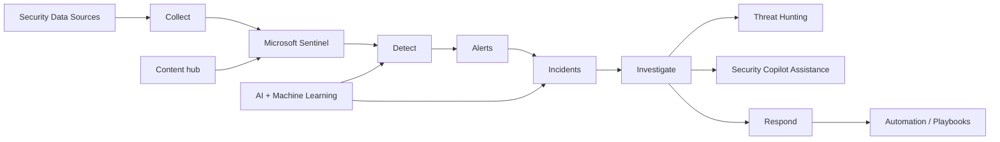
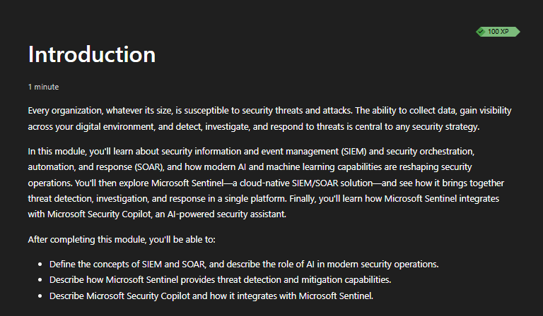
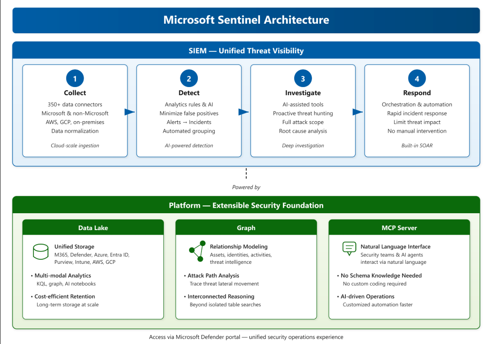
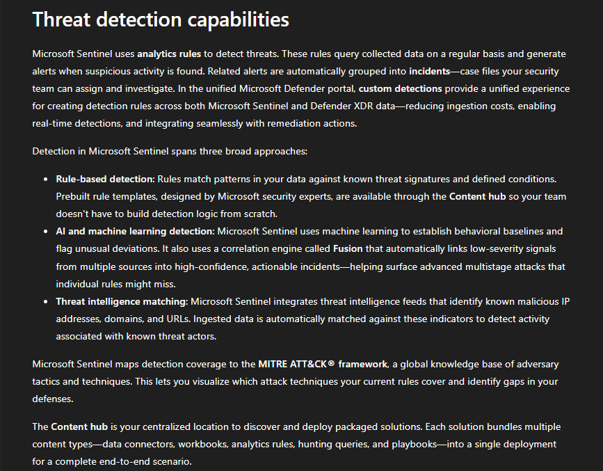
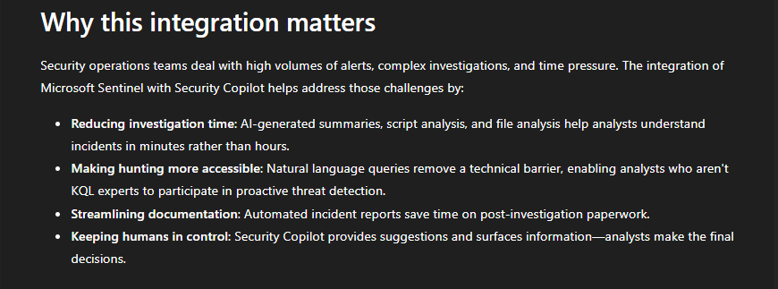
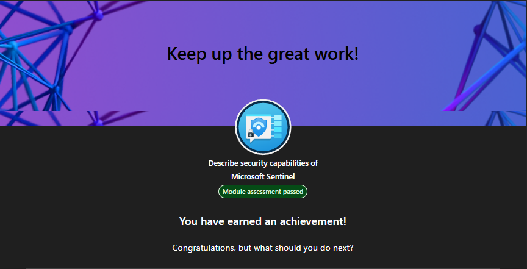

# Lab 08 - Microsoft Sentinel

> **Status:** Complete

## AI Use Disclosure

AI tools may be used to support learning, troubleshooting, documentation organization, technical review, and GitHub formatting during this lab.

All hands-on configuration, validation, screenshots, administrative decisions, and final documentation review must be completed by the project author. AI-generated guidance must be reviewed against Microsoft documentation and the observed behavior of the lab environment before being accepted.

---

## Lab Metadata

| Item | Value |
|---|---|
| Difficulty | Beginner |
| Estimated Time | 2-3 hours |
| Lab Type | Microsoft Learn + read-only discovery |
| SC-900 Domain | Describe the capabilities of Microsoft security solutions |
| Primary Objective | Describe security capabilities of Microsoft Sentinel |
| Previous Lab Dependency | Lab 07 - Microsoft Defender for Cloud |
| Next Lab Dependency | Lab 09 - Microsoft Defender XDR |

---

## Objective

Build a practical understanding of Microsoft Sentinel and explain how a cloud-native SIEM and SOAR platform collects and analyzes security data, detects suspicious activity, groups related alerts into incidents, supports investigation and threat hunting, and helps automate response.

By completing this lab, I:

- Reviewed Security Information and Event Management (SIEM) concepts
- Reviewed Security Orchestration, Automation, and Response (SOAR) concepts
- Reviewed the current Microsoft Sentinel architecture and security-operations flow
- Reviewed data connectors and multi-source security data collection
- Reviewed analytics rules and alert generation
- Reviewed incidents and alert correlation
- Reviewed AI and machine learning in modern security operations
- Reviewed Fusion and higher-confidence incident correlation
- Reviewed the Content hub and packaged Sentinel content
- Reviewed threat hunting, workbooks, automation, and playbooks conceptually
- Reviewed Microsoft Security Copilot integration with Microsoft Sentinel
- Completed read-only Microsoft Sentinel discovery
- Passed the Microsoft Learn assessment and eight scenario-based knowledge checks
- Confirmed that no billable Sentinel deployment or data ingestion was created solely for the lab

---

## Business Problem Solved

Monroe Redstone Technology Group (MRTG) needs a centralized security-operations capability that can collect and correlate security data from multiple sources, detect suspicious activity, create incidents, support investigation, and automate repetitive response actions.

Without centralized SIEM and SOAR capabilities, MRTG could experience:

- Fragmented security logs
- Slow threat detection
- Alert overload
- Difficulty correlating events across identities, endpoints, applications, cloud resources, and networks
- Limited threat-hunting capability
- Inconsistent incident-response processes
- Manual repetitive response work
- Poor visibility across Microsoft, multicloud, and on-premises data sources
- Delayed escalation of high-confidence threats

This lab established the SC-900-level knowledge required to explain how Microsoft Sentinel addresses those concerns.

---

## Scenario

MRTG has completed cloud posture and workload-protection review with Microsoft Defender for Cloud and now needs to understand how a security operations team can centralize security data and respond to threats across the broader environment.

MRTG must be able to:

- Explain SIEM and SOAR
- Understand the Sentinel security-operations flow from collection through response
- Explain data connectors
- Explain analytics rules, alerts, and incidents
- Explain AI-assisted detection and correlation
- Understand the role of threat hunting and automation
- Understand how Microsoft Security Copilot can assist analysts
- Distinguish Microsoft Sentinel from Microsoft Defender for Cloud

```text
Discovery-only
```

No Log Analytics workspace, Microsoft Sentinel deployment, data connector, analytics rule, automation rule, playbook, or billable ingestion path was created solely for portfolio evidence.

---

## Success Criteria

The lab was considered successful because:

- The Microsoft Learn module **Describe security capabilities of Microsoft Sentinel** was completed
- The module assessment was passed
- SIEM and SOAR were distinguished
- The Sentinel architecture and collect-detect-investigate-respond flow were reviewed
- Data connectors were explained
- Analytics rules were explained
- Alerts and incidents were distinguished
- AI and machine learning concepts were reviewed
- Fusion was explained
- Content hub was explained
- Threat hunting, workbooks, and automation concepts were reviewed
- Microsoft Security Copilot integration was reviewed
- Read-only Sentinel discovery was completed
- Eight knowledge checks were passed
- Evidence was sanitized and uploaded

---

## Prerequisites

Before beginning this lab, the following were available:

- Completed Lab 07
- Access to Microsoft Learn
- Microsoft Defender portal / Microsoft Sentinel access for read-only discovery where available
- General security-operations fundamentals
- Understanding of Zero Trust and defense in depth
- Access to the project GitHub repository

---

## Expected Starting State

- Lab 07 complete
- Microsoft Learn module available
- No Sentinel deployment created solely for Lab 08
- No Log Analytics workspace created solely for Lab 08
- No data connector enabled solely for Lab 08
- No analytics rule, automation rule, or playbook created solely for Lab 08
- No billable data ingestion required for the core lab

---

## Required Permissions

| Permission or Role | Purpose | Required |
|---|---|---|
| Microsoft Learn account | Complete module and assessment | Yes |
| Sentinel / Defender portal read access | Read-only discovery | Recommended |
| High-privilege Azure or Sentinel administrative role | Not required for core lab | No |

Least privilege was maintained. No elevated role was requested solely to generate portfolio evidence.

---

## Services / Resources Used

| Service, Resource, or Platform | Purpose |
|---|---|
| Microsoft Learn | SC-900-aligned Sentinel instruction and assessment |
| Microsoft Sentinel | Read-only security-operations discovery |
| Microsoft Defender portal | Unified security-operations interface shown in current learning content and used where available |
| GitHub | Documentation and sanitized evidence storage |

---

## Why Services Were Used

### Microsoft Learn

Microsoft Learn provided certification-aligned instruction covering SIEM, SOAR, Microsoft Sentinel architecture, data collection, threat detection, investigation, response, AI and machine learning concepts, and Security Copilot integration.

### Microsoft Sentinel

Microsoft Sentinel was reviewed because it provides SIEM and SOAR capabilities for collecting, correlating, investigating, and responding to security data from multiple sources.

### Microsoft Defender Portal

The current learning content presents Microsoft Sentinel through a unified Microsoft security-operations experience in the Defender portal. Read-only review connected the conceptual Sentinel workflow to the operational interface without creating billable data ingestion.

---

## Environment

| Item | Value |
|---|---|
| Organization | Monroe Redstone Technology Group |
| Project | MRTG Security, Compliance & Identity Fundamentals |
| Lab | Lab 08 - Microsoft Sentinel |
| Security Operations Platform | Microsoft Sentinel |
| Primary Interface | Microsoft Defender portal / Sentinel experience where available |
| Learning Platform | Microsoft Learn |
| Lab Type | Discovery-only |
| Sentinel Deployment Created for Lab | None |
| Log Analytics Workspace Created for Lab | None |
| Data Connectors Enabled for Lab | None |
| Analytics Rules Created for Lab | None |
| Automation Rules or Playbooks Created for Lab | None |
| Estimated Azure Consumption Cost | $0.00 for discovery-only work |
| Documentation Platform | GitHub |

---

## Architecture / Concept Diagram



The current Microsoft Learn architecture image also presented platform components labeled **Data Lake**, **Graph**, and **MCP Server** beneath the Sentinel security-operations workflow. These labels were reviewed conceptually and were not configured during the lab.

---

## Lab Safety & Change Control

- Confirmed the correct learning and portal environments before discovery.
- Used read-only review wherever practical.
- Did not create a Log Analytics workspace solely for the lab.
- Did not onboard Microsoft Sentinel solely for evidence.
- Did not enable data connectors solely for evidence.
- Did not create analytics rules.
- Did not create automation rules or Logic App playbooks.
- Did not modify incidents or run remediation actions solely for evidence.
- Avoided publishing real security incidents, user identities, IP addresses, tenant details, resource details, or sensitive log data.
- Used concept-focused Microsoft Learn screenshots for portfolio evidence.

---

## Steps Performed

### Step 1: Review Current Module Scope

1. Opened the Microsoft Learn module **Describe security capabilities of Microsoft Sentinel**.
2. Reviewed the current module objectives.
3. Confirmed the module emphasizes SIEM and SOAR, the role of AI and machine learning in modern security operations, Sentinel architecture and threat detection, and Microsoft Security Copilot integration.
4. Captured the starting state.



**Validation:** The screenshot confirms the current module scope used for Lab 08.

### Step 2: Review Sentinel Architecture and SIEM/SOAR Flow

1. Reviewed Microsoft Sentinel as a SIEM and SOAR platform.
2. Reviewed the end-to-end security operations flow:

```text
Collect -> Detect -> Investigate -> Respond
```

3. Reviewed data collection from Microsoft, AWS, Google Cloud, and on-premises sources as presented in the learning content.
4. Reviewed the role of analytics, incidents, investigation, and automated response.
5. Reviewed the unified Microsoft Defender portal context shown in the current architecture.



**Validation:** The screenshot demonstrates the Sentinel security-operations workflow and its SIEM/SOAR role.

### Step 3: Review Threat Detection Capabilities

1. Reviewed analytics rules that query collected security data and generate alerts.
2. Reviewed grouping of related alerts into incidents.
3. Reviewed rule-based detection, AI and machine-learning-assisted detection, and threat-intelligence matching.
4. Reviewed Fusion as a way to correlate multiple signals into higher-confidence incidents.
5. Reviewed MITRE ATT&CK mapping concepts.
6. Reviewed the Content hub and packaged content such as data connectors, analytics rules, hunting queries, workbooks, and playbooks.



**Validation:** The screenshot demonstrates how Sentinel supports multiple detection methods, alert correlation, and deployable security content.

### Step 4: Review Microsoft Security Copilot Integration

1. Reviewed how Security Copilot can help reduce investigation time.
2. Reviewed AI-generated summaries and analysis concepts.
3. Reviewed natural-language-assisted threat hunting and querying concepts.
4. Reviewed assistance with incident documentation.
5. Confirmed the human analyst remains responsible for final judgment and response decisions.



**Validation:** The screenshot demonstrates how Security Copilot can augment, rather than replace, analyst workflows in Sentinel.

### Step 5: Complete Read-Only Sentinel Discovery

Reviewed the following Sentinel areas without changing configuration:

1. Overview
2. Data connectors
3. Analytics / analytics rules
4. Incidents
5. Hunting
6. Content hub
7. Automation / playbooks
8. Workbooks
9. Security Copilot integration where visible

No connector, data ingestion path, rule, automation, or playbook was created solely for the lab.

### Step 6: Complete Assessment and Knowledge Checks

1. Passed the Microsoft Learn module assessment.
2. Completed eight scenario-based knowledge checks covering SIEM, SOAR, incidents, analytics rules, AI/ML, Fusion, Content hub, and Security Copilot.
3. Captured the module completion state.



**Validation:** The screenshot confirms that the module assessment was passed and the module was completed.

---

## Supporting Concept Summary

### SIEM

Security Information and Event Management centralizes security data from many sources so analysts can detect, investigate, and understand suspicious activity across an environment.

At a high level:

```text
Many security data sources -> centralized analysis -> alerts/incidents -> investigation
```

### SOAR

Security Orchestration, Automation, and Response helps coordinate and automate repetitive security-response actions.

SOAR does not eliminate the need for analysts. It helps security teams respond more consistently and efficiently.

### Data Connectors

Data connectors bring security data from supported sources into Sentinel for analysis. The learning content showed sources spanning Microsoft services, AWS, Google Cloud, and on-premises environments.

### Analytics Rules

Analytics rules examine security data for suspicious activity and can generate alerts when defined conditions or detections are met.

### Alerts and Incidents

An **alert** represents detected suspicious activity. Related alerts can be grouped into an **incident**, providing analysts with a broader investigation context.

### AI and Machine Learning

AI and machine learning can help identify unusual patterns, correlate signals, reduce noise, and prioritize higher-confidence security activity.

### Fusion

Fusion correlates multiple lower-severity or related signals to help surface a higher-confidence incident.

### Content Hub

The Content hub provides packaged Sentinel content. The learning material included examples such as:

- Data connectors
- Analytics rules
- Hunting queries
- Workbooks
- Playbooks

### Threat Hunting

Threat hunting is a proactive activity in which analysts search security data for suspicious behavior that may not already have generated a confirmed incident.

### Automation and Playbooks

Automation can reduce repetitive analyst work. Playbooks can orchestrate response workflows, but deployment can involve Logic Apps and potential consumption charges.

### Security Copilot Integration

Security Copilot can assist analysts with investigation summaries, analysis, natural-language-driven security querying, and documentation. Human analysts remain responsible for decisions and actions.

---

## Evidence Collected

| Screenshot | Evidence |
|---|---|
| `00-sentinel-module-starting-state.png` | Current module scope and learning objectives |
| `01-sentinel-architecture-siem-soar.png` | Sentinel architecture, SIEM/SOAR, and collect-detect-investigate-respond workflow |
| `02-sentinel-threat-detection-capabilities.png` | Analytics, alerts/incidents, AI/ML, Fusion, MITRE ATT&CK, and Content hub concepts |
| `03-sentinel-security-copilot-integration.png` | Security Copilot assistance for investigation, hunting, and documentation |
| `04-sentinel-module-complete.png` | Passed module assessment and completion |

---

## Validation

| Validation Item | Expected Result | Actual Result |
|---|---|---|
| Microsoft Learn module | Correct Sentinel module completed | Passed |
| Module assessment | Assessment completed successfully | Passed |
| SIEM | Explain centralized collection and analysis of security data | Passed |
| SOAR | Explain orchestration and automated response | Passed |
| Incidents | Explain grouping of related alerts for investigation | Passed |
| Analytics rules | Explain detection rules that generate alerts | Passed |
| AI / machine learning | Explain assisted anomaly detection and signal correlation | Passed |
| Fusion | Explain higher-confidence correlation of multiple signals | Passed |
| Content hub | Explain packaged Sentinel security content | Passed |
| Security Copilot | Explain AI-assisted investigation and querying | Passed |
| Read-only Sentinel discovery | Completed without billable deployment | Passed |
| Data ingestion created for lab | None | Passed |
| Screenshot security review | Final evidence sanitized | Passed |

---

## Completion Checklist

- [x] Capture starting-state screenshot
- [x] Review SIEM
- [x] Review SOAR
- [x] Review Microsoft Sentinel overview
- [x] Review Sentinel architecture
- [x] Review data connectors
- [x] Review analytics rules
- [x] Review alerts and incidents
- [x] Review AI and machine learning concepts
- [x] Review Fusion
- [x] Review MITRE ATT&CK mapping concept
- [x] Review Content hub
- [x] Review hunting
- [x] Review workbooks
- [x] Review automation rules and playbooks conceptually
- [x] Review Security Copilot integration
- [x] Pass module assessment
- [x] Complete read-only Sentinel discovery
- [x] Complete eight knowledge checks
- [x] Upload sanitized screenshots
- [x] Verify all five screenshot files in the repository
- [x] Confirm no billable Sentinel deployment was created for evidence
- [x] Perform final repository evidence review
- [x] Mark Lab 08 complete

---

## SC-900 Exam Objective Coverage

### Primary Exam Domain

```text
Describe the capabilities of Microsoft security solutions
```

### Skills Measured

This lab supports the ability to:

- Describe Security Information and Event Management concepts
- Describe Security Orchestration, Automation, and Response concepts
- Describe Microsoft Sentinel capabilities
- Describe how Sentinel collects and analyzes security data
- Describe analytics and threat-detection concepts
- Describe alerts and incidents
- Describe AI and machine learning in security operations
- Describe Microsoft Security Copilot integration with Sentinel
- Recognize threat hunting and automation concepts

### How This Lab Supports the Objectives

The lab connected SC-900 terminology to the modern Sentinel workflow by reviewing how security data is collected, analyzed, correlated, investigated, and acted upon through a unified security-operations platform.

---

## Mini Objective Coverage

By completing this lab, I can:

- Explain SIEM
- Explain SOAR
- Explain Microsoft Sentinel
- Explain data connectors
- Explain analytics rules
- Distinguish alerts from incidents
- Explain Fusion
- Explain the role of AI and machine learning in security operations
- Explain the Content hub
- Explain threat hunting
- Explain automation and playbook concepts
- Explain Security Copilot assistance in Sentinel
- Describe the collect-detect-investigate-respond workflow
- Distinguish Sentinel from Defender for Cloud
- Explain why Sentinel deployments require cost awareness

---

## Exam Traps / Key Distinctions

### Sentinel vs Defender for Cloud

- Microsoft Sentinel is a SIEM and SOAR platform for security operations.
- Defender for Cloud focuses on cloud security posture management and cloud workload protection.

### SIEM vs SOAR

- SIEM focuses on collecting, analyzing, correlating, and investigating security data.
- SOAR focuses on orchestrating and automating response workflows.

### Alert vs Incident

- An alert represents detected suspicious activity.
- An incident can group related alerts into a broader investigation case.

### Analytics Rules vs Data Connectors

- Data connectors bring data into Sentinel.
- Analytics rules analyze data and can generate alerts.

### AI Assistance vs Analyst Replacement

- AI and Security Copilot can accelerate analysis and querying.
- Human analysts remain responsible for judgment, validation, and response decisions.

### Fusion vs Single Detection Rule

- A single analytics rule detects activity based on a defined detection approach.
- Fusion correlates multiple signals to help create higher-confidence incidents.

### Content Hub vs Data Connector

- A data connector is one method of bringing data into Sentinel.
- Content hub solutions can package multiple types of Sentinel content, including connectors, analytics rules, workbooks, hunting queries, and playbooks.

---

## IAM / Security Relevance

Identity systems generate important security signals. Sentinel can correlate identity-related events with endpoint, cloud, application, and network telemetry when the appropriate data sources are connected.

This can help security teams investigate scenarios such as:

```text
Suspicious sign-in
        +
Privilege change
        +
Unusual endpoint activity
        ↓
Correlated security incident
```

For identity-focused security work, this demonstrates why authentication and authorization events become more valuable when analyzed in the context of the broader environment.

---

## On-Premises Connection

Traditional security operations centers centralize logs from domain controllers, firewalls, endpoints, servers, identity systems, and applications into SIEM platforms.

Microsoft Sentinel applies the same security-operations model to cloud, hybrid, and multicloud environments by using connectors to bring data into a centralized analysis and response workflow.

This makes Sentinel relevant to organizations that maintain both on-premises and cloud infrastructure.

---

## Security Analysis

The major risks addressed by this lab include:

### Fragmented Security Telemetry

Security data spread across many systems can make attacks difficult to recognize. Centralized SIEM analysis improves cross-source visibility.

### Alert Overload

Individual alerts can create excessive analyst workload. Incident grouping, signal correlation, AI-assisted analysis, and Fusion can help prioritize more meaningful activity.

### Slow Investigation

Analysts need context to determine what happened and what should happen next. Incidents, hunting, and Security Copilot assistance can reduce investigation friction.

### Inconsistent Response

SOAR and automation can standardize repetitive response workflows and reduce manual handling.

### Data-Collection Cost

Security visibility has a cost dimension. Collecting unnecessary data can increase ingestion and retention costs without proportionate security value.

---

## Zero Trust Analysis

Lab 08 reinforces all three Zero Trust principles:

- **Verify explicitly:** security signals from identities, endpoints, applications, networks, and cloud resources can be continuously evaluated.
- **Use least-privilege access:** Sentinel administrative and investigation permissions should be limited to the roles required.
- **Assume breach:** SIEM, threat hunting, incident investigation, and automated response are built around detecting and responding to activity that preventive controls did not stop.

Sentinel is especially aligned with **assume breach** because it provides visibility and response capabilities after suspicious activity is observed.

---

## Governance / Compliance

A production Sentinel program should define:

- Approved data sources
- Data-connector ownership
- Data-retention requirements
- Ingestion-cost governance
- Analytics-rule ownership
- Incident severity and triage standards
- Investigation procedures
- Threat-hunting responsibilities
- Automation approval processes
- Playbook change control
- Role-based access and least privilege
- Evidence retention for investigations and audits
- Security Copilot usage and human-review expectations
- Privacy requirements for collected security data

SIEM data can contain sensitive identity, endpoint, network, and application details, so access to security telemetry should be tightly controlled.

---

## Cost & Licensing

```text
Estimated Azure consumption cost for this lab: $0.00
```

No Sentinel deployment, Log Analytics workspace, data connector, or billable data ingestion was created solely for Lab 08.

Microsoft Sentinel can incur charges based on factors such as data ingestion, retention, and related Azure services. Automation and playbooks can also introduce Logic Apps or other service charges.

A production deployment should review current Microsoft pricing, expected daily ingestion volume, retention requirements, data-source value, automation usage, and cost-control options before onboarding large data sets.

---

## Troubleshooting

No material technical issue prevented completion of the lab.

The main design decision was to avoid deploying or ingesting data solely to demonstrate Sentinel concepts. The SC-900 learning goals were satisfied through Microsoft Learn, read-only product discovery, scenario-based knowledge validation, and sanitized evidence.

---

## What I Would Do Differently in Production

A production Sentinel implementation should include:

- Define security-operations requirements before onboarding data
- Inventory high-value log sources
- Estimate ingestion and retention costs
- Connect identity, endpoint, cloud, network, and application telemetry based on security value
- Prioritize analytics rules for real organizational threats
- Map detections to MITRE ATT&CK where useful
- Define alert-to-incident triage procedures
- Establish hunting processes
- Implement automation only after testing and approval
- Use playbooks with change control and least privilege
- Define Security Copilot human-review requirements
- Monitor data quality and connector health
- Integrate incident escalation with the broader SOC process

---

## Lessons Learned

- SIEM centralizes and analyzes security data; SOAR orchestrates and automates response.
- Sentinel follows an end-to-end collect, detect, investigate, and respond model.
- Data connectors provide the telemetry that analytics depend on.
- Analytics rules generate alerts, while related alerts can be grouped into incidents.
- AI and machine learning can reduce noise and help identify higher-confidence threats.
- Fusion correlates multiple signals into more meaningful incidents.
- Content hub solutions package reusable Sentinel content.
- Security Copilot assists analysts but does not replace human judgment.
- Sentinel complements Defender for Cloud rather than replacing it.
- Discovery-only learning can build SC-900 understanding without creating unnecessary ingestion costs.

---

## Skills Demonstrated

- SIEM fundamentals
- SOAR fundamentals
- Microsoft Sentinel fundamentals
- Security-operations architecture analysis
- Data-connector concepts
- Analytics-rule concepts
- Alert and incident analysis
- AI and machine learning security concepts
- Fusion correlation concepts
- Content hub concepts
- Threat-hunting awareness
- Workbooks awareness
- Security automation and playbook awareness
- Security Copilot integration awareness
- Zero Trust security-operations analysis
- Cloud-cost awareness
- Security-conscious evidence collection
- Scenario-based SC-900 knowledge validation

---

## Cleanup

No Microsoft Sentinel deployment, Log Analytics workspace, data connector, analytics rule, automation rule, playbook, or other Azure resource was created solely for this lab.

```text
Resources to delete: None
Data connectors to disable: None
Analytics rules to remove: None
Automation rules to remove: None
Playbooks to delete: None
Estimated ongoing lab cost: $0.00
```

---

## Documentation Security Review

The final evidence set was reviewed to avoid intentionally exposing:

- Tenant IDs
- Subscription IDs
- Workspace IDs
- User principal names
- Real security incidents
- IP addresses tied to real systems
- Hostnames or endpoint names
- Sensitive query results
- Authentication details
- Administrative identities
- Secrets, keys, or tokens
- Billing information

The final screenshots are concept-focused Microsoft Learn evidence and do not intentionally expose tenant-specific security operations data.

---

## Outcome

Lab 08 successfully established the Microsoft Sentinel foundation required for SC-900.

MRTG can now explain SIEM, SOAR, Sentinel architecture, data connectors, analytics, alerts, incidents, AI-assisted threat detection, Fusion, Content hub, threat hunting, automation, and Security Copilot integration at a fundamentals level.

**Lab 08 status: Complete.**

---

## Screenshot Inventory / Screenshots

| Screenshot | Status | Purpose |
|---|---|---|
| `00-sentinel-module-starting-state.png` | Included | Current module objectives and starting state |
| `01-sentinel-architecture-siem-soar.png` | Included | Sentinel architecture and collect-detect-investigate-respond workflow |
| `02-sentinel-threat-detection-capabilities.png` | Included | Analytics, incidents, AI/ML, Fusion, MITRE ATT&CK, and Content hub |
| `03-sentinel-security-copilot-integration.png` | Included | Security Copilot assistance for investigation and hunting |
| `04-sentinel-module-complete.png` | Included | Passed assessment and module completion |

---

## Next Lab / Series Completion

```text
Lab 09 - Microsoft Defender XDR
```

Lab 09 will move from centralized SIEM/SOAR operations into Microsoft Defender XDR and the integrated threat-protection capabilities that bring together endpoint, identity, email, collaboration, cloud application, vulnerability, and threat-intelligence signals.
