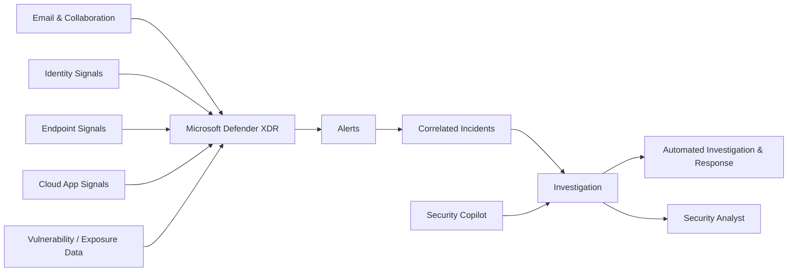
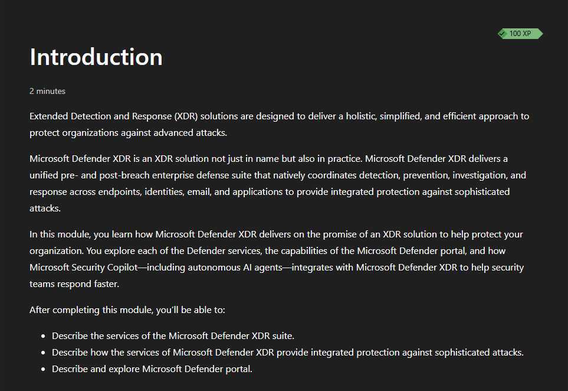
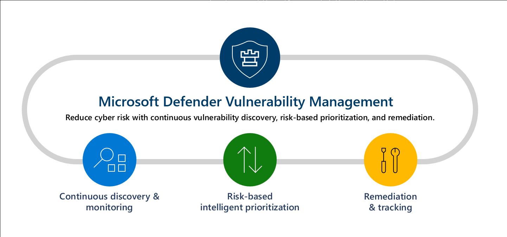
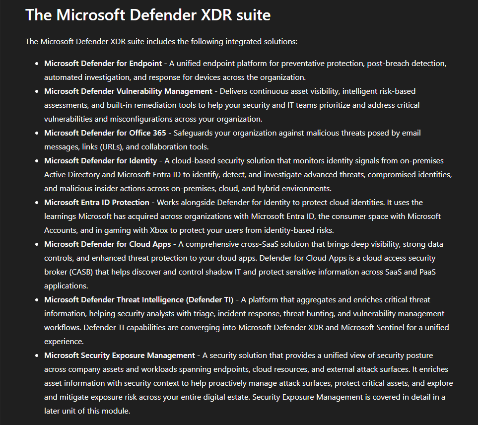
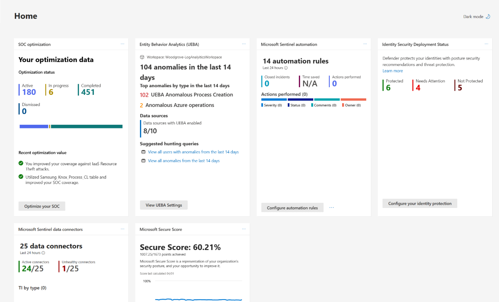
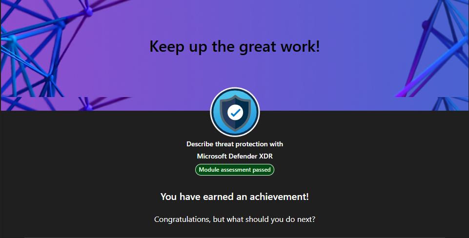

# Lab 09 - Microsoft Defender XDR

> **Status:** Complete

## AI Use Disclosure

AI tools may be used to support learning, troubleshooting, documentation organization, technical review, and GitHub formatting during this lab.

All hands-on configuration, validation, screenshots, administrative decisions, and final documentation review must be completed by the project author. AI-generated guidance must be reviewed against Microsoft documentation and the observed behavior of the lab environment before being accepted.

---

## Lab Metadata

| Item | Value |
|---|---|
| Difficulty | Beginner |
| Estimated Time | 2-3 hours |
| Lab Type | Microsoft Learn + read-only discovery |
| SC-900 Domain | Describe the capabilities of Microsoft security solutions |
| Primary Objective | Describe threat protection with Microsoft Defender XDR |
| Previous Lab Dependency | Lab 08 - Microsoft Sentinel |
| Next Lab Dependency | Lab 10 - Service Trust and Compliance |

---

## Objective

Build a practical understanding of Microsoft Defender XDR and explain how Microsoft security capabilities work together to provide integrated threat prevention, detection, investigation, and response across endpoints, identities, email and collaboration, cloud applications, and related security signals.

By completing this lab, I:

- Reviewed Microsoft Defender XDR as an extended detection and response platform
- Reviewed cross-domain alert and incident correlation
- Reviewed Microsoft Defender for Endpoint
- Reviewed Microsoft Defender Vulnerability Management
- Reviewed Microsoft Defender for Office 365
- Reviewed Microsoft Defender for Identity
- Reviewed Microsoft Defender for Cloud Apps
- Reviewed Microsoft Entra ID Protection in the broader security suite context
- Reviewed Defender Threat Intelligence and Security Exposure Management concepts shown in the learning material
- Reviewed automated investigation and response concepts
- Reviewed the unified Microsoft Defender portal experience
- Reviewed Microsoft Security Copilot integration conceptually
- Completed a read-only Microsoft Defender portal walkthrough
- Passed the Microsoft Learn module assessment
- Completed a 10-question SC-900-style Defender XDR knowledge check with a perfect score

---

## Business Problem

Monroe Redstone Technology Group (MRTG) needs a way to correlate security activity across identities, endpoints, email, collaboration tools, and cloud applications instead of investigating each security product in isolation.

Without integrated extended detection and response, MRTG could experience fragmented alerts, slow cross-domain investigations, difficulty identifying attack chains, repetitive analyst work, and delayed containment.

Microsoft Defender XDR helps address this by connecting related security signals into a broader investigation context.

---

## Scenario

MRTG has completed its Microsoft Sentinel SIEM/SOAR review and now needs to understand Microsoft Defender XDR as the integrated threat-protection layer across Microsoft security workloads.

The lab uses Microsoft Learn plus read-only discovery in the Microsoft Defender portal. No endpoint onboarding, policy deployment, connector enablement, remediation action, or licensing change was performed solely to create portfolio evidence.

---

## Success Criteria

The lab was considered successful because:

- The Microsoft Learn module **Describe threat protection with Microsoft Defender XDR** was completed
- The module assessment was passed
- Defender XDR can be explained at an SC-900 level
- Alerts and incidents can be distinguished
- Cross-domain correlation can be explained
- Defender for Endpoint can be explained
- Defender for Office 365 can be explained
- Defender for Identity can be explained
- Defender for Cloud Apps can be explained
- Vulnerability management concepts can be explained
- Automated investigation and response can be explained
- Defender XDR can be distinguished from Microsoft Sentinel
- Read-only Defender portal discovery was completed
- A 10-question SC-900-style knowledge check was passed with 10/10 correct
- Five sanitized screenshots were uploaded and verified

---

## Prerequisites

- Completed Lab 08
- Access to Microsoft Learn
- Access to the Microsoft Defender portal for read-only discovery where available
- Basic understanding of identities, endpoints, email security, cloud applications, and incident response
- Access to the project GitHub repository

---

## Expected Starting State

- Lab 08 complete
- Microsoft Learn module available
- No endpoint onboarding required for Lab 09
- No Defender security policies changed solely for the lab
- No remediation actions required solely for the lab
- No licensing changes required solely for the lab

---

## Required Permissions

| Permission or Role | Purpose | Required |
|---|---|---|
| Microsoft Learn account | Complete module and assessment | Yes |
| Defender portal read access | Read-only discovery | Recommended |
| Defender administrative privileges | Configuration not required for the core lab | No |

Least privilege was maintained. No elevated role was requested solely for portfolio evidence.

---

## Services/Resources Used

| Service or Resource | Purpose |
|---|---|
| Microsoft Learn | SC-900-aligned Defender XDR instruction and assessment |
| Microsoft Defender XDR | Integrated threat protection concepts and read-only discovery |
| Microsoft Defender portal | Unified security-operations interface |
| GitHub | Documentation and sanitized evidence storage |

---

## Why Services Used

### Microsoft Learn

Microsoft Learn provided the current fundamentals-level scope for Defender XDR, vulnerability management, the Defender security suite, the unified portal, and threat protection concepts.

### Microsoft Defender XDR

Defender XDR was reviewed because attacks often move across multiple security domains. XDR correlation helps analysts connect activity involving email, identities, endpoints, and cloud applications into a unified investigation.

### Microsoft Defender Portal

The Defender portal was reviewed to connect the learning material to the current operational interface without changing configuration.

---

## Environment

```text
Organization: Monroe Redstone Technology Group (MRTG)
Lab mode: Microsoft Learn + read-only discovery
Endpoint onboarding performed for lab: None
Security policies modified for lab: None
Remediation actions performed for lab: None
Licensing changes performed for lab: None
Estimated Azure consumption cost: $0.00 for discovery-only work
```

---

## Architecture/Concept Diagram



The key concept is correlation: security signals from multiple domains become more useful when investigated as one attack story instead of as isolated alerts.

---

## Lab Safety & Change Control

- Used Microsoft Learn and read-only portal discovery.
- Did not onboard endpoints solely for the lab.
- Did not isolate devices or run remediation actions.
- Did not modify email-security policies.
- Did not alter identity sensors or identity-security configuration.
- Did not enable connectors solely for portfolio evidence.
- Did not change Microsoft licensing.
- Avoided publishing real incidents, identities, device names, IP addresses, or other tenant-specific security telemetry.
- Used concept-focused screenshots for public evidence.

---

## Steps Performed

### Step 1: Review Current Module Scope

Opened the Microsoft Learn module **Describe threat protection with Microsoft Defender XDR** and reviewed its current objectives, including Defender XDR, integrated protection across security domains, the Microsoft Defender portal, and Microsoft Security Copilot concepts.



### Step 2: Review Defender Vulnerability Management

Reviewed the vulnerability-management lifecycle shown in the learning material:

```text
Continuous discovery and monitoring
        ↓
Risk-based prioritization
        ↓
Remediation and tracking
```



### Step 3: Review the Defender XDR Security Suite

Reviewed the broader Microsoft security suite shown in the learning material, including Defender for Endpoint, Defender Vulnerability Management, Defender for Office 365, Defender for Identity, Microsoft Entra ID Protection, Defender for Cloud Apps, Defender Threat Intelligence, and Security Exposure Management.



### Step 4: Review the Unified Defender Portal Experience

Reviewed the learning material illustrating the unified Microsoft Defender portal and how multiple security capabilities can be brought together into one security-operations experience.



### Step 5: Complete Read-Only Defender Portal Discovery

Reviewed the following areas where available without changing configuration:

1. Incidents and alerts
2. Assets / devices
3. Identities
4. Email and collaboration
5. Cloud apps
6. Vulnerability / exposure management
7. Advanced Hunting
8. Automated investigation and response areas

The purpose was to identify where the major Defender XDR security domains appear in the real portal, not to deploy or remediate anything.

### Step 6: Complete Assessment and Knowledge Validation

Passed the Microsoft Learn module assessment and completed a 10-question SC-900-style Defender XDR quiz with 10/10 correct.

Topics included Defender XDR purpose, Defender for Endpoint, Defender for Identity, Defender for Office 365, Defender for Cloud Apps, incidents, alerts, automated investigation and response, Sentinel versus XDR, and cross-domain attack correlation.



---

## Supporting Concept Summary

### Microsoft Defender XDR

Microsoft Defender XDR provides extended detection and response by correlating security signals across multiple Microsoft security domains.

### Defender for Endpoint

Focuses on endpoint security, including device-focused prevention, detection, investigation, response, and related exposure-management capabilities.

### Defender for Office 365

Focuses on threats affecting email and collaboration, such as phishing, malicious links, and malicious attachments.

### Defender for Identity

Uses identity-related signals to help detect threats involving identities and identity infrastructure, including suspicious lateral movement and credential-related activity.

### Defender for Cloud Apps

Provides visibility and security capabilities related to cloud application usage and associated risks.

### Vulnerability Management

Helps discover exposures, prioritize risk, and track remediation. At the fundamentals level, the important idea is reducing attack surface before vulnerabilities are exploited.

### Alerts and Incidents

An alert represents detected suspicious activity. Defender XDR can correlate related alerts into an incident that gives analysts a broader attack story.

### Automated Investigation and Response

Automated investigation and response can analyze evidence and perform supported remediation actions where appropriate. Automation assists analysts; it does not remove the need for human oversight.

### Microsoft Security Copilot

Security Copilot can assist analysts with investigation and security operations. AI assistance should augment analyst decision-making rather than replace accountable human judgment.

---

## Evidence Collected

| Screenshot | Evidence |
|---|---|
| `00-defender-xdr-module-starting-state.png` | Current Microsoft Learn module scope and objectives |
| `01-defender-vulnerability-management.png` | Vulnerability-management lifecycle concepts |
| `02-defender-xdr-suite.png` | Defender security suite and workload coverage |
| `03-defender-portal-unified-security-operations.png` | Unified Defender portal security-operations experience |
| `04-defender-xdr-module-complete.png` | Module assessment passed and completion |

---

## Validation

| Validation Item | Result |
|---|---|
| Microsoft Learn module completed | Passed |
| Module assessment | Passed |
| 10-question SC-900-style quiz | 10/10 |
| Defender XDR purpose understood | Passed |
| Cross-domain correlation understood | Passed |
| Defender product roles distinguished | Passed |
| Alerts vs incidents distinguished | Passed |
| Automated investigation and response understood | Passed |
| Sentinel vs Defender XDR distinguished | Passed |
| Read-only Defender portal walkthrough | Completed |
| Five screenshot files verified in repository | Passed |
| Configuration changes required | None |

---

## Completion Checklist

- [x] Capture starting-state screenshot
- [x] Review Defender XDR overview
- [x] Review integrated incidents and alerts
- [x] Review Defender for Endpoint
- [x] Review Defender for Office 365
- [x] Review Defender for Identity
- [x] Review Defender for Cloud Apps
- [x] Review vulnerability management
- [x] Review threat intelligence concepts
- [x] Review automated investigation and response concepts
- [x] Distinguish Defender XDR from Sentinel
- [x] Pass module assessment
- [x] Complete read-only Defender portal discovery
- [x] Complete 10-question knowledge check with 10/10 correct
- [x] Upload sanitized screenshots
- [x] Verify all five screenshot files in the repository
- [x] Perform final repository evidence review
- [x] Mark Lab 09 complete

---

## SC-900 Exam Objective Coverage

### Primary Exam Domain

```text
Describe the capabilities of Microsoft security solutions
```

This lab supports the ability to describe Microsoft Defender XDR and the roles of major Defender security capabilities at a fundamentals level.

---

## Mini Objective Coverage

By completing this lab, I can:

- Explain Microsoft Defender XDR
- Explain why XDR correlates signals across security domains
- Explain Defender for Endpoint
- Explain Defender for Office 365
- Explain Defender for Identity
- Explain Defender for Cloud Apps
- Explain vulnerability-management concepts
- Distinguish alerts from incidents
- Explain automated investigation and response
- Explain the unified Defender portal at a fundamentals level
- Distinguish Defender XDR from Microsoft Sentinel

---

## Exam Traps/Key Distinctions

### Defender XDR vs Microsoft Sentinel

- **Defender XDR:** integrated detection and response across Microsoft Defender security domains.
- **Microsoft Sentinel:** broader SIEM and SOAR platform for collecting, analyzing, correlating, and responding to security data from many sources.

They can work together, but they are not the same product.

### Defender for Endpoint vs Defender for Identity

- **Endpoint:** devices.
- **Identity:** identity-related threats and identity infrastructure signals.

### Defender for Office 365 vs Defender for Cloud Apps

- **Office 365:** email and collaboration threat protection.
- **Cloud Apps:** visibility and security for cloud application usage and related risks.

### Alert vs Incident

- **Alert:** a detection or security signal.
- **Incident:** related alerts correlated into a broader investigation context.

### Automation vs Human Judgment

Automated investigation and response can accelerate investigation and remediation, but security teams remain responsible for validation, risk decisions, and oversight.

---

## IAM/Security Relevance

Defender XDR is highly relevant to identity-focused security because attackers rarely remain in one technical domain.

```text
Phishing email
      ↓
Credential theft
      ↓
Suspicious identity activity
      ↓
Endpoint access or execution
      ↓
Correlated XDR incident
```

IAM controls help prevent unauthorized access; Defender XDR helps detect and investigate when identity activity becomes part of a broader attack chain.

---

## On-Premises Connection

Hybrid organizations may have endpoints, Active Directory infrastructure, cloud identities, Microsoft 365 workloads, and cloud applications operating together.

Defender XDR's value is the ability to connect relevant security signals across these domains so analysts can investigate an attack that crosses traditional on-premises and cloud boundaries.

---

## Security Analysis

The major security problem addressed by XDR is fragmentation. An attacker can begin with phishing, steal credentials, move through identity systems, execute activity on endpoints, and access cloud applications.

If each product is investigated separately, the attack chain can be difficult to recognize. Cross-domain correlation improves context, prioritization, and investigation speed.

Vulnerability management adds a preventive layer by helping reduce exploitable exposure before an attack succeeds.

---

## Zero Trust Analysis

Lab 09 reinforces all three Zero Trust principles:

- **Verify explicitly:** use security signals and context across identities, endpoints, applications, and workloads.
- **Use least-privilege access:** restrict security administration and remediation capabilities to authorized roles.
- **Assume breach:** detect, correlate, investigate, and respond when preventive controls are bypassed.

Defender XDR strongly supports the **assume breach** principle by helping analysts understand attacks that span multiple security domains.

---

## Governance/Compliance

A production Defender XDR deployment should define ownership for alerts and incidents, role-based access, remediation authority, endpoint onboarding, email-security configuration, identity-sensor administration, automation approvals, evidence retention, and escalation procedures.

Security telemetry can contain sensitive identity, endpoint, email, and cloud-application information. Access to the Defender portal and investigation data should follow least privilege and organizational privacy requirements.

---

## Cost & Licensing

```text
Estimated Azure consumption cost for this lab: $0.00
```

No Azure consumption resources were deployed for Lab 09.

Many Defender XDR capabilities depend on Microsoft 365, Defender, Entra, or related security licensing. Feature availability can vary by tenant and license.

No paid license, trial, endpoint onboarding, sensor deployment, or policy change was enabled solely for portfolio evidence.

---

## Troubleshooting

The main repository issue during closeout was screenshot placement. An initial upload placed the wrong Lab 07 files in the Lab 09 screenshot directory, and a later correction placed the proper Lab 09 files one directory too high.

The evidence set was corrected and all five intended Lab 09 screenshots were verified in the final `screenshots/` directory before closeout.

No Defender configuration issue prevented completion of the lab.

---

## What I Would Do Differently in Production

A production Defender XDR implementation should:

- Confirm licensing before enabling features
- Define the security products and workloads in scope
- Onboard endpoints through controlled deployment processes
- Validate email and collaboration protections
- Validate identity-sensor architecture where Defender for Identity is used
- Configure cloud-app security according to organizational requirements
- Establish incident ownership and severity standards
- Define automated-remediation boundaries
- Test response actions before broad deployment
- Use least-privilege Defender roles
- Protect and retain investigation evidence appropriately
- Integrate Defender XDR and Sentinel when broader SIEM/SOAR coverage is required

---

## Lessons Learned

- XDR is about correlation across security domains, not just collecting more alerts.
- Defender for Endpoint protects devices; Defender for Identity focuses on identity threats; Defender for Office 365 protects email and collaboration; Defender for Cloud Apps focuses on cloud applications.
- Related alerts can be correlated into incidents that provide a more complete attack story.
- Vulnerability management helps reduce exposure before exploitation.
- Automated investigation and response can reduce repetitive analyst work while keeping humans accountable for security decisions.
- Defender XDR and Sentinel complement each other but serve different primary roles.
- The unified Defender portal helps bring multiple security workflows into one operational experience.

---

## Skills Demonstrated

- Microsoft Defender XDR fundamentals
- Cross-domain threat-correlation analysis
- Endpoint-security fundamentals
- Email and collaboration threat-protection fundamentals
- Identity threat-detection fundamentals
- Cloud-app security fundamentals
- Vulnerability-management fundamentals
- Alert and incident analysis
- Automated investigation and response concepts
- Microsoft Defender portal navigation
- Defender XDR versus Sentinel differentiation
- Zero Trust security analysis
- Read-only security discovery
- Security-conscious documentation and evidence handling
- SC-900 knowledge validation

---

## Cleanup

No endpoint, policy, connector, remediation action, license, or Azure resource was created or changed solely for this lab.

```text
Resources to delete: None
Endpoints to offboard: None
Policies to revert: None
Licensing changes to undo: None
Estimated ongoing lab cost: $0.00
```

---

## Documentation Security Review

The final evidence set was reviewed to avoid intentionally exposing:

- Tenant IDs
- User principal names
- Real incidents or alerts
- Device names
- IP addresses
- Identity-security details
- Email-security telemetry
- Administrative identities
- Secrets, credentials, or tokens
- Unnecessary tenant-specific security posture data

The published screenshots are focused on learning concepts rather than tenant-specific operational data.

---

## Outcome

Lab 09 successfully established the Microsoft Defender XDR foundation required for SC-900.

MRTG can now explain how Microsoft Defender security domains work together to provide integrated prevention, detection, investigation, and response, and can distinguish XDR from the broader SIEM/SOAR role of Microsoft Sentinel.

**Lab 09 status: Complete.**

---

## Screenshot Inventory/Screenshots

| Screenshot | Status | Purpose |
|---|---|---|
| `00-defender-xdr-module-starting-state.png` | Included | Current module scope and objectives |
| `01-defender-vulnerability-management.png` | Included | Vulnerability-management concepts |
| `02-defender-xdr-suite.png` | Included | Defender product suite and security-domain coverage |
| `03-defender-portal-unified-security-operations.png` | Included | Unified Defender portal experience |
| `04-defender-xdr-module-complete.png` | Included | Assessment passed and module completion |

---

## Next Lab / Series Completion

```text
Lab 10 - Service Trust and Compliance
```

Lab 10 moves the series from threat protection into Microsoft's trust, assurance, and compliance resources.
