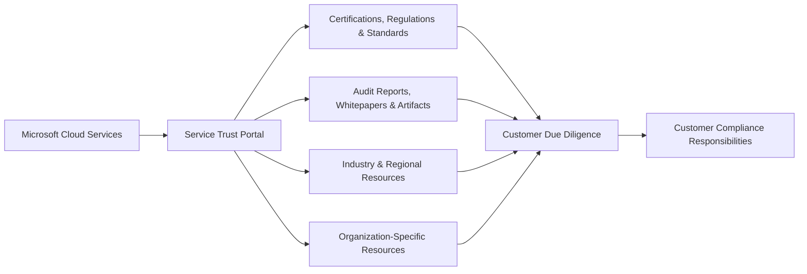
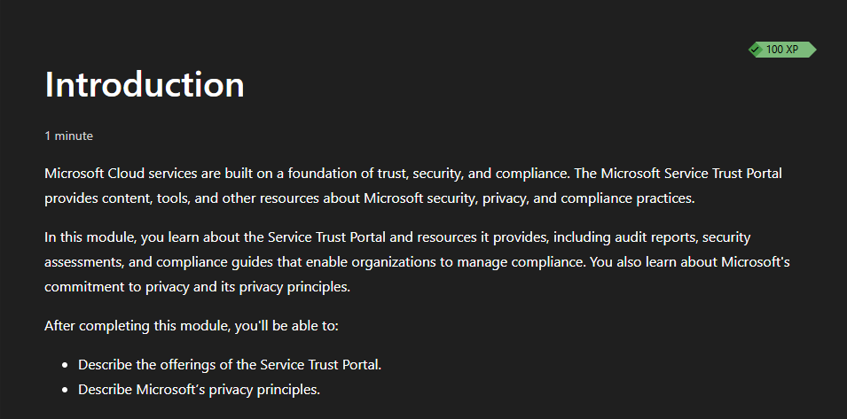
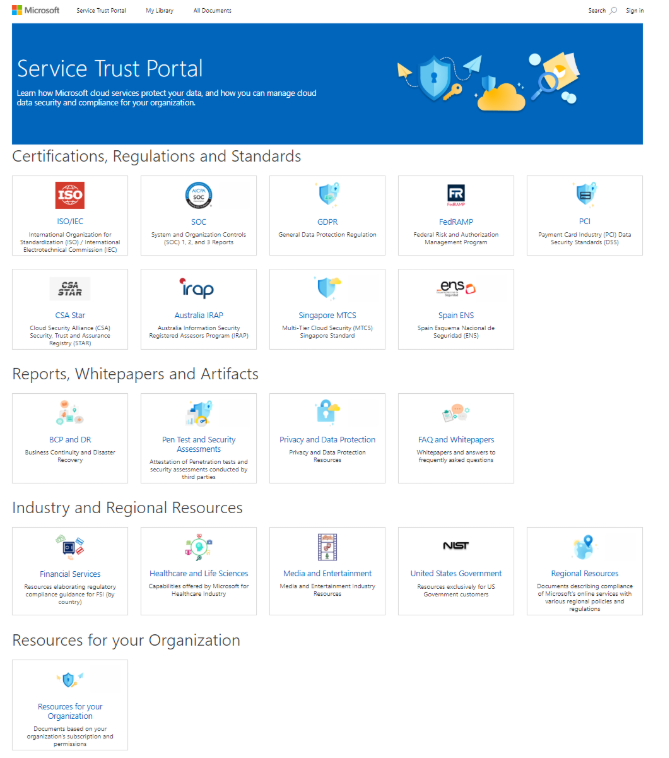
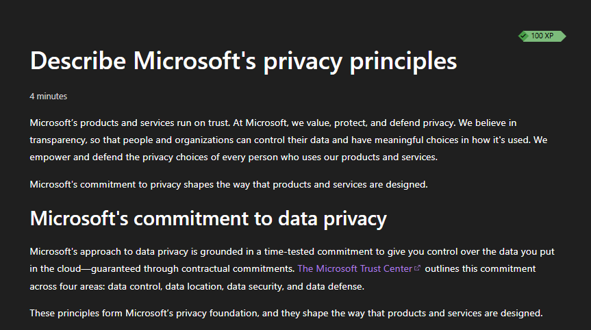
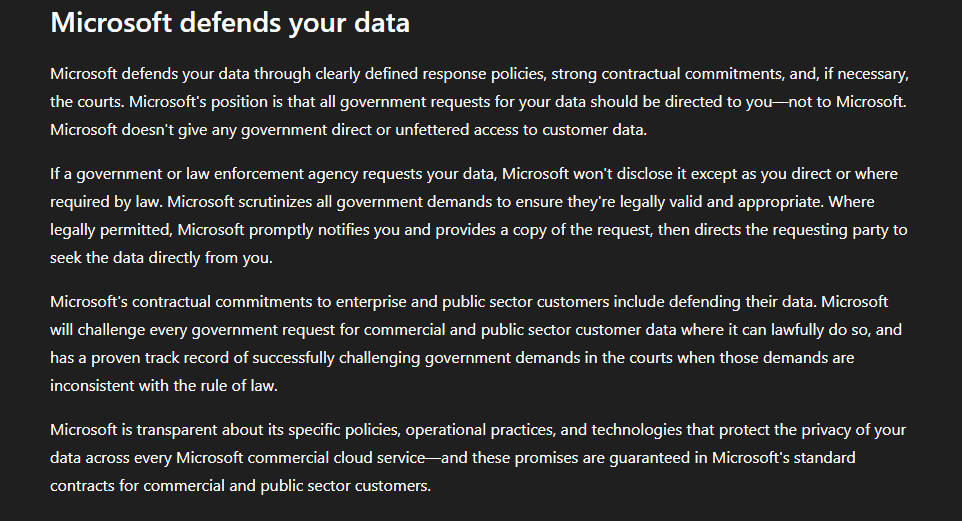
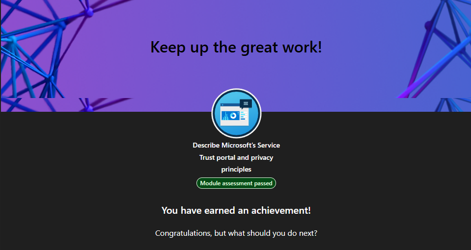

# Lab 10 - Service Trust and Compliance

> **Status:** Complete

## AI Use Disclosure

AI tools may be used to support learning, troubleshooting, documentation organization, technical review, and GitHub formatting during this lab.

All hands-on work, validation, screenshots, administrative decisions, and final documentation review must be completed by the project author. AI-generated guidance must be reviewed against Microsoft documentation and observed lab results before being accepted.

---

## Lab Metadata

| Item | Value |
|---|---|
| Difficulty | Beginner |
| Estimated Time | 1-2 hours |
| Lab Type | Microsoft Learn + read-only Service Trust content review |
| SC-900 Domain | Describe the capabilities of Microsoft compliance solutions |
| Primary Objective | Describe Microsoft’s Service Trust Portal and privacy principles |
| Previous Lab Dependency | Lab 09 - Microsoft Defender XDR |
| Next Lab Dependency | Lab 11 - Microsoft Purview |

---

## Objective

Build a practical understanding of Microsoft trust, assurance, privacy, and compliance resources by completing the Microsoft Learn module **Describe Microsoft’s Service Trust portal and privacy principles** and reviewing the Service Trust Portal content categories in a read-only manner.

The lab focused on:

- The purpose of the Microsoft Service Trust Portal
- Certifications, regulations, and standards
- Audit reports and assurance documentation
- Reports, whitepapers, and artifacts
- Industry and regional resources
- Organization-specific resources where available
- My Library and document-management concepts
- Microsoft privacy principles
- Data control
- Data location
- Data security
- Data defense
- Shared responsibility and customer due diligence

---

## Business Problem

Monroe Redstone Technology Group (MRTG) needs authoritative information about how Microsoft cloud services address security, privacy, compliance, and regulatory requirements.

Security and compliance teams may need evidence such as certifications, independent audit reports, privacy documentation, and technical whitepapers during vendor reviews, internal audits, regulatory assessments, and customer due-diligence activities.

The Service Trust Portal provides a centralized location for this type of Microsoft assurance documentation. However, Microsoft’s certifications and reports do not automatically make a customer compliant. MRTG remains responsible for its own controls, configurations, data handling, access decisions, and regulatory obligations.

---

## Scenario

MRTG has completed its Microsoft threat-protection review and now needs to understand how organizations evaluate the trustworthiness and compliance posture of Microsoft cloud services.

The lab uses Microsoft Learn and read-only review of Service Trust Portal content. No compliance configuration, security policy, Azure resource, paid service, or tenant setting was changed solely to create portfolio evidence.

---

## Success Criteria

The lab was considered successful because:

- The Microsoft Learn module was completed
- The module assessment was passed
- The purpose of the Service Trust Portal can be explained
- Major Service Trust Portal content categories can be identified
- Audit and assurance resources can be explained at an SC-900 level
- Microsoft’s privacy principles can be explained
- Data control, data location, data security, and data defense can be distinguished
- Microsoft’s data-defense commitments can be explained
- Provider assurance can be distinguished from customer compliance responsibility
- Five sanitized screenshots were uploaded and verified

---

## Prerequisites

- Completed Lab 09
- Access to Microsoft Learn
- Web access to Microsoft Service Trust information
- Basic understanding of shared responsibility, cloud security, and compliance concepts
- Access to the project GitHub repository

---

## Expected Starting State

- Lab 09 complete
- Microsoft Learn module available
- No Azure resources required
- No tenant configuration changes required
- No compliance policy changes required
- No paid licensing changes required

---

## Required Permissions

| Permission or Role | Purpose | Required |
|---|---|---|
| Microsoft Learn account | Complete module and assessment | Yes |
| Public Service Trust Portal access | Review public trust and compliance resources | Yes |
| Organizational Microsoft Entra account | May be required for some restricted resources | Optional |
| Compliance administrator role | No configuration was performed | No |

Least privilege was maintained. No elevated administrative role was requested solely for this lab.

---

## Services/Resources Used

| Service or Resource | Purpose |
|---|---|
| Microsoft Learn | SC-900-aligned instruction and assessment |
| Microsoft Service Trust Portal | Trust, assurance, audit, privacy, and compliance resources |
| Microsoft Trust Center references | Privacy and data-protection concepts referenced by the module |
| GitHub | Documentation and sanitized evidence storage |

---

## Why Services Used

### Microsoft Learn

Microsoft Learn provided the current SC-900 fundamentals-level scope for the Service Trust Portal and Microsoft privacy principles.

### Service Trust Portal

The Service Trust Portal was reviewed because organizations need reliable assurance documentation when evaluating a cloud provider’s security, privacy, and compliance posture.

### GitHub

GitHub was used to document the learning outcome and preserve a small, sanitized evidence set without publishing restricted or tenant-specific compliance documents.

---

## Environment

```text
Organization: Monroe Redstone Technology Group (MRTG)
Lab mode: Microsoft Learn + read-only Service Trust review
Compliance settings changed: None
Security policies changed: None
Azure resources created: None
Licensing changes performed: None
Estimated Azure consumption cost: $0.00
```

---

## Architecture/Concept Diagram



The Service Trust Portal provides evidence about Microsoft controls and commitments. The customer still owns its own compliance decisions and responsibilities.

---

## Lab Safety & Change Control

- Used Microsoft Learn and read-only trust/compliance resources.
- Did not modify compliance policies or security settings.
- Did not create Azure consumption resources.
- Did not enable paid trials or licenses.
- Did not publish tenant-restricted reports or customer-specific artifacts.
- Did not publish personal account details.
- Used concept-focused screenshots rather than confidential audit-document contents.
- Kept the evidence set to five screenshots.

---

## Steps Performed

### Step 1: Review the Current Module Scope

Opened the Microsoft Learn module **Describe Microsoft’s Service Trust portal and privacy principles**.

The module objectives were to describe the offerings of the Service Trust Portal and Microsoft’s privacy principles.



### Step 2: Review Service Trust Portal Offerings

Reviewed the major content categories shown in the Service Trust Portal, including:

- Certifications, Regulations and Standards
- Reports, Whitepapers and Artifacts
- Industry and Regional Resources
- Resources for your Organization

Examples visible in the learning evidence included ISO/IEC, SOC, GDPR, FedRAMP, PCI, privacy and data-protection resources, security-assessment resources, financial-services resources, healthcare resources, U.S. government resources, and regional resources.



### Step 3: Review Microsoft Privacy Principles

Reviewed Microsoft’s privacy foundation and the four commitment areas described by the module:

```text
Data control
Data location
Data security
Data defense
```



### Step 4: Review Microsoft Data Defense

Reviewed Microsoft’s data-defense commitments, including its stated approach to government and law-enforcement requests for customer data, legal review of requests, customer notification where legally permitted, and contractual commitments to challenge inappropriate demands where Microsoft can lawfully do so.



### Step 5: Complete Module Assessment

Completed the Microsoft Learn assessment and earned the module achievement.



---

## Supporting Concept Summary

### Service Trust Portal

The Service Trust Portal is a Microsoft resource for security, privacy, compliance, audit, and assurance information related to Microsoft cloud services.

### Certifications, Regulations, and Standards

These resources help organizations understand Microsoft’s alignment with recognized standards, regulatory frameworks, and independent assurance programs.

### Audit Reports and Assurance Documentation

Independent audit reports and related artifacts can support vendor due diligence and help organizations understand how Microsoft controls have been assessed.

### Microsoft Privacy Principles

The module grouped Microsoft’s privacy commitments into four areas: data control, data location, data security, and data defense.

### Data Control

Customers retain control over their data, including access, modification, deletion, and decisions about how the data is used within the terms of the service.

### Data Location

Microsoft provides information and commitments related to where customer data is stored and processed, subject to the service, region, and contractual terms.

### Data Security

Microsoft uses security controls to protect customer data, including protections for data at rest and in transit where applicable.

### Data Defense

Microsoft describes contractual and legal commitments around defending customer data from improper government access requests and states that governments are not given direct or unfettered access to customer data.

---

## Evidence Collected

| Screenshot | Evidence |
|---|---|
| `00-service-trust-module-starting-state.png` | Current module scope and learning objectives |
| `01-service-trust-portal-offerings.png` | Service Trust Portal categories and assurance resources |
| `02-microsoft-privacy-principles.png` | Microsoft privacy foundation and four commitment areas |
| `03-microsoft-data-defense.png` | Microsoft data-defense commitments |
| `04-service-trust-module-complete.png` | Module assessment passed and achievement earned |

---

## Validation

| Validation Item | Result |
|---|---|
| Microsoft Learn module completed | Passed |
| Module assessment | Passed |
| Service Trust Portal purpose understood | Passed |
| Major content categories identified | Passed |
| Privacy principles understood | Passed |
| Data control vs location vs security vs defense distinguished | Passed |
| Provider assurance vs customer responsibility distinguished | Passed |
| Five screenshot files verified in repository | Passed |
| Azure resources created | None |
| Tenant settings modified | None |

---

## Completion Checklist

- [x] Capture module starting-state screenshot
- [x] Review Service Trust Portal purpose
- [x] Review Service Trust Portal content categories
- [x] Review audit and assurance resource concepts
- [x] Review My Library concept from the portal interface
- [x] Review Microsoft privacy principles
- [x] Distinguish data control, location, security, and defense
- [x] Review Microsoft data-defense commitments
- [x] Connect provider assurance to customer shared responsibility
- [x] Pass module assessment
- [x] Upload sanitized screenshots
- [x] Verify all five screenshot files in the repository
- [x] Perform final repository evidence review
- [x] Mark Lab 10 complete

---

## SC-900 Exam Objective Coverage

### Primary Exam Domain

```text
Describe the capabilities of Microsoft compliance solutions
```

This lab supports the ability to describe Microsoft’s Service Trust Portal and Microsoft privacy principles at the SC-900 fundamentals level.

---

## Mini Objective Coverage

By completing this lab, I can:

- Explain the purpose of the Microsoft Service Trust Portal
- Identify major Service Trust Portal resource categories
- Explain the role of audit and assurance documentation
- Explain why cloud-provider compliance evidence supports due diligence
- Explain Microsoft’s privacy principles
- Distinguish data control, data location, data security, and data defense
- Explain the basic purpose of My Library
- Explain why Microsoft compliance does not automatically make a customer compliant

---

## Exam Traps/Key Distinctions

### Service Trust Portal vs Microsoft Purview

- **Service Trust Portal:** provides Microsoft trust, audit, assurance, privacy, and compliance documentation.
- **Microsoft Purview:** provides tools for governing, protecting, and managing organizational data and compliance activities.

### Microsoft Compliance vs Customer Compliance

A Microsoft certification or audit report demonstrates something about Microsoft’s controls or services. It does **not** automatically certify the customer’s own configuration, processes, users, or data handling.

### Data Control vs Data Location

- **Data control:** who controls and manages customer data.
- **Data location:** where customer data is stored or processed.

### Data Security vs Data Defense

- **Data security:** technical and operational protections for the data.
- **Data defense:** Microsoft’s legal and contractual commitments around protecting customer data from improper government access demands.

### Audit Report vs Compliance Guide

An audit report provides assurance evidence about evaluated controls. A compliance guide helps customers understand requirements or how services relate to a compliance topic. They are not interchangeable.

---

## IAM/Security Relevance

IAM and security teams frequently need evidence that cloud providers use appropriate identity, access, encryption, logging, security, and operational controls.

Service Trust documentation can support:

```text
Vendor review
    +
Security assessment
    +
Identity/control evidence
    +
Audit preparation
    ↓
Risk and compliance decision-making
```

In regulated environments, technical controls are important, but auditors and risk teams also need documented evidence that those controls exist and are independently assessed.

---

## On-Premises Connection

Organizations with hybrid environments remain responsible for controls across both on-premises infrastructure and cloud services.

Microsoft may provide assurance documentation for the Microsoft-controlled portions of a cloud service, while the organization must still document and operate its own Active Directory controls, endpoints, networks, administrative processes, applications, physical environments, and user-access practices.

---

## Security Analysis

The Service Trust Portal does not directly prevent attacks. Its security value comes from **assurance and transparency**.

Security teams can use its documentation to better understand provider controls, evaluate third-party risk, support procurement decisions, answer customer security questionnaires, and prepare for audits.

The privacy-principles portion of the lab also reinforces that security includes more than technical attack prevention. Organizations must understand who controls data, where it resides, how it is protected, and how providers respond to legal demands for access.

---

## Zero Trust Analysis

Lab 10 supports Zero Trust indirectly through evidence and governance:

- **Verify explicitly:** organizations should validate provider security claims using documented evidence rather than assume a cloud service is secure because of its brand or reputation.
- **Use least-privilege access:** access to restricted assurance documents and organizational resources should be limited to authorized users.
- **Assume breach:** compliance and audit evidence should be part of broader risk management, not treated as proof that breaches cannot occur.

Zero Trust and compliance complement each other, but compliance alone is not a security strategy.

---

## Governance/Compliance

A mature organization should maintain a process for reviewing third-party assurance documentation and determining which reports are relevant to its own legal, regulatory, contractual, and internal requirements.

Governance teams should track items such as:

- Applicable regulatory frameworks
- Current audit-report periods
- Scope of certifications
- Customer responsibilities
- Control ownership
- Evidence retention
- Vendor-risk review cycles
- Changes to cloud services or contractual commitments

Restricted documents should be handled according to their access and redistribution requirements.

---

## Cost & Licensing

```text
Estimated Azure consumption cost for this lab: $0.00
```

No Azure consumption resources were deployed.

Many Service Trust resources can be reviewed without deploying Azure resources. Some documents or organization-specific resources may require authentication, eligible subscriptions, or specific permissions.

No paid license, trial, or tenant change was enabled solely for this lab.

---

## Troubleshooting

No technical configuration issue blocked the lab.

The primary documentation consideration was selecting evidence that demonstrates Service Trust and privacy concepts without publishing restricted audit-document contents or tenant-specific information.

The final evidence set therefore focuses on module objectives, portal categories, privacy principles, data defense, and module completion.

---

## What I Would Do Differently in Production

In a production governance, risk, and compliance program, I would:

- Identify the exact regulations and contractual obligations that apply to the organization
- Download only the reports needed for a defined business purpose
- Verify report scope and audit period
- Track document expiration and updated versions
- Use My Library or equivalent processes to monitor relevant documentation
- Restrict access to sensitive assurance reports
- Map provider controls to customer-owned controls
- Document gaps and compensating controls
- Maintain evidence for vendor-risk reviews and audits
- Involve legal, privacy, security, IAM, procurement, and compliance stakeholders where appropriate

---

## Lessons Learned

- The Service Trust Portal is primarily an **assurance and evidence** resource, not a configuration portal.
- Microsoft provides certifications, reports, whitepapers, and industry/regional resources to support customer due diligence.
- Provider certifications do not automatically make the customer compliant.
- Microsoft’s privacy foundation is organized around data control, data location, data security, and data defense.
- Data defense is specifically about Microsoft’s legal and contractual stance toward government requests for customer data.
- Compliance evidence should be treated as one input into a broader security and risk-management program.

---

## Skills Demonstrated

- Microsoft Service Trust Portal fundamentals
- Cloud assurance and audit-documentation concepts
- Regulatory and standards awareness
- Privacy-principle analysis
- Data-control concepts
- Data-location concepts
- Data-security concepts
- Data-defense concepts
- Shared-responsibility analysis
- Third-party risk and due-diligence fundamentals
- Security-conscious evidence handling
- SC-900 compliance-solution fundamentals

---

## Cleanup

No Azure resources, tenant configurations, policies, or paid features were created or changed for the lab.

```text
Resources to delete: None
Policies to revert: None
Licensing changes to undo: None
Downloaded restricted evidence to remove: None documented
Estimated ongoing lab cost: $0.00
```

---

## Documentation Security Review

The final evidence set was reviewed to avoid intentionally exposing:

- Personal Microsoft account information
- Tenant IDs
- Organization-specific restricted documents
- Customer-specific audit reports
- Subscription details
- Internal compliance assessments
- Confidential security artifacts
- Credentials, secrets, tokens, or authentication details

The screenshots focus on public learning concepts and Service Trust resource categories rather than restricted document contents.

---

## Outcome

Lab 10 successfully established the trust, assurance, and privacy foundation required for the SC-900 compliance domain.

MRTG can now explain what the Service Trust Portal provides, how Microsoft communicates privacy commitments, and why cloud-provider assurance evidence supports—but does not replace—the customer’s own compliance responsibilities.

**Lab 10 status: Complete.**

---

## Screenshot Inventory/Screenshots

| Screenshot | Status | Purpose |
|---|---|---|
| `00-service-trust-module-starting-state.png` | Included | Current module scope and objectives |
| `01-service-trust-portal-offerings.png` | Included | Service Trust Portal content categories |
| `02-microsoft-privacy-principles.png` | Included | Four Microsoft privacy commitment areas |
| `03-microsoft-data-defense.png` | Included | Data-defense commitments |
| `04-service-trust-module-complete.png` | Included | Assessment passed and module completion |

---

## Next Lab / Series Completion

```text
Lab 11 - Microsoft Purview
```

Lab 11 moves from Microsoft trust and assurance documentation into data governance, information protection, retention, auditing, and eDiscovery capabilities in Microsoft Purview.
