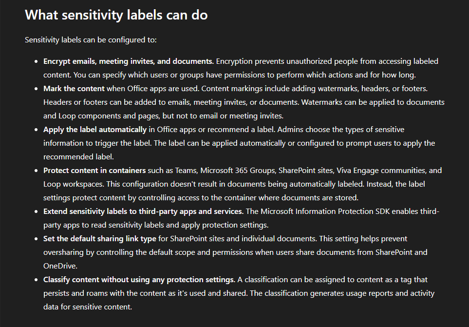
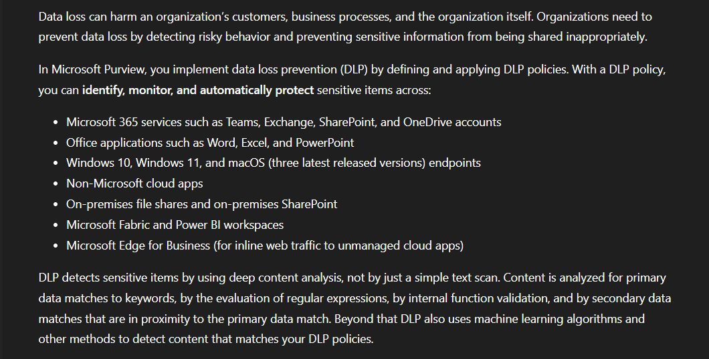
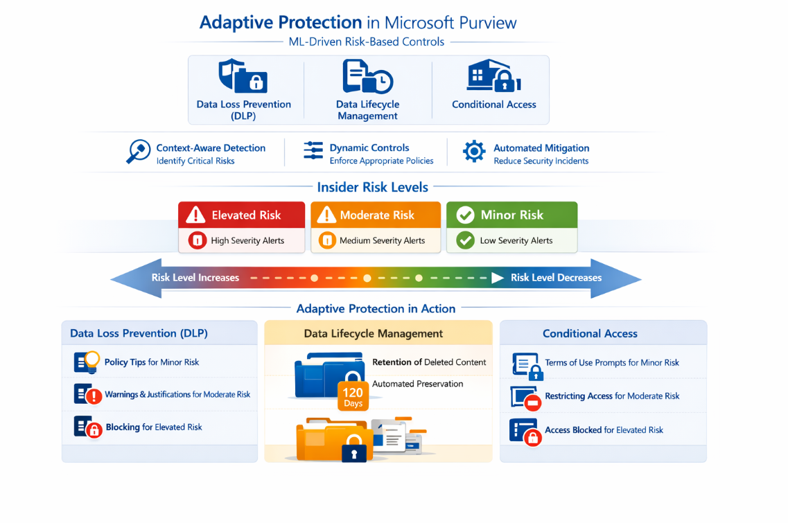
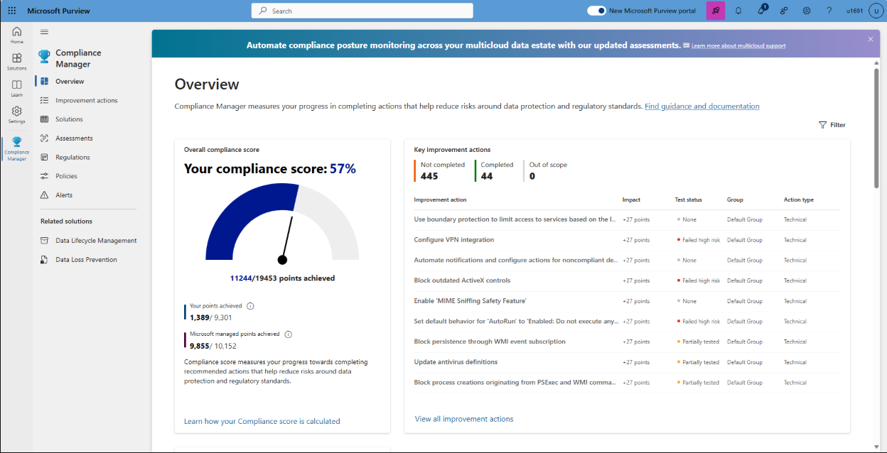
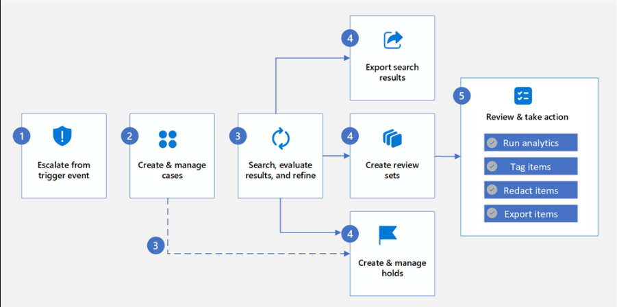
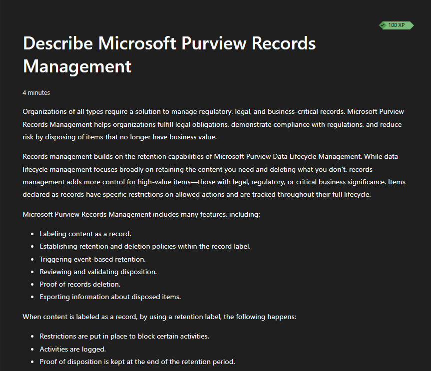
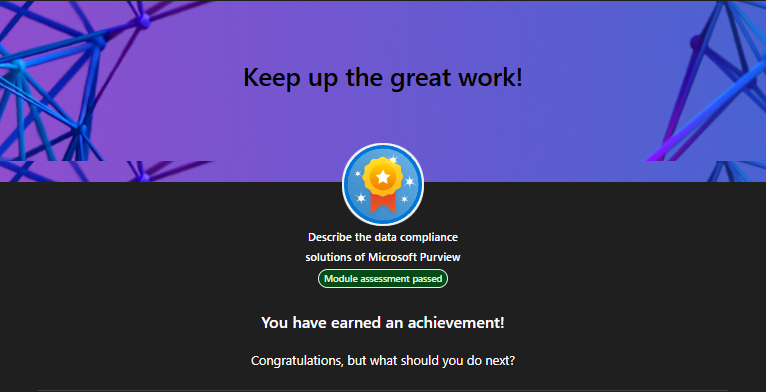

# Lab 11 - Microsoft Purview

> **Status:** Complete

## AI Use Disclosure

AI tools may be used to support learning, troubleshooting, documentation organization, technical review, and GitHub formatting during this lab.

All hands-on work, validation, screenshots, administrative decisions, and final documentation review must be completed by the project author. AI-generated guidance must be reviewed against Microsoft documentation and observed lab results before being accepted.

---

## Lab Metadata

| Item | Value |
|---|---|
| Difficulty | Beginner |
| Estimated Time | 2-4 hours |
| Lab Type | Microsoft Learn + concept-focused discovery |
| SC-900 Domain | Describe the capabilities of Microsoft compliance solutions |
| Primary Objective | Describe Microsoft Purview data security and data compliance solutions |
| Previous Lab Dependency | Lab 10 - Service Trust and Compliance |
| Next Lab Dependency | Lab 12 - MRTG SC-900 Security, Compliance, and Identity Capstone |

---

## Objective

Build a practical SC-900-level understanding of Microsoft Purview by completing the current Microsoft Learn modules for **data security** and **data compliance**.

By completing this lab, I:

- Completed **Describe the data security solutions of Microsoft Purview**
- Completed **Describe the data compliance solutions of Microsoft Purview**
- Passed both Microsoft Learn module assessments
- Reviewed Microsoft Purview Information Protection and sensitivity labels
- Reviewed Microsoft Purview Data Loss Prevention
- Reviewed Insider Risk Management and Adaptive Protection
- Reviewed Data Security Posture Management
- Reviewed Data Security Investigations
- Reviewed Compliance Manager
- Reviewed Communication Compliance
- Reviewed eDiscovery
- Reviewed Audit
- Reviewed Data Lifecycle Management
- Reviewed Records Management
- Connected Purview data-protection and compliance capabilities to identity, Zero Trust, governance, and regulated-environment requirements

---

## Business Problem

Monroe Redstone Technology Group (MRTG) needs to protect sensitive information throughout its lifecycle while also meeting operational, legal, regulatory, investigation, and records-management requirements.

Without coordinated data-security and compliance capabilities, MRTG could experience:

- Sensitive data being shared inappropriately
- Inconsistent classification and protection
- Data exposure caused by risky user behavior
- Weak visibility into data-security posture
- Difficulty investigating sensitive-data incidents
- Poor compliance tracking
- Incomplete legal discovery workflows
- Insufficient audit evidence
- Excessive retention of unnecessary information
- Premature deletion of required records

Microsoft Purview addresses these concerns through integrated data security, data governance, risk, audit, eDiscovery, lifecycle, and records-management capabilities.

---

## Scenario

MRTG has completed its review of Microsoft trust, privacy, and assurance resources and now needs to understand how Microsoft Purview helps an organization protect and govern its own data.

This was a **discovery-focused lab** using current Microsoft Learn material and concept evidence. No production-style sensitivity label, DLP policy, retention policy, insider-risk policy, eDiscovery hold, audit configuration, or records-management configuration was created solely for portfolio evidence.

---

## Success Criteria

The lab was considered successful because:

- Both current Microsoft Purview Learn modules were completed
- Both module assessments were passed
- Sensitivity labels can be explained
- DLP can be explained
- Insider Risk Management and Adaptive Protection can be explained
- Data Security Posture Management can be explained
- Data Security Investigations can be explained
- Compliance Manager can be explained
- Communication Compliance can be explained
- eDiscovery can be explained
- Audit can be explained
- Data Lifecycle Management and Records Management can be distinguished
- Eight sanitized screenshots were uploaded and verified
- No unnecessary compliance configuration or Azure consumption resource was created

---

## Prerequisites

Before beginning this lab:

- Lab 10 was complete
- Microsoft Learn access was available
- Basic Microsoft 365, identity, security, and compliance concepts were understood
- No Azure consumption resources were required
- No Purview administrative change was required solely for evidence collection

---

## Expected Starting State

| Item | Starting State |
|---|---|
| Previous lab | Complete |
| Purview policies created for Lab 11 | None |
| Retention changes performed | None |
| eDiscovery holds created | None |
| Insider Risk policies created | None |
| Azure resources created | None |
| Estimated Azure consumption cost | $0.00 |

---

## Required Permissions

| Permission or Role | Purpose | Required |
|---|---|---|
| Microsoft Learn account | Complete modules and assessments | Yes |
| Microsoft Purview administrative role | Not required for concept-focused Learn completion | No |
| Compliance Administrator | Not required for this discovery-focused lab | No |
| eDiscovery role group | Not required because no case or hold was created | No |

Least privilege was maintained by avoiding elevated administrative access that was unnecessary for the learning objectives.

---

## Services/Resources Used

| Service or Resource | Purpose |
|---|---|
| Microsoft Learn | Current SC-900-aligned Purview instruction and module assessments |
| Microsoft Purview | Data security, data compliance, lifecycle, audit, risk, and investigation concepts |
| GitHub | Lab documentation and sanitized screenshot evidence |

---

## Why Services Used

### Microsoft Learn

Microsoft Learn provided the current fundamentals-level scope for Purview. Using the current modules prevented the lab from being tied to an older single-module structure.

### Microsoft Purview

Microsoft Purview was reviewed because it brings together capabilities that classify, protect, monitor, retain, investigate, and govern organizational data.

### GitHub

GitHub was used to preserve a concise public portfolio record of the learning outcome while avoiding publication of real tenant-sensitive compliance data.

---

## Environment

| Item | Value |
|---|---|
| Organization | Monroe Redstone Technology Group |
| Lab mode | Microsoft Learn + concept-focused discovery |
| Sensitivity labels created | None |
| DLP policies created | None |
| Insider Risk policies created | None |
| Retention policies created | None |
| eDiscovery cases or holds created | None |
| Audit configuration changed | None |
| Azure resources created | None |
| Estimated Azure consumption cost | $0.00 |

---

## Architecture/Concept Diagram

~~~mermaid
flowchart LR
    Data[Organizational Data] --> Classify[Classify & Label]
    Classify --> Protect[Protect with Sensitivity Labels]
    Protect --> DLP[Data Loss Prevention]

    UserRisk[User Risk / Insider Signals] --> Adaptive[Adaptive Protection]
    Adaptive --> DLP
    Adaptive --> Lifecycle[Data Lifecycle Management]
    Adaptive --> CA[Conditional Access]

    Data --> DSPM[Data Security Posture Management]
    DSPM --> Investigate[Data Security Investigations]

    Data --> Compliance[Compliance Manager]
    Data --> EDisc[eDiscovery]
    Data --> Audit[Audit]
    Data --> Records[Records Management]

    Lifecycle --> Records
~~~

The key Purview idea is that data security and compliance are related but distinct. Purview can classify and protect data, prevent inappropriate sharing, adjust controls based on risk, investigate incidents, measure compliance posture, preserve evidence, audit activity, and govern information over time.

---

## Lab Safety & Change Control

- Used current Microsoft Learn content rather than forcing outdated module assumptions.
- Did not create or publish real sensitive-information matches.
- Did not create DLP, retention, records, insider-risk, or eDiscovery policies solely for screenshots.
- Did not create an eDiscovery hold.
- Did not change audit settings.
- Did not enable paid trials solely for portfolio evidence.
- Did not deploy Azure consumption resources.
- Avoided publishing real user activity, insider-risk cases, audit events, or tenant-specific compliance findings.
- Kept the final evidence set focused on concepts and module completion.

---

## Steps Performed

### Step 1: Complete the Purview Data Security Module

Completed **Describe the data security solutions of Microsoft Purview** and passed the module assessment.

### Step 2: Review Sensitivity Labels

Reviewed how sensitivity labels can classify and protect content.

The learning material showed that labels can support capabilities such as encryption, content markings, automatic or recommended labeling, protection for containers, third-party integration, sharing-control settings, and classification without mandatory protection actions.

### Step 3: Review Data Loss Prevention

Reviewed Microsoft Purview DLP and how it identifies, monitors, and protects sensitive information from inappropriate sharing.

The module showed DLP coverage across Microsoft 365 services, Office applications, endpoints, cloud apps, on-premises data locations, Microsoft Fabric / Power BI, and supported web activity.

### Step 4: Review Insider Risk and Adaptive Protection

Reviewed Adaptive Protection in Microsoft Purview.

The learning material showed how user risk levels can influence controls across Data Loss Prevention, Data Lifecycle Management, and Conditional Access.

Adaptive Protection uses context-aware detection, dynamic controls, and automated mitigation to apply stronger protection as risk increases.

### Step 5: Review Data Security Posture and Investigations

Reviewed Data Security Posture Management (DSPM) and Data Security Investigations conceptually.

DSPM provides a unified data-risk view and helps organizations answer questions such as:

- What data do we have?
- Where is it stored?
- Who can access it?
- How is it protected?

Data Security Investigations provides an investigation workspace for data-security incidents and uses generative-AI-assisted capabilities to help analysts find, categorize, examine, and assess impacted data.

### Step 6: Review the Purview Data Compliance Module

Completed **Describe the data compliance solutions of Microsoft Purview**.

The module covered the Microsoft Purview portal, Compliance Manager, Communication Compliance, eDiscovery, Audit, Data Lifecycle Management, and Records Management.

### Step 7: Review Compliance Manager

Reviewed Compliance Manager as a tool for assessing compliance posture through a compliance score, assessments, and improvement actions.

The evidence image illustrates the relationship between a compliance score and recommended improvement work. It is concept evidence, not a statement about MRTG's actual tenant score.

### Step 8: Review eDiscovery

Reviewed the eDiscovery workflow for legal and investigative scenarios.

The module illustrated a workflow that can include trigger events, case creation, search and refinement, review sets, holds, exports, and review actions.

### Step 9: Review Audit

Reviewed Microsoft Purview Audit conceptually.

Purview Audit records user and administrator activity across Microsoft 365 services so authorized investigators can search activity for security, compliance, legal, and forensic purposes.

The module also distinguished Audit offerings at a fundamentals level, including broader capabilities available with premium licensing.

### Step 10: Review Data Lifecycle and Records Management

Reviewed the distinction between Data Lifecycle Management and Records Management.

Data Lifecycle Management broadly governs retention and deletion. Records Management builds on retention capabilities with stronger controls for information that has legal, regulatory, or critical business significance.

### Step 11: Complete the Data Compliance Assessment

Passed the data compliance module assessment.

---

## Supporting Concept Summary

### Microsoft Purview Information Protection

Helps organizations discover, classify, and protect sensitive information.

### Sensitivity Labels

Sensitivity labels classify information and can also apply protection such as encryption, content markings, sharing controls, and other policy-based behavior.

### Data Loss Prevention

DLP detects sensitive information and can monitor, warn, restrict, or block inappropriate data-sharing actions according to policy.

### Insider Risk Management

Helps identify and investigate potentially risky user activity involving organizational data.

### Adaptive Protection

Uses changing insider-risk levels to dynamically adjust protection controls instead of treating every user as having the same risk level at all times.

### Data Security Posture Management

Provides a unified view of data-security risk and helps organizations discover sensitive data, assess exposure, and prioritize remediation.

### Data Security Investigations

Supports end-to-end investigation of data-security incidents and can use generative AI to assist analysis of affected information.

### Compliance Manager

Helps organizations assess compliance posture, review assessments, and prioritize improvement actions.

### Communication Compliance

Helps organizations identify and address communication behavior that may violate organizational, regulatory, or conduct requirements.

### eDiscovery

Supports legal and investigative workflows involving search, preservation, collection, review, and export of electronic information.

### Audit

Captures user and administrator activities to support investigations, accountability, compliance, and legal requirements.

### Data Lifecycle Management

Manages retention and deletion of content over time.

### Records Management

Adds stronger governance for high-value records, including record declaration, retention controls, event-based retention, disposition review, and proof of deletion where applicable.

---

## Evidence Collected

| Screenshot | Evidence |
|---|---|
| 00-purview-data-security-module-complete.png | Data security module assessment passed |
| 01-purview-sensitivity-labels.png | Sensitivity-label capabilities |
| 02-purview-data-loss-prevention.png | DLP purpose and coverage |
| 03-purview-adaptive-protection.png | Risk-based Adaptive Protection controls |
| 04-purview-compliance-manager.png | Compliance Manager score and improvement-action concepts |
| 05-purview-ediscovery-workflow.png | eDiscovery case and review workflow |
| 06-purview-records-management.png | Records Management and retention distinctions |
| 07-purview-data-compliance-module-complete.png | Data compliance module assessment passed |

---

## Validation

| Validation Item | Expected Result | Actual Result |
|---|---|---|
| Purview data security module | Completed | Passed |
| Data security assessment | Passed | Passed |
| Sensitivity-label review | Concept understood | Passed |
| DLP review | Concept understood | Passed |
| Adaptive Protection review | Concept understood | Passed |
| DSPM / Data Security Investigations review | Concepts understood | Passed |
| Purview data compliance module | Completed | Passed |
| Data compliance assessment | Passed | Passed |
| Compliance Manager review | Concept understood | Passed |
| eDiscovery review | Concept understood | Passed |
| Audit review | Concept understood | Passed |
| Data Lifecycle / Records review | Concepts distinguished | Passed |
| Screenshot verification | Eight expected files present | Passed |
| Compliance policy changes | None required | Passed |
| Azure resource creation | None expected | Passed |

---

## Completion Checklist

- [x] Completed the current Purview data security module
- [x] Passed the data security module assessment
- [x] Reviewed Information Protection and sensitivity labels
- [x] Reviewed Data Loss Prevention
- [x] Reviewed Insider Risk Management
- [x] Reviewed Adaptive Protection
- [x] Reviewed Data Security Posture Management
- [x] Reviewed Data Security Investigations
- [x] Completed the current Purview data compliance module
- [x] Passed the data compliance module assessment
- [x] Reviewed Compliance Manager
- [x] Reviewed Communication Compliance
- [x] Reviewed eDiscovery
- [x] Reviewed Audit
- [x] Reviewed Data Lifecycle Management
- [x] Reviewed Records Management
- [x] Uploaded eight sanitized screenshots
- [x] Verified all eight screenshot filenames in GitHub
- [x] Confirmed no Azure consumption resources were created
- [x] Confirmed no unnecessary compliance configuration was created
- [x] Marked Lab 11 complete

---

## SC-900 Exam Objective Coverage

### Primary Exam Domain

**Describe the capabilities of Microsoft compliance solutions**

This lab supports the ability to describe the major Microsoft Purview data-security and data-compliance capabilities at the fundamentals level.

### Skills Measured

This lab supports the ability to recognize and explain scenarios involving:

- Data classification and protection
- Sensitivity labels
- DLP
- Insider risk and Adaptive Protection
- Data-security posture and investigations
- Compliance Manager
- Communication Compliance
- eDiscovery
- Audit
- Data lifecycle
- Records management

### How This Lab Supports the Objectives

The lab connected Microsoft Learn concepts to common business scenarios involving protecting sensitive information, preventing inappropriate data sharing, adjusting controls based on user risk, assessing compliance posture, investigating legal or security events, retaining required information, disposing of information appropriately, and preserving accountable audit evidence.

---

## Mini Objective Coverage

By completing this lab, I can:

- Explain Microsoft Purview at an SC-900 level
- Explain what sensitivity labels do
- Explain how DLP differs from sensitivity labels
- Explain Insider Risk Management
- Explain Adaptive Protection
- Explain Data Security Posture Management
- Explain Data Security Investigations
- Explain Compliance Manager
- Explain Communication Compliance
- Explain eDiscovery
- Explain Audit
- Explain Data Lifecycle Management
- Explain Records Management
- Distinguish retention from records-management controls
- Recognize when each Purview capability should be used

---

## Exam Traps/Key Distinctions

### Sensitivity Labels vs DLP

- **Sensitivity labels:** classify content and can apply protection.
- **DLP:** monitors data use and can warn, restrict, or block inappropriate sharing or movement.

### Data Lifecycle Management vs Records Management

- **Data Lifecycle Management:** broadly manages retention and deletion.
- **Records Management:** adds stronger controls for high-value records with legal, regulatory, or business significance.

### Compliance Manager vs Service Trust Portal

- **Compliance Manager:** helps the organization assess and improve its own compliance posture.
- **Service Trust Portal:** provides Microsoft audit, assurance, privacy, and compliance documentation about Microsoft services.

### eDiscovery vs Audit

- **eDiscovery:** supports legal and investigative discovery workflows involving content.
- **Audit:** records user and administrator activity for investigation and accountability.

### Insider Risk Management vs Adaptive Protection

- **Insider Risk Management:** detects and investigates risky user behavior.
- **Adaptive Protection:** uses risk levels to dynamically apply stronger or lighter controls.

### Compliance Score

A Compliance Manager score helps prioritize improvement work. It is not a guarantee that an organization is legally or regulatorily compliant.

---

## IAM/Security Relevance

Purview is strongly connected to identity because data protection often depends on who the user is, what data they are accessing, how sensitive the data is, what action they are attempting, what their current risk is, and what policy applies.

IAM determines whether an identity can access a resource. Purview adds controls around what happens to the data before, during, and after that access.

Examples include sensitivity labels protecting files that users can access, DLP restricting risky sharing, Adaptive Protection changing controls based on user risk, Audit recording user and administrator actions, and eDiscovery preserving information for authorized investigations.

---

## On-Premises Connection

Purview can apply to hybrid data-security and compliance scenarios, including supported on-premises data locations.

| Traditional / On-Premises Concept | Microsoft Purview Concept |
|---|---|
| Manual document classification | Sensitivity labels and information protection |
| File-share data handling rules | DLP and data classification |
| Records retention schedules | Data Lifecycle Management and Records Management |
| Event-log review | Purview Audit for Microsoft 365 activity |
| Legal document collection | eDiscovery |
| Employee-risk investigation | Insider Risk Management |

The core governance problem is the same: organizations must know what data they have, who can access it, how it is protected, how long it must be kept, and how actions can be investigated.

---

## Security Analysis

Purview adds a **data-centric** layer to security.

Traditional controls can protect identities, devices, applications, and networks, but sensitive data can still be exposed through legitimate access followed by inappropriate sharing or misuse.

Purview helps address that gap by classifying sensitive information, applying protection to the information itself, monitoring data movement, detecting risky behavior, adjusting controls based on risk, investigating data-security incidents, and logging user and administrator activity.

Administrative access to Purview capabilities should use least privilege because compliance and investigation tools can expose highly sensitive information.

---

## Zero Trust Analysis

### Verify Explicitly

Purview can use data sensitivity, user context, risk, and activity to inform policy decisions rather than relying only on whether a user successfully signed in.

### Use Least Privilege

Purview administrative, eDiscovery, audit, insider-risk, and records roles should be limited to authorized personnel with a documented business need.

### Assume Breach

Purview supports the assumption that preventive controls can fail. DLP, Audit, Insider Risk Management, Adaptive Protection, Data Security Investigations, and eDiscovery provide ways to detect, investigate, contain, preserve, and understand data-related incidents.

---

## Governance/Compliance

Microsoft Purview demonstrates how governance and compliance controls operate across the data lifecycle:

**Discover → Classify → Protect → Monitor → Retain → Investigate → Dispose**

Production governance should define:

- Data owners
- Classification standards
- Sensitivity-label taxonomy
- DLP policy ownership
- Retention schedules
- Records categories
- eDiscovery authorization
- Audit access
- Insider-risk case handling
- Separation of duties
- Legal and privacy review
- Policy exception processes
- Review and recertification schedules

Compliance tooling supports compliance efforts, but technical configuration alone does not guarantee legal or regulatory compliance.

---

## Cost & Licensing

### Estimated Lab Cost

**Estimated Azure consumption cost: $0.00**

No Azure consumption resources were deployed for this lab.

### Licensing

Purview feature availability varies by Microsoft 365 and compliance licensing.

Capabilities that may have plan or license dependencies include advanced sensitivity labeling, endpoint and advanced DLP features, Insider Risk Management, Adaptive Protection, Data Security Posture Management, Data Security Investigations, advanced Audit capabilities, advanced eDiscovery capabilities, and Records Management features.

No paid trial or license was enabled solely to produce portfolio evidence.

---

## Troubleshooting

### Issue: Original Lab Scope Was Broader Than a Single Current Module

**Symptom**

The original Lab 11 plan assumed one Purview module would cover information protection, DLP, retention, records, Audit, and eDiscovery.

**Cause**

Current Microsoft Learn content separates Purview fundamentals into multiple modules, including distinct data security and data compliance modules.

**Resolution**

The lab followed the current Microsoft Learn structure instead of forcing an outdated single-module design.

**Result**

Both current modules were completed, both assessments were passed, and the final README documents the actual topics reviewed.

### Issue: Evidence Set Became Too Large

**Symptom**

More than ten useful screenshots were available across the two modules.

**Resolution**

The evidence set was pruned to eight screenshots that best demonstrate module completion and the major SC-900 concepts.

**Result**

The final public evidence remains comprehensive without becoming repetitive.

---

## What I Would Do Differently in Production

A production Purview implementation would include formal planning before enabling controls.

### Information Protection

- Define a sensitivity-label taxonomy
- Map labels to business and regulatory requirements
- Pilot labels before broad deployment
- Train users on classification expectations

### Data Loss Prevention

- Begin with audit or simulation modes where appropriate
- Tune false positives before blocking
- Define exception and escalation processes
- Coordinate endpoint, Microsoft 365, cloud-app, and on-premises coverage

### Insider Risk and Adaptive Protection

- Involve legal, privacy, HR, compliance, and security stakeholders
- Limit access to insider-risk information
- Define case-handling procedures
- Validate automated protections before broad enforcement

### Compliance and Investigations

- Assign least-privilege roles
- Define eDiscovery and legal-hold authorization
- Establish audit-log access standards
- Protect investigation evidence
- Maintain documented chain-of-custody procedures where required

### Lifecycle and Records

- Build retention schedules from legal and business requirements
- Define record categories
- Configure disposition review
- Test deletion and preservation behavior
- Document exceptions and legal holds

---

## Lessons Learned

- Microsoft Purview covers both **data security** and **data compliance**.
- Sensitivity labels classify information and can apply protection.
- DLP controls how sensitive information is used or shared.
- Adaptive Protection changes controls dynamically based on user risk.
- DSPM focuses on understanding and reducing risk around the data itself.
- Compliance Manager helps prioritize compliance-improvement actions.
- eDiscovery and Audit solve different investigation needs.
- Data Lifecycle Management and Records Management are related but not identical.
- Compliance and data security are closely connected to identity because users are the actors accessing, sharing, changing, and deleting information.
- Current Microsoft Learn structure should drive portfolio documentation rather than older module assumptions.

### Technical Takeaway

Purview provides a coordinated set of controls for classification, protection, risk detection, investigation, retention, auditing, and records management.

### Business Takeaway

Data security is not complete unless an organization also knows how information should be governed, retained, investigated, and disposed of.

### IAM Takeaway

Identity establishes who can access data; Purview helps govern what those identities can do with sensitive information and how their actions are monitored.

### Security Takeaway

Data-centric controls help reduce the risk that legitimate access becomes inappropriate data use or exfiltration.

### Compliance Takeaway

Purview provides technical capabilities that support compliance programs, but organizational policy, legal interpretation, governance, and evidence management remain necessary.

### Exam Takeaway

Know the purpose of each major Purview capability and be able to distinguish closely related tools such as sensitivity labels vs DLP, eDiscovery vs Audit, and Data Lifecycle Management vs Records Management.

---

## Skills Demonstrated

- Microsoft Purview fundamentals
- Information Protection concepts
- Sensitivity-label concepts
- Data Loss Prevention fundamentals
- Insider Risk Management fundamentals
- Adaptive Protection fundamentals
- Data Security Posture Management fundamentals
- Data Security Investigations concepts
- Compliance Manager fundamentals
- Communication Compliance fundamentals
- eDiscovery fundamentals
- Audit fundamentals
- Data Lifecycle Management fundamentals
- Records Management fundamentals
- Zero Trust analysis
- IAM and data-security analysis
- Compliance and governance analysis
- Licensing awareness
- Security-conscious evidence selection
- Technical documentation

---

## Cleanup

No cloud resource, policy, hold, case, label, retention configuration, or paid feature was created solely for this lab.

| Item | Cleanup Required |
|---|---|
| Sensitivity labels | None |
| DLP policies | None |
| Insider Risk policies | None |
| Retention policies | None |
| eDiscovery holds | None |
| Azure resources | None |
| Paid trials | None |
| Estimated ongoing Azure cost | $0.00 |

---

## Documentation Security Review

Before publishing this lab:

- [x] Tenant identifiers were reviewed
- [x] User principal names and email addresses were reviewed
- [x] Real sensitive-information matches were not published
- [x] Real insider-risk cases were not published
- [x] Real eDiscovery case information was not published
- [x] Real audit events were not published
- [x] Credentials, secrets, tokens, and authentication details were not exposed
- [x] Tenant-specific compliance findings were not represented as MRTG production data
- [x] The Compliance Manager image is documented as concept evidence rather than MRTG's actual compliance score
- [x] Screenshots were limited to learning and concept evidence

---

## Outcome

Lab 11 successfully established the Microsoft Purview foundation required for the SC-900 compliance domain.

MRTG can now explain how Microsoft Purview classifies and protects sensitive data, prevents inappropriate data sharing, detects and responds to insider risk, applies Adaptive Protection, assesses data-security posture, supports data-security investigations, measures compliance posture, supports communication compliance, performs eDiscovery, records auditable activity, manages data lifecycle, and governs business and regulatory records.

Both current Purview Microsoft Learn modules were completed and both assessments were passed.

**Lab 11 status: Complete.**

---

## Screenshot Inventory/Screenshots

| Screenshot | Status | Purpose |
|---|---|---|
| 00-purview-data-security-module-complete.png | Included | Data security module assessment passed |
| 01-purview-sensitivity-labels.png | Included | Sensitivity-label capabilities |
| 02-purview-data-loss-prevention.png | Included | DLP purpose and supported coverage |
| 03-purview-adaptive-protection.png | Included | Risk-based Adaptive Protection |
| 04-purview-compliance-manager.png | Included | Compliance Manager concepts |
| 05-purview-ediscovery-workflow.png | Included | eDiscovery workflow |
| 06-purview-records-management.png | Included | Records Management and retention concepts |
| 07-purview-data-compliance-module-complete.png | Included | Data compliance module assessment passed |

### Data Security Module Complete

### Sensitivity Labels

### Data Loss Prevention

### Adaptive Protection

### Compliance Manager

### eDiscovery

### Records Management

### Data Compliance Module Complete

---

## Next Lab / Series Completion

The next lab is:

**Lab 12 - MRTG SC-900 Security, Compliance, and Identity Capstone**

Lab 12 will integrate the identity, security, threat-protection, data-protection, governance, and compliance concepts from the full SC-900 series into a final capstone scenario.
