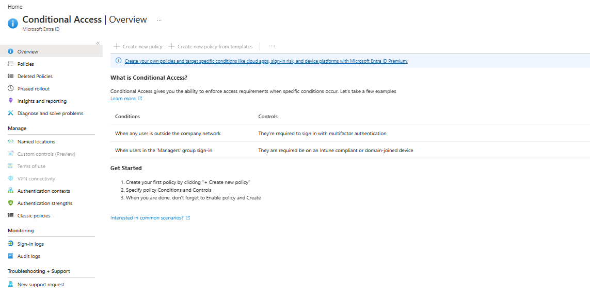
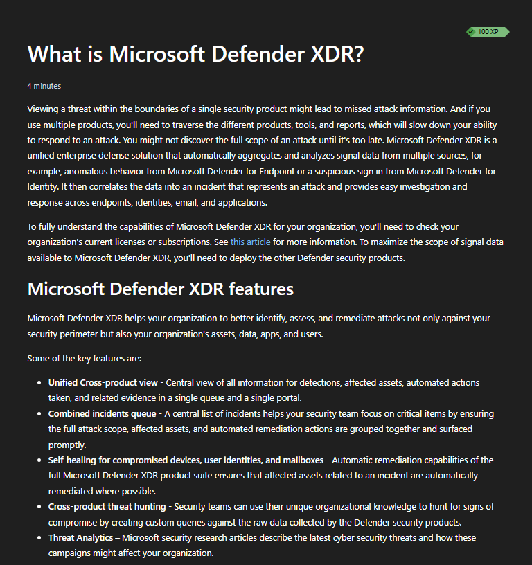
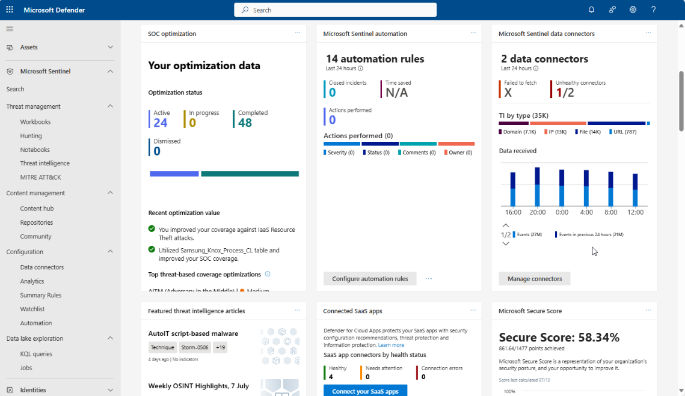
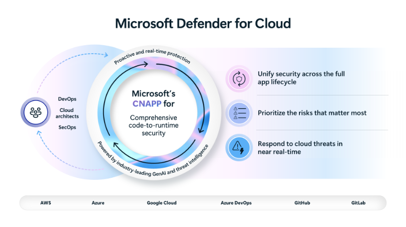
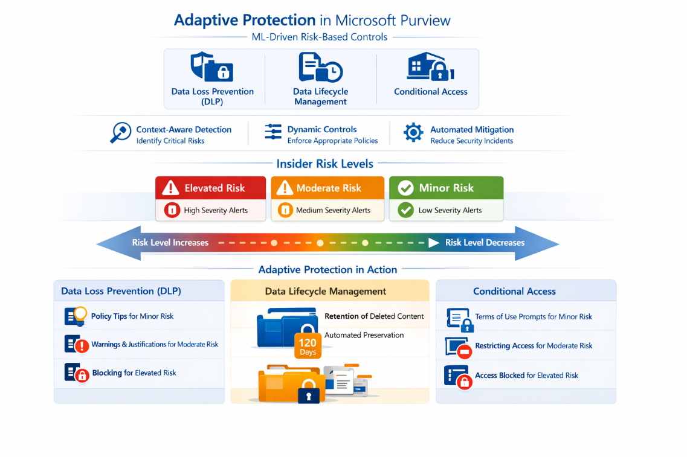
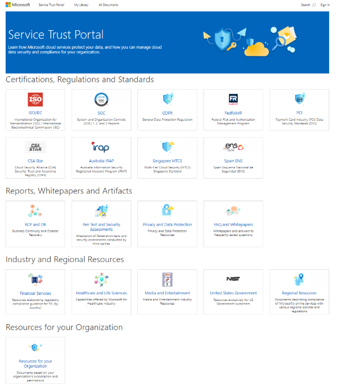

# Lab 12 - MRTG SC-900 Security, Compliance, and Identity Capstone

> **Status:** Complete

## AI Use Disclosure

AI tools may be used to support learning, troubleshooting, documentation organization, technical review, and GitHub formatting during this lab.

All hands-on work, validation, screenshots, administrative decisions, and final documentation review must be completed by the project author. AI-generated guidance must be reviewed against Microsoft documentation and observed lab results before being accepted.

---

## Lab Metadata

| Item | Value |
|---|---|
| Difficulty | Beginner / Intermediate |
| Estimated Time | 2-3 hours |
| Lab Type | Integrated discovery and incident-analysis capstone |
| SC-900 Domain | All four SC-900 domains |
| Previous Lab Dependency | Lab 11 - Microsoft Purview |
| Next Lab Dependency | None - series completion |

---

## Objective

Integrate the identity, security, threat-protection, cloud-security, privacy, governance, and compliance concepts from Labs 01-11 into one end-to-end SC-900 capstone scenario.

By completing this lab, I:

- Mapped a phishing and credential-theft scenario to Microsoft Entra controls
- Applied Zero Trust principles to identity and access decisions
- Mapped email, identity, endpoint, and cloud-app signals to Microsoft Defender XDR
- Distinguished Defender XDR from Microsoft Sentinel
- Distinguished Defender for Cloud from Defender XDR and Sentinel
- Connected Microsoft Purview controls to attempted sensitive-data exfiltration
- Connected Service Trust Portal evidence to shared responsibility and customer due diligence
- Reviewed least-privilege and investigation-access requirements
- Completed a read-only, concept-focused capstone without creating unnecessary cost or risk
- Verified six final capstone screenshots in GitHub
- Closed the 12-lab MRTG SC-900 series

---

## Business Problem

Monroe Redstone Technology Group (MRTG) needs a repeatable way to understand and respond to a cross-domain security event involving identity compromise, malicious email, endpoint activity, cloud access, and possible sensitive-data exposure.

A real incident can cross multiple Microsoft security and compliance services. If each product is treated in isolation, analysts may miss the attack chain, apply the wrong control, or fail to preserve the evidence needed for legal, compliance, and security review.

This capstone demonstrates how the Microsoft security, compliance, and identity ecosystem works together.

---

## Scenario

A fictional MRTG employee receives a phishing email and enters credentials into a malicious site.

The attacker then:

1. Attempts to sign in using the stolen credentials.
2. Accesses Microsoft 365 resources.
3. Executes suspicious activity from an endpoint.
4. Attempts to locate and download sensitive information.
5. Tries to share that information externally.

MRTG must determine which Microsoft services would prevent, detect, investigate, correlate, protect, preserve, and document the activity.

This was a **discovery and analysis capstone**. No real compromise, destructive action, paid feature, or production-style policy was created solely for evidence collection.

---

## Success Criteria

The capstone was considered successful because:

- The attack path was mapped from phishing through attempted data exfiltration
- Microsoft Entra controls were mapped to identity protection and access decisions
- Defender XDR components were mapped to email, identity, endpoint, and cloud-app signals
- Microsoft Sentinel was correctly distinguished from Defender XDR
- Defender for Cloud was correctly distinguished from Defender XDR and Sentinel
- Microsoft Purview controls were mapped to data protection and compliance
- Zero Trust principles were applied
- Least-privilege administrative access was documented
- Shared responsibility was explained
- Six sanitized screenshots were uploaded and verified
- No unnecessary paid or destructive configuration was performed
- The project was updated to 12 of 12 labs complete

---

## Prerequisites

- Labs 01-11 complete
- Microsoft Learn concept evidence available from previous labs
- Read-only access to applicable Microsoft portals where available
- Basic understanding of Microsoft Entra, Defender, Sentinel, Purview, and Service Trust Portal concepts
- Access to the GitHub project repository

---

## Expected Starting State

| Item | Starting State |
|---|---|
| Labs completed | 11 of 12 |
| Capstone scenario | Defined |
| Real security incident required | No |
| New identities required | No |
| New security policies required | No |
| New compliance policies required | No |
| Azure consumption resources required | No |
| Estimated Azure consumption cost | $0.00 |

---

## Required Permissions

| Permission or Role | Purpose | Required |
|---|---|---|
| Microsoft Learn access | Review concept evidence | Yes |
| Microsoft Entra read access | Conditional Access / identity review | Where available |
| Microsoft Defender read access | Conceptual security-operations review | Where available |
| Microsoft Sentinel read access | SIEM/SOAR review | Where available |
| Microsoft Purview read access | Data protection / compliance review | Where available |
| Privileged administrative role | Not required for core capstone analysis | No |

Least privilege was maintained. No privileged role was requested solely to create screenshots.

---

## Services/Resources Used

| Service or Resource | Purpose |
|---|---|
| Microsoft Entra | Identity, authentication, Conditional Access, and Zero Trust analysis |
| Microsoft Defender XDR | Cross-domain detection and incident correlation |
| Microsoft Sentinel | SIEM/SOAR, broader telemetry, hunting, and automation concepts |
| Microsoft Defender for Cloud | Cloud security posture and workload-protection concepts |
| Microsoft Purview | Data security, DLP, adaptive protection, audit, eDiscovery, retention, and records concepts |
| Service Trust Portal | Assurance, privacy, and shared-responsibility evidence |
| GitHub | Final project documentation and sanitized evidence |

---

## Why Services Used

### Microsoft Entra

Microsoft Entra provides the identity and access-control layer. Conditional Access, MFA, authentication strength, Identity Protection, least privilege, and governance controls help reduce the value of stolen credentials.

### Microsoft Defender XDR

Defender XDR correlates signals across Microsoft security domains so activity involving email, identities, endpoints, and applications can be investigated as one attack story.

### Microsoft Sentinel

Sentinel provides broader SIEM/SOAR capabilities across many data sources and supports analytics, hunting, incidents, and automation.

### Microsoft Defender for Cloud

Defender for Cloud focuses on cloud security posture, workload protection, multicloud security, and risk prioritization across cloud resources and development environments.

### Microsoft Purview

Purview provides the data-centric controls needed to classify, protect, monitor, retain, investigate, and govern sensitive information.

### Service Trust Portal

The Service Trust Portal provides Microsoft assurance, audit, certification, privacy, and compliance evidence used for due diligence. It does not replace the customer's own security and compliance responsibilities.

---

## Environment

| Item | Value |
|---|---|
| Organization | Monroe Redstone Technology Group |
| Lab mode | Discovery and incident-analysis capstone |
| Real incident created | No |
| Security policies changed | None |
| Compliance policies changed | None |
| Azure resources created | None |
| Paid trials enabled | None |
| Estimated Azure consumption cost | $0.00 |

---

## Architecture/Concept Diagram

~~~mermaid
flowchart LR
    Phish[Phishing Email] --> Creds[Credential Theft]
    Creds --> Entra[Microsoft Entra]
    Entra --> CA[Conditional Access / MFA / Risk Controls]

    Phish --> MDO[Defender for Office 365]
    Creds --> MDI[Defender for Identity]
    Endpoint[Suspicious Endpoint Activity] --> MDE[Defender for Endpoint]
    CloudApps[Cloud App Activity] --> MDCA[Defender for Cloud Apps]

    MDO --> XDR[Microsoft Defender XDR]
    MDI --> XDR
    MDE --> XDR
    MDCA --> XDR

    XDR --> Incident[Correlated Incident]
    Incident --> Sentinel[Microsoft Sentinel]
    Sentinel --> SOC[SOC Investigation / Automation]

    Sensitive[Sensitive Data] --> Purview[Microsoft Purview]
    Purview --> Labels[Sensitivity Labels]
    Purview --> DLP[Data Loss Prevention]
    Purview --> Audit[Audit]
    Purview --> EDisc[eDiscovery]
    Purview --> Retention[Retention / Records]

    Cloud[Cloud Workloads] --> DFC[Defender for Cloud]

    SOC --> Response[Containment and Response]
    Purview --> Response
    DFC --> Response
~~~

---

## Lab Safety & Change Control

- Used a fictional attack scenario.
- Did not create a real security incident.
- Did not add guest users or change tenant membership solely to gain portal access.
- Did not publish real user identities, device names, incident details, tenant IDs, application IDs, or object IDs.
- Used Microsoft Learn concept evidence when live portal access was unnecessary or would expose operational details.
- Did not deploy billable Sentinel or Azure resources.
- Did not enable paid trials solely for evidence.
- Kept the final evidence set concise and sanitized.

---

## Steps Performed

### Step 1: Identity and Zero Trust Review

Reviewed Microsoft Entra Conditional Access as the identity-control layer for the compromised-user scenario.

The capstone reinforced that possession of a password should not automatically grant access. Conditional Access can evaluate conditions such as sign-in risk, device state, location, authentication context, or group membership and require controls such as MFA or a compliant device.

### Step 2: Defender XDR Correlation Review

Reviewed Microsoft Defender XDR concept evidence showing that Defender XDR aggregates and analyzes signals from multiple Microsoft security products.

The attack scenario maps naturally to:

- Defender for Office 365 for phishing and malicious email
- Defender for Identity for identity-related attack signals
- Defender for Endpoint for suspicious endpoint activity
- Defender for Cloud Apps for risky cloud-app activity

Related detections can be correlated into incidents for broader investigation and response.

### Step 3: Microsoft Sentinel SIEM/SOAR Review

Reviewed Microsoft Sentinel concept evidence showing security-operations capabilities such as data connectors, analytics, threat intelligence, hunting, workbooks, MITRE ATT&CK mapping, and automation.

Sentinel complements Defender XDR by providing broader SIEM/SOAR coverage across many security sources.

### Step 4: Defender for Cloud Review

Reviewed Microsoft Defender for Cloud as a CNAPP-focused service for cloud security posture and workload protection.

The capstone evidence highlights multicloud coverage, risk prioritization, application-lifecycle security, and cloud threat response.

### Step 5: Purview Data Protection Review

Reviewed Adaptive Protection in Microsoft Purview.

Adaptive Protection connects insider-risk levels to dynamic controls across DLP, Data Lifecycle Management, and Conditional Access. This ties identity risk directly to data-protection decisions.

### Step 6: Service Trust and Shared Responsibility Review

Reviewed Service Trust Portal evidence covering certifications, regulations, standards, reports, whitepapers, privacy resources, and industry/regional content.

The portal helps MRTG evaluate Microsoft's controls and commitments while reinforcing that MRTG remains responsible for its own configuration, identities, access decisions, data handling, and compliance obligations.

---

## Supporting Concept Summary

### Identity and Access

Microsoft Entra controls determine whether a request should be trusted and what additional requirements should apply.

### Cross-Domain Detection and Response

Defender XDR correlates related security signals across Microsoft Defender products into a broader incident context.

### SIEM and SOAR

Microsoft Sentinel ingests and analyzes security data from many sources and supports hunting, investigation, and automation.

### Cloud Security Posture and Workload Protection

Defender for Cloud helps prioritize and reduce cloud risk across Azure and multicloud environments.

### Data Security and Compliance

Microsoft Purview protects and governs sensitive information through classification, labels, DLP, insider-risk controls, audit, eDiscovery, lifecycle, and records-management capabilities.

### Assurance and Shared Responsibility

The Service Trust Portal provides evidence about Microsoft services. MRTG must still operate its own controls correctly.

---

## Evidence Collected

| Screenshot | Evidence |
|---|---|
| `01-capstone-entra-zero-trust.png` | Conditional Access and Zero Trust identity control |
| `02-capstone-defender-xdr-incident.png` | Defender XDR cross-product correlation |
| `03-capstone-sentinel-security-operations.png` | Sentinel SIEM/SOAR security-operations concepts |
| `04-capstone-defender-for-cloud.png` | CNAPP, posture, workload, and multicloud security |
| `05-capstone-purview-data-protection.png` | Adaptive Protection and data-risk controls |
| `06-capstone-service-trust.png` | Service Trust assurance and compliance resources |

---

## Validation

| Validation Item | Expected Result | Actual Result |
|---|---|---|
| Identity / Zero Trust mapping | Completed | Passed |
| Defender XDR mapping | Completed | Passed |
| Sentinel SIEM/SOAR mapping | Completed | Passed |
| Defender for Cloud distinction | Completed | Passed |
| Purview data-protection mapping | Completed | Passed |
| Service Trust / shared responsibility mapping | Completed | Passed |
| Six capstone screenshots | Present in GitHub | Passed |
| Sensitive evidence exposure | None required | Passed |
| Azure resource creation | None | Passed |
| Paid feature enablement | None | Passed |
| Project completion state | 12 of 12 | Passed |

---

## Completion Checklist

- [x] Reviewed capstone scenario
- [x] Completed identity and Zero Trust mapping
- [x] Completed Defender XDR mapping
- [x] Completed Sentinel SIEM/SOAR mapping
- [x] Completed Defender for Cloud distinction
- [x] Completed Purview data-security and compliance mapping
- [x] Completed Service Trust / shared-responsibility mapping
- [x] Completed read-only / concept-focused walkthrough
- [x] Captured and sanitized final evidence
- [x] Verified six evidence files in GitHub
- [x] Completed final SC-900 concept review
- [x] Marked Lab 12 complete
- [x] Updated root README to 12 of 12 complete
- [x] Closed the MRTG SC-900 project

---

## SC-900 Exam Objective Coverage

This capstone integrates all four SC-900 domains:

1. **Describe the concepts of security, compliance, and identity**
2. **Describe the capabilities of Microsoft Entra**
3. **Describe the capabilities of Microsoft security solutions**
4. **Describe the capabilities of Microsoft compliance solutions**

The capstone does not introduce a new product objective. Its purpose is to demonstrate that the major concepts can be connected correctly in one scenario.

---

## Mini Objective Coverage

By completing this capstone, I can:

- Trace an attack from phishing through attempted data exfiltration
- Explain why stolen credentials alone should not equal trusted access
- Map identity controls to Microsoft Entra
- Map Defender products to their security domains
- Explain Defender XDR incident correlation
- Explain Sentinel's SIEM/SOAR role
- Explain Defender for Cloud's CNAPP role
- Explain Purview's data-protection and compliance role
- Explain Service Trust Portal assurance evidence
- Apply Zero Trust and least privilege across the scenario
- Explain shared responsibility
- Identify which evidence sources support security, legal, and compliance review

---

## Exam Traps/Key Distinctions

### Defender XDR vs Microsoft Sentinel

- **Defender XDR:** cross-domain detection and response across Microsoft Defender security products.
- **Microsoft Sentinel:** broader SIEM/SOAR platform for security data from many sources.

### Defender for Cloud vs Defender XDR

- **Defender for Cloud:** cloud security posture and workload protection.
- **Defender XDR:** cross-product threat detection, correlation, investigation, and response.

### Microsoft Entra vs Defender XDR

- **Microsoft Entra:** identity, authentication, authorization, risk, and access-control platform.
- **Defender XDR:** detects and correlates security threats across Defender products.

### Sensitivity Labels vs DLP

- **Sensitivity labels:** classify content and can apply protection.
- **DLP:** monitors sensitive-data use and can warn, restrict, or block risky activity.

### Compliance Manager vs Service Trust Portal

- **Compliance Manager:** helps the customer assess and improve its own compliance posture.
- **Service Trust Portal:** provides Microsoft assurance and compliance documentation.

### Audit vs eDiscovery

- **Audit:** records user and administrator activity.
- **eDiscovery:** supports legal and investigative search, preservation, review, and export workflows.

---

## IAM/Security Relevance

The capstone reinforces the project's identity-first model:

1. **Who or what is requesting access?**
2. **What grants that identity permission?**
3. **How would misuse or compromise be prevented, detected, or investigated?**

A phishing attack becomes more damaging when identity controls, endpoint security, cloud-app monitoring, data protection, and investigation workflows are weak or disconnected.

---

## On-Premises Connection

Hybrid environments can contain on-premises Active Directory, cloud identities, endpoints, Microsoft 365 workloads, cloud resources, and third-party services.

The Microsoft security ecosystem provides different layers for these areas:

| Security Need | Microsoft Capability |
|---|---|
| Cloud identity and access | Microsoft Entra |
| Endpoint, identity, email, app threat correlation | Defender XDR |
| Broad security monitoring and automation | Microsoft Sentinel |
| Cloud posture and workload protection | Defender for Cloud |
| Data security and compliance | Microsoft Purview |
| Provider assurance evidence | Service Trust Portal |

---

## Security Analysis

The capstone scenario demonstrates why security must be layered.

No single product solves the entire attack:

- Entra can challenge or block risky access.
- Defender for Office 365 can detect the phishing message.
- Defender for Identity can detect identity-related attack activity.
- Defender for Endpoint can detect malicious device behavior.
- Defender XDR can correlate those signals.
- Sentinel can add broader telemetry and automation.
- Defender for Cloud can protect cloud workloads.
- Purview can protect sensitive data and preserve investigation evidence.

This is defense in depth applied across identity, endpoint, cloud, security operations, and data.

---

## Zero Trust Analysis

### Verify Explicitly

Use identity, authentication strength, device state, risk, location, resource sensitivity, and data context to evaluate access.

### Use Least Privilege

Limit administrative, investigative, eDiscovery, audit, security-operations, and compliance access to authorized roles and scopes.

### Assume Breach

Design controls with the expectation that credentials, devices, or sessions can be compromised. Detect, correlate, investigate, contain, preserve evidence, and reduce attacker impact.

---

## Governance/Compliance

A production organization would define:

- Identity and device ownership
- Security-role ownership
- Incident severity and escalation standards
- eDiscovery and legal-hold authority
- Audit-log access
- DLP and sensitivity-label ownership
- Retention schedules
- Records categories
- Insider-risk case handling
- Separation of duties
- Privacy review
- Evidence-retention standards
- Vendor and cloud-provider assurance review
- Change-management procedures

Technical tools support governance, but governance defines who is accountable for using them correctly.

---

## Cost & Licensing

### Estimated Lab Cost

**Estimated Azure consumption cost: $0.00**

No billable Azure resources were deployed solely for this capstone.

### Licensing

Feature availability can vary across Microsoft Entra, Defender, Sentinel, Purview, Microsoft 365, and Azure subscriptions.

The capstone did not enable paid trials or premium features solely to create portfolio evidence. Where live access was unavailable or unnecessary, Microsoft Learn concept evidence was used instead.

---

## Troubleshooting

### Defender Portal Access Mismatch

**Symptom**

An attempted Microsoft Defender portal sign-in produced an account/tenant mismatch.

**Resolution**

No guest account or tenant change was created solely to obtain portal access. The capstone used sanitized Microsoft Learn Defender XDR evidence instead.

**Result**

The capstone remained accurate while following the project's discovery-before-deployment and security-first documentation principles.

### Live Portal Evidence vs Training Evidence

**Issue**

Some live security portals can expose real security posture, connector health, identities, incidents, or tenant metadata.

**Resolution**

Microsoft Learn screenshots were preferred where a live screenshot added unnecessary disclosure risk.

---

## What I Would Do Differently in Production

In a real incident-response environment, I would:

- Require strong MFA and appropriate Conditional Access controls
- Use separate privileged accounts for administration
- Use PIM for privileged roles
- Define incident severity and escalation procedures
- Integrate Defender XDR and Sentinel according to the organization's telemetry strategy
- Validate endpoint and identity sensor coverage
- Define automated-response guardrails
- Protect sensitive data with labels and DLP
- Establish eDiscovery and legal-hold processes
- Restrict Audit and Insider Risk access
- Preserve chain of custody for evidence where required
- Use formal post-incident review and lessons-learned processes
- Maintain current Service Trust and assurance documentation for vendor-risk reviews

---

## Lessons Learned

- Security, compliance, and identity controls are most effective when treated as an integrated system.
- Identity is the control plane for access, but identity controls alone do not stop every attack.
- Defender XDR, Sentinel, and Defender for Cloud have different primary jobs.
- Purview protects the data layer and supports legal, audit, and compliance workflows.
- Service Trust documentation supports due diligence but does not transfer customer responsibility to Microsoft.
- Zero Trust provides the common decision model across identity, access, devices, applications, and data.
- Discovery-only evidence can demonstrate strong understanding without unnecessary configuration, cost, or exposure.

### Technical Takeaway

The Microsoft security ecosystem is layered: Entra controls access, Defender detects and correlates threats, Sentinel broadens security operations, Defender for Cloud protects cloud posture and workloads, and Purview protects and governs data.

### Business Takeaway

Security controls must support business continuity, legal requirements, privacy obligations, auditability, and risk management—not just threat detection.

### IAM Takeaway

Compromised credentials should not automatically lead to trusted access. Strong authentication, Conditional Access, least privilege, and governance reduce attacker freedom.

### Security Takeaway

Cross-domain correlation is critical because attackers move between email, identity, endpoints, applications, and data.

### Compliance Takeaway

Protecting data includes classification, DLP, retention, records, audit, eDiscovery, and documented provider assurance.

### Exam Takeaway

Know the **primary purpose and boundaries** of Microsoft Entra, Defender XDR, Sentinel, Defender for Cloud, Purview, Compliance Manager, and Service Trust Portal.

---

## Skills Demonstrated

- SC-900 concept integration
- Microsoft Entra fundamentals
- Zero Trust analysis
- Conditional Access concepts
- Defender XDR fundamentals
- Microsoft Sentinel SIEM/SOAR fundamentals
- Defender for Cloud CNAPP fundamentals
- Microsoft Purview data security and compliance fundamentals
- Service Trust and shared-responsibility analysis
- Incident-path analysis
- Least-privilege analysis
- Governance and compliance reasoning
- Security-conscious evidence handling
- Technical documentation
- Portfolio closeout

---

## Cleanup

No real incident, user, policy, hold, connector, Azure resource, or paid feature was created solely for this capstone.

| Item | Cleanup Required |
|---|---|
| Test identities | None |
| Security policies | None |
| Compliance policies | None |
| eDiscovery holds | None |
| Sentinel resources | None |
| Azure resources | None |
| Paid trials | None |
| Estimated ongoing Azure cost | $0.00 |

---

## Documentation Security Review

Before publishing this lab:

- [x] No tenant IDs were intentionally exposed
- [x] No user principal names or personal email addresses were published
- [x] No real incidents were published
- [x] No device names were published
- [x] No application IDs or object IDs were published
- [x] No secrets, tokens, passwords, or authentication details were exposed
- [x] Live tenant security posture was avoided where it was not necessary
- [x] Microsoft Learn concept evidence was used where safer
- [x] The six final capstone screenshots were verified in GitHub

---

## Outcome

Lab 12 successfully integrated the concepts from the full MRTG SC-900 lab series into one end-to-end security, compliance, and identity scenario.

The capstone demonstrated how Microsoft Entra, Defender XDR, Sentinel, Defender for Cloud, Microsoft Purview, and Service Trust resources fit together without confusing their primary responsibilities.

**Lab 12 status: Complete.**

---

## Screenshot Inventory/Screenshots

| Screenshot | Status | Purpose |
|---|---|---|
| `01-capstone-entra-zero-trust.png` | Included | Conditional Access and Zero Trust |
| `02-capstone-defender-xdr-incident.png` | Included | Defender XDR correlation |
| `03-capstone-sentinel-security-operations.png` | Included | Sentinel SIEM/SOAR |
| `04-capstone-defender-for-cloud.png` | Included | Cloud posture and workload protection |
| `05-capstone-purview-data-protection.png` | Included | Purview Adaptive Protection |
| `06-capstone-service-trust.png` | Included | Service Trust assurance resources |

---

## Series Completion

This lab completes the **MRTG Security, Compliance & Identity Fundamentals** project.

The 12-lab series established practical foundations in:

- Security, compliance, and identity concepts
- Shared responsibility
- Zero Trust
- Microsoft Entra ID
- Authentication and authorization
- MFA and passwordless authentication
- Conditional Access
- Least privilege
- Identity governance
- Azure infrastructure security
- Microsoft Defender for Cloud
- Microsoft Sentinel
- Microsoft Defender XDR
- Service Trust Portal
- Microsoft Purview
- Information protection
- Data Loss Prevention
- Audit and eDiscovery
- Retention and records management
- Threat detection and response
- Professional technical documentation
- Secure evidence handling

**Series status: 12 of 12 labs complete.**
